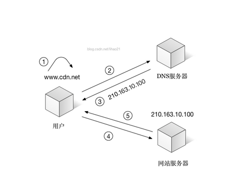
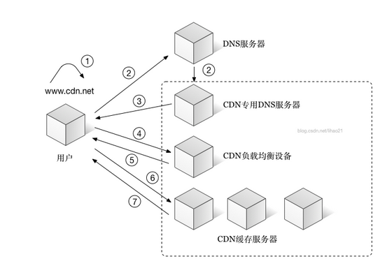

# CDN

Content Distribute Network, 内容分发网络

## 作用

CDN可以加速网络请求，举例来说，原来用户一个请求平均用时5秒，用了CDN之后，提速到2秒，大大加强了用户体验。

## 可能造成拥堵的地方

- 用户接入互联网的出入口带宽：即用户自己家里的网速，如果一边下载一边看片，视频流分到的网速自然就慢
- 服务器接入互联网的出入口带宽：服务器端网速，当用户请求量超出网站的出口带宽，就会在出口处造成拥塞
- ISP互联：因特网服务提供商之间的互联，网站服务器和用户上网选择的运营商（如电信网通）可能不同，需要进行跨网访问，一般较慢
- 长途骨干传输：长距离传输时延问题，骨干网络的拥塞问题都会带来拥堵

## 实现原理

将数据**缓存**在离用户最近的地方，使用户以最快的速度获取。

一般来说，通过CDN加载的都是静态资源，动态资源还是把请求发回源站去获取。

## 组件

- CDN专有DNS
- CDN专有负载均衡
- CDN专有缓存服务器

## 网络请求流程

没有用CDN的时候

用了CDN之后

# Links

- <http://blog.csdn.net/lihao21/article/details/52808747>
- <https://www.zhihu.com/question/36514327>
