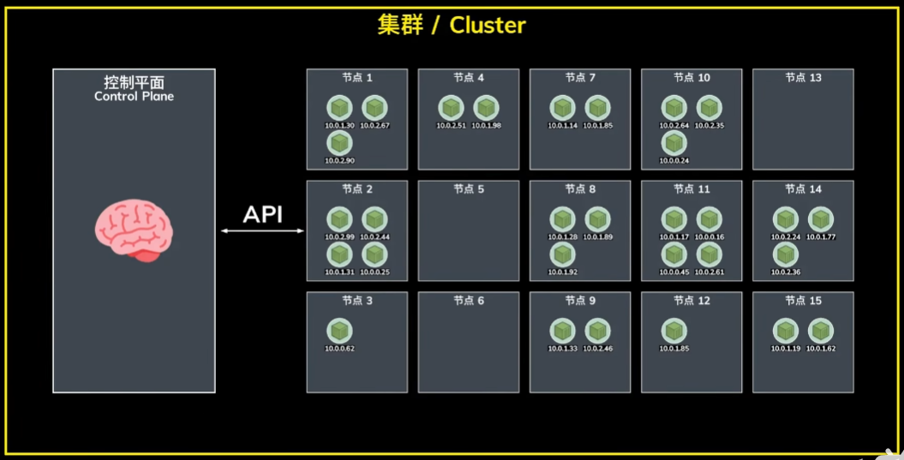
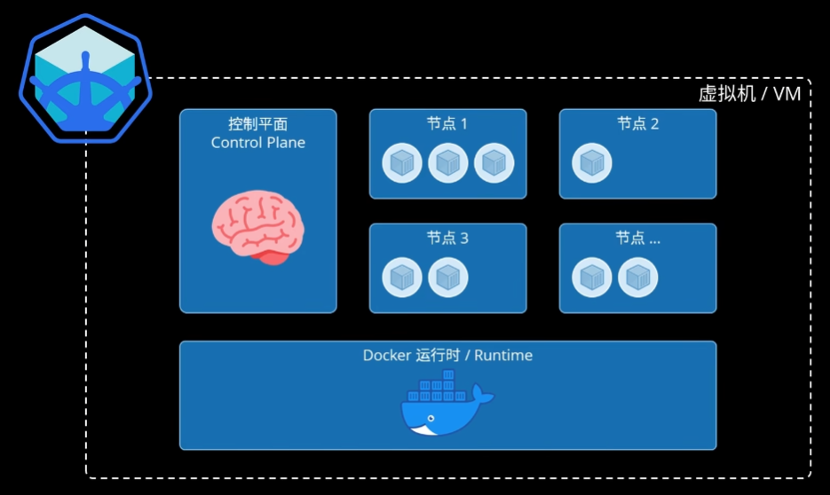

# CI/CD - K8S

## 概念

- Cluster 集群
- Control Plane 控制平面
- Node 节点
- Pod 容器

## 搭建环境

- 自建服务器搭建集群环境
- 使用云服务提供商现成的环境（阿里 ACK，Amazon EKS，Google GKE）
- 本地使用 MiniCube

下载后启动：`minicube start`

## 应用部署

deployment.yaml：定义如何部署整个环境

Service 之 NodePort：指定暴露给外网的端口

`kubectl apply -f deployment.yaml`：在集群上部署应用

`kubectl get pods`：查看pod的运行状态

`kubectl get services`：查看创建的服务

`minikube service <app_name>`：打开浏览器访问部署的Web应用

`kubectl delete -f deployment.yaml`：从集群中移除应用

## 链接

- B站10分钟快速入门k8s <https://www.bilibili.com/video/BV1DL4y187cL>