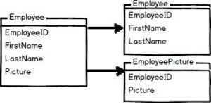

# Horizontal Partitioning

Also known as "Sharding". (分库)

Horizontal partitioning involves putting different rows into different tables.

Each partition forms part of a shard, which may in turn be located on a separate database server or physical location. 

The advantage is 
- the number of rows in each table is reduced which improves search performance.
- if shards are based on geo-locations, application may re-direct queries based on regions, which improves performance.
- you can use more cheaper, "lower-end" machines to host your data on, instead of one big server, which might not suffice anymore.

## When

db撑不住了，performance差
- records很多，（多少量级？）
- qps很高，（多少量级？）

## How

db层面，需要做分割，（Sharding Strategy?）

应用层方面，需要做导流

## Deploy

停机部署法

双写部署法

- [分库分表后如何部署上线](https://www.cnblogs.com/rjzheng/p/9597810.html)

# Vertical Partitioning

Proper "Normalization" is one form of vertical partitioning. (分库)

Vertical partitioning involves creating tables with fewer columns and using additional tables to store the remaining columns. 

