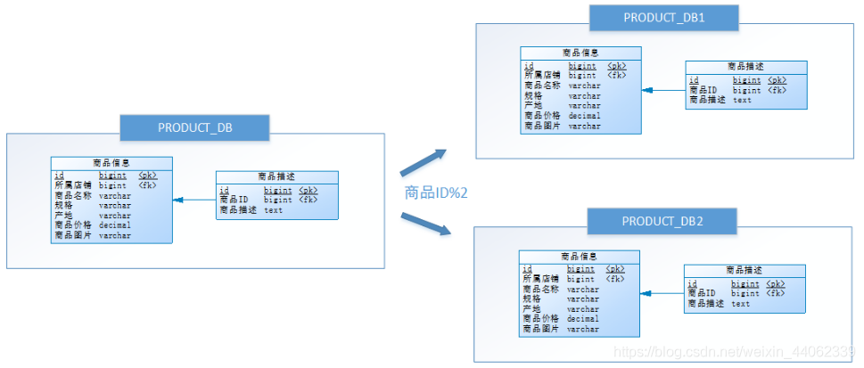
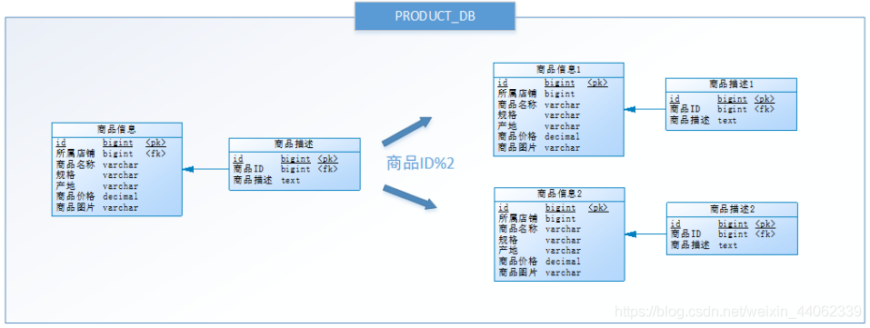

# DB - Sharding

## 分片

分片，即 Sharding 。它可以将一块数据切分为多块数据分片。常用于分布式系统中。

举例：原先只有一个数据库 A ，所有数据都存入 A 中；
现在扩展成三个数据库 A ， B ， C ，分别部署在不同机器上。存储时数据根据 ID%3 进行分片，存入不同的数据库中。（这个例子其实就是分库）

注： 个人理解， Sharding 更多地，是一种概念/思想。它可以被运用于分区，分库，分表中。

## 分区

分区，即 Partition 。它可以将一个表分为多个分区。这些分区可以存在一个不同磁盘（机器）上。

举例：比如有一个大表 BIG_TABLE_A 。存放了亿级别的数据，查询起来很慢。
于是，我们可以根据时间（年份）创建 Partition 。以后在 query 时，同样加入年份这个过滤条件，就会快很多。

## 分库分表

分库，就是把一个数据库，拆分为多个数据库。（从而可以存放在不同机器上）

分表，就是把一张表，拆分成多个表。

具体来说，可以分为水平切分（Scale Out）和垂直切分（Scale Up）。
水平切分扩展性强，不太依赖业务逻辑。垂直切分一般伴随着一些业务逻辑的切分。

所以，就有：
- 垂直分表
- 垂直分库
- 水平分库
- 水平分表

### 垂直分表

将一个表按照字段分成多表，每个表存储其中一部分字段。

举例：

PRODUCT 表中有一个字段 DETAILS ，信息量非常大，但是不常访问，于是可以进行垂直分表，把这个字段单独放到一个 PRODUCT_DETAIL 表中，有需要的时候再做 join 查询。

通常我们按以下原则进行垂直拆分:

- 把不常用的字段单独放在一张表
- 把text，blob等大字段拆分出来放在附表中
- 经常组合查询的列放在一张表中

### 垂直分库

按照业务将表进行分类，分布到不同的数据库上面，每个库可以放在不同的服务器上，它的核心理念是专库专用。

它需要解决跨库带来的所有复杂问题：
- 如何将读写请求分发到对应的数据库上
- 如何做跨数据库关联查询

### 水平分库

把同一个表的数据按一定规则拆到不同的数据库中，每个库可以放在不同的服务器上。从而使访问压力被多服务器负载，大大提升性能。它也需要解决跨库带来的所有复杂问题

一般来说，如果数据量增长很大，可以采用水平分库解决。

工具： ShardingSphere <https://shardingsphere.apache.org/document/legacy/4.x/document/cn/overview>

### 水平分表

在同一个数据库内，把同一个表的数据按一定规则拆到多个表中。这样做能小幅提升性能，它仅仅作为水平分库的一个补充优化。

## 部署

停机部署法

双写部署法

- [分库分表后如何部署上线](https://www.cnblogs.com/rjzheng/p/9597810.html)

## 参考

- [彻底搞清分库分表] <https://blog.csdn.net/weixin_44062339/article/details/100491744>
- [数据库分库分表思路] <https://www.cnblogs.com/butterfly100/p/9034281.html>
