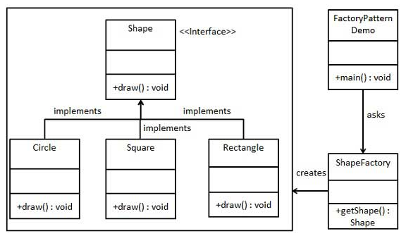

# Design Pattern - Basic

## Singleton Pattern

Eager: crate instance when the class is loaded

~~~ java
public class Singleton {
    private Singleton() {}
    private static final Singleton INSTANCE = new Singleton();
    public static Singleton getInstance() {
        return INSTANCE;
    }
}
~~~

Lazy: crate instance only when its needed

~~~ java
public class SingletonDemo {
    private SingletonDemo() {}
	  private static SingletonDemo instance = null;
    public static synchronized SingletonDemo getInstance() {
        if (instance == null) {
            instance = new SingletonDemo();
        }
        return instance;
    }
}
~~~

## MVC Pattern

- Model: an object representing data or even activity
- View: some form of visualization of the state of the model
- Controller: offers facilities to change the state of the model

- <http://www.tutorialspoint.com/design_pattern/mvc_pattern.htm>

## Template Method Pattern

It defines the program skeleton of an algorithm in a method, called template method, which defers some steps to subclasses.

~~~ java
public class Coffee {
	  public final void cookCoffee() {
		    stepA();
		    stepB();
		    stepC();
	  }
	  public abstract void stepA();
	  public abstract void stepB();
	  public abstract void stepC();
}

public class CabuchinoCoffee extends Coffee() {
	  public void stepA() {...}
	  public void stepB() {...}
	  public void stepC() {...}
}
~~~

## Factory Pattern

- create object without exposing the creation logic to the client
- use a factory to create the object

~~~ java
public class ShapeFactory {
    public Shape getShape(String shapeType) {
       if (shapeType == null) {
           return null;
       }
       if (shapeType.equalsIgnoreCase("CIRCLE")) {
           return new Circle();
       } else if (shapeType.equalsIgnoreCase("RECTANGLE")) {
           return new Rectangle();
       }
       return null;
    }
}

public class FactoryPatternDemo {
    public static void main(String[] args) {
		    ShapeFactory shapeFactory = new ShapeFactory();
        Shape shape1 = shapeFactory.getShape("CIRCLE");
		    shape1.draw();
    }
}
~~~

- <http://www.tutorialspoint.com/design_pattern/factory_pattern.htm>

## Observer Pattern

- When to use: Whenever a subject has to be observed by one or more observers.
- Intent: Defines a one-to-many dependency between objects so that when one object changes state, 
all its dependents are notified and updated automatically.

- `Subject` holds `State` and `List of Observers`.
- When `State` changes, `Subject` will notify `Observer`.
- And then `Observer` can update the change to end user.

