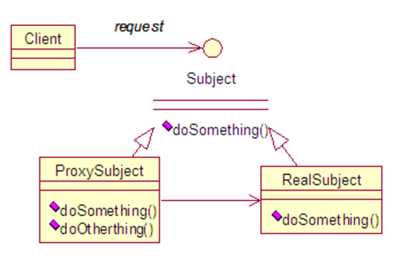
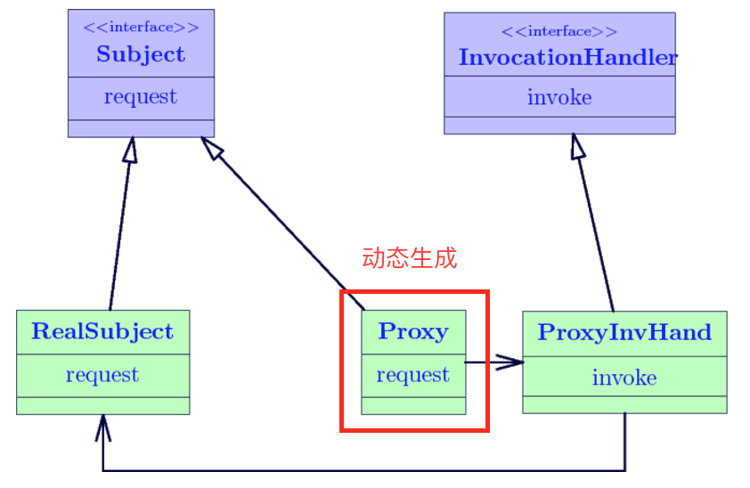

# Design Pattern - Proxy

一般涉及三个角色：
- 抽象角色 Subject
- 代理角色 ProxySubject
- 真实角色 RealSubject

使用代理(Proxy)的作用/意义：为真实角色提供一个代理以控制对该角色的访问。

## 实际使用场景

- 保护代理(Protect or Access Proxy)：控制对一个对象的访问权限。
- 智能引用(Smart Reference Proxy)：提供比目标对象额外的服务和功能。

## 代理种类

代理模式，一般分为两种：
- 静态代理
- 动态代理

两者的区别在于：代理类是静态生成的还是动态生成的。

## 静态代理

静态代理中，代理类在编译前就写好。

一般通过两种方式实现：
- implements interface
- extends abstract class

~~~ java
// 此例中采用了抽象类
abstract public class Subject {
    abstract public void  request();
}

public class  RealSubject  extends  Subject  {
  public  RealSubject()  { }

  public void  request()  {
     System.out.println( " From real subject. " );
    }
}

public class  ProxySubject  extends  Subject  {
  private  Subject realSubject;
  public  ProxySubject(Subject realSubject)  {this.realSubject = realSubject }
  public void  request()  {
     preRequest();
     realSubject.request();  // 此处执行真实对象的request方法
     postRequest();
  }
  ...
}

// 客户端调用
RealSubject real = new RealSubject();
Subject sub = new  ProxySubject(real);
Sub.request();
~~~

- <http://www.cnblogs.com/machine/archive/2013/02/21/2921345.html>
- <http://www.cnblogs.com/Eason-S/p/5856141.html>

问题：在静态代理中，一个RealSubject对应一个Proxy，大量使用这种代理模式，会使我们系统内的类的规模增大，并且不易维护。并且，Proxy的实际使用逻辑一般是：在调用某个方法前及方法后做一些额外的业务。如果这些额外的业务是一样的，比如写log，使用静态代理为每一个真实角色都创建一个对应的代理角色就会显得很多余。

解决：在运行状态中，需要代理的地方，根据Subject和RealSubject，动态地创建一个Proxy，用完之后就销毁。

## 动态代理

动态代理中，代理类是在运行时动态生成的。

参考以下代码，新建了一个代理类ProxySubjectA，与此类似，我们可以创建ProxySubjectB，ProxySubjectC，等等。它们的代码高度类似。为了简化，我们可以使用动态代理。

~~~ java
    public class ProxySubjectA implements SubjectA {
        private Subject realSubject;
        public  ProxySubject(Subject realSubject)  {
            this.realSubject = realSubject 
        }
        public void request() {
            preRequest();
            realSubject.request();
            postRequest();
        }
        ...
    }
~~~

那么这个动态代理是如何生成的呢？是使用了java.lang.reflect.Proxy下面的newProxyInstance方法创建得到的。

~~~ java
static Object newProxyInstance(ClassLoader loader,Class<?>[] interfaces,InvocationHandler h)
~~~

这里传入了三个参数
- ClassLoader：RealSubject的加载器，Class.getClassLoader()
- Interfaces：Subject这个接口，也是RealSubject实现的接口
- InvocationHandler：新建一个Impl类实现InvocationHandler接口，规定invoke()前后的操作

前两个参数RealSubject，Subject很好理解，在静态代理中也用到了，最后一个参数InvocationHandlerImpl，是动态代理独有的，它的作用是定义ProxySubject有哪些功能。然后在需要调用的地方通过Proxy.newProxyInstance(…)来动态创建ProxySubject类。

<http://blog.csdn.net/luanlouis/article/details/24589193/>

~~~ java
// Subject
public interface UserService {
    public abstract void add();
}

// RealSubject
public class UserServiceImpl implements UserService {
    public void add() {
        System.out.println("add");
    }
}

// InvocationHandlerImpl
public class MyInvocationHandler implements InvocationHandler {
    private Object target;
    public MyInvocationHandler(Object target) {
        super();
        this.target = target;
    }
    public Object invoke(Object proxy, Method method, Object[] args) throws Throwable {
        System.out.println("before");
        Object result = method.invoke(target, args);  // 调用真实对象的方法
        System.out.println("after");
        return result;
    }
    public Object getProxy() {  //  动态创建代理类
        return Proxy.newProxyInstance(Thread.currentThread().getContextClassLoader(),
                target.getClass().getInterfaces(), this);
    }
}

// 实际调用逻辑
public void testProxy() throws Throwable {
    UserService userService = new UserServiceImpl();
    MyInvocationHandler invocationHandler = new MyInvocationHandler(userService);
    UserService proxy = (UserService) invocationHandler.getProxy();
    proxy.add();
}
~~~

<http://rejoy.iteye.com/blog/1627405>

## 总结

静态代理的实现，我们涉及到创建三个类/接口：
- Subject
- RealSubject
- ProxySubject

然后在需要调用的地方直接创建ProxySubject类。

动态代理的实现，两个不变，新加了一个：
- Subject
- RealSubject
- InvocationHandlerImpl

ProxySubject是通过Proxy.newProxyInstance(...)动态生成的。
