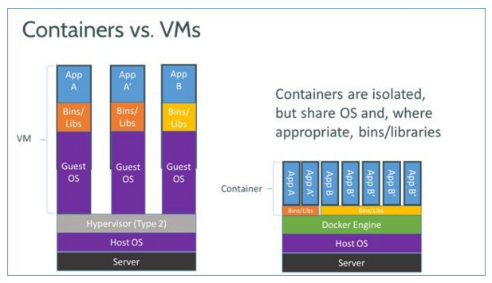
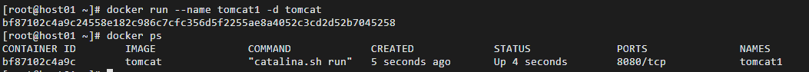
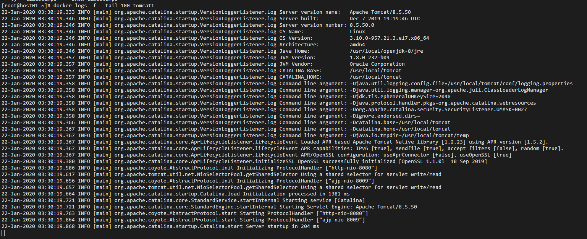

# Docker

## 什么是Docker

> Docker可以让开发者打包他们的应用(app)以及依赖包(dependency)到一个轻量级、可移植的容器中，然后发布到任何机器上。

更直白的说，Docker是**环境**。Docker不是虚拟机，Docker实际上只做了一件事情 - 镜像管理。负责将可执行的镜像导入导出，在不同设备上迁移。

## Docker的原理

Docker是基于LXC(Linux Container)技术之上构建的**应用容器引擎**。

- 虚拟机，需要模拟整台机器的所有硬件，有自己的操作系统（GuestOS）。
- 容器，是运行在母操作系统（HostOS）上的，有独立的二进制，库，和应用。

## Docker的特点

优点
- 小：轻量，需要资源少。
- 快：启动快，搭建环境快。
- 简单：配置简单，且同样的配置可以在不同环境下使用（不同的硬件设施，不同的平台）。

缺点
- 隔离性：Docker隔离性更弱。Docker属于进程之间的隔离，虚拟机属于系统级别隔离。
- 安全性：Docker的安全性也更弱。Docker的租户root和宿主机root等同，一旦容器内的用户从普通用户权限提升为root权限，它就直接具备了宿主机的root权限，进而可进行无限制的操作。虚拟机租户root权限和宿主机的root虚拟机权限是分离的。

## Docker的应用场景

各种复杂的后台应用的开发，部署，测试
- Web应用
- 数据库
- 其它后台应用

## Docker的组成部分

- Image(镜像)
  - 一个只读模板，可以用来创建容器，一个镜像可以创建多个容器。
  - Docker 提供了一个很简单的机制来创建和更新现有的镜像，甚至可以直接从其他人那里获取做好的镜像直接使用。
  - 可以理解为 Java 中的类。
- Container(容器)
  - 容器是从镜像创建的运行实例，也就是镜像启动后的一个实例称为容器，是独立运行的一个或一组应用。
  - docker 利用容器来运行应用，他可以被启动、开始、停止、删除，每个容器都是相互隔离的、保证安全的平台。
  - 可以把容器看做是一个简易版的 Linux（包括 root 用户权限、进程空间、用户空间和网络空间等）和运行在其中的应用程序。
  - 可以理解为 Java 中通过类创建的实例。
- Repository(仓库)
  - 仓库是集中存放镜像文件的场所，类似 git 代码仓库等。
  - 仓库（Respository）和仓库注册服务器（Registry）是有区别的。仓库注册服务器一般存放多个仓库，每个仓库又有多个镜像，每个镜像又有不同的标签（tag）。
  - 仓库分为公开仓库（public）和私有仓库（private）两种形式。
  - 最大的公开仓库是 Docker Hub，国内的公开仓库有阿里云等。
  - 可以在本地网络创建一个私有仓库。
  - 当创建好自己的镜像后，可以通过 push 命令把它上传到公开或私有仓库。
  - 仓库的概念类似 Git，仓库注册服务器可以理解为 GitHub 这种托管服务。

这一部分摘自
- [零基础入门 Docker]<https://gitbook.cn/books/5b670bf396290075f582a9ab/index.html>

## Docker的命令

### 安装和启动

安装

~~~
yum install docker
~~~

启动，设为开机启动，停止

~~~
systemctl start docker
systemctl enable docker
systemtctl stop docker
~~~

### 镜像

搜索，下载，删除

~~~
docker search tomcat
docker pull tomcat
docker rmi tomcat
~~~

### 容器

启动

- `-d`：detached，启动守护式容器（相当于后台运行），控制台将不会阻塞，可以继续输入命令操作。
- `-it`:启动交互式容器，控制台会切换到容器的命令终端。退出时会关闭容器。
- `-p`：映射指定要的IP和端口，但是一个指定端口只可以绑定一个容器。
- `-P`：随机映射一个49000~49900的端口到内部容器开放的网络端口。

~~~
docker run --name container-name -d image-name
docker run --name container-name -it image-name
docker run --name container-name -d -p 8888:8080 image-name
~~~

查看进程，查看日志，进程，细节

~~~
docker ps -a

docker logs container-name/container-id
docker top container-name/container-id
docker inspect container-name/container-id

docker image ls
docker container ls
~~~

停止，重启，删除

~~~
docker stop container-name/container-id
docker restart container-name/container-id
docker rm container-name/container-id
~~~

连接到运行中的容器

- `--sig-proxy=false`：确保 CTRL-D 或 CTRL-C 不会关闭容器。
- 感觉这个功能有点像查看日志，目前暂时还没有发现更多用途。

~~~
docker attach container-name/container-id
docker attach --sig-proxy=false container-name/container-id
~~~

进入容器执行命令

- 下例是：在容器中打开新的终端，并且启动新的bash进程。

~~~
docker exec -it container-name/container-id bash
exit
~~~

拷贝文件

~~~
docker cp /dir1/file1 container-id:/dir2
~~~

## Links

1
- [Docker — 从入门到实践]<https://yeasy.gitbooks.io/docker_practice/content/>
- [可能是最为详细的Docker入门吐血总结]<https://blog.csdn.net/deng624796905/article/details/86493330>

2
- [docker-curriculum]<https://docker-curriculum.com/>
- [Docker不是虚拟机]<https://github.com/shell909090/slides/blob/master/md/docker.md>
- [Docker 核心技术预览]<http://www.infoq.com/cn/articles/docker-core-technology-preview>
- [使用Docker运行Java Web应用]<https://yq.aliyun.com/articles/6894?spm=5176.100239.blogcont40494.22.kLOqEG>
