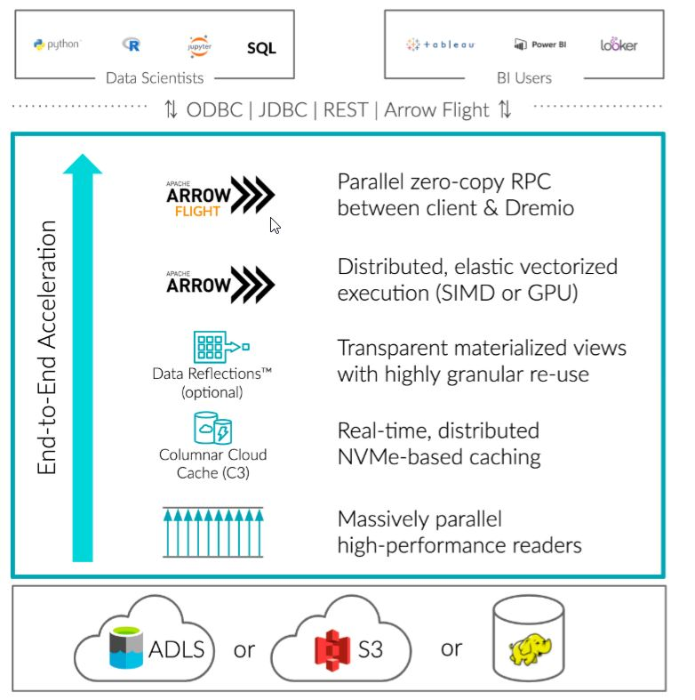
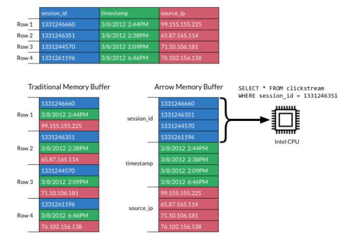
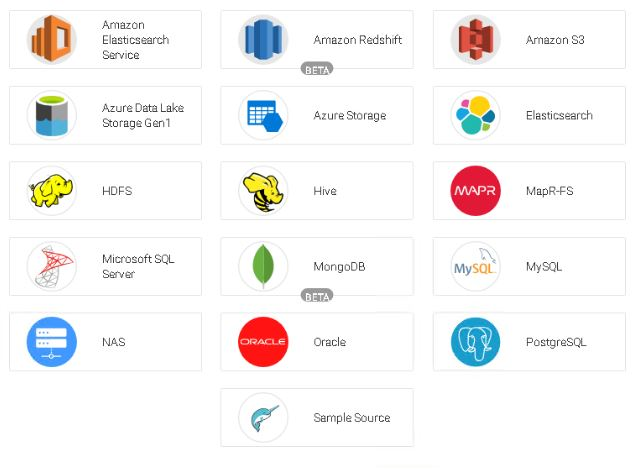
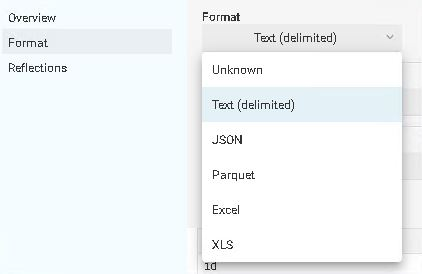
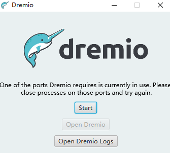
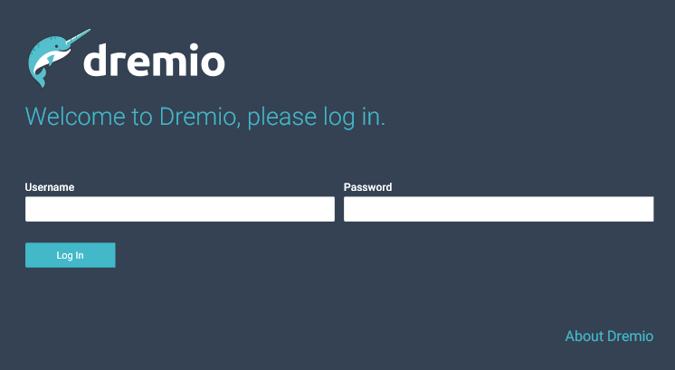
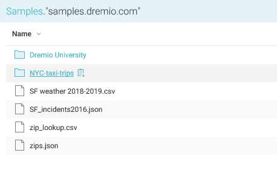
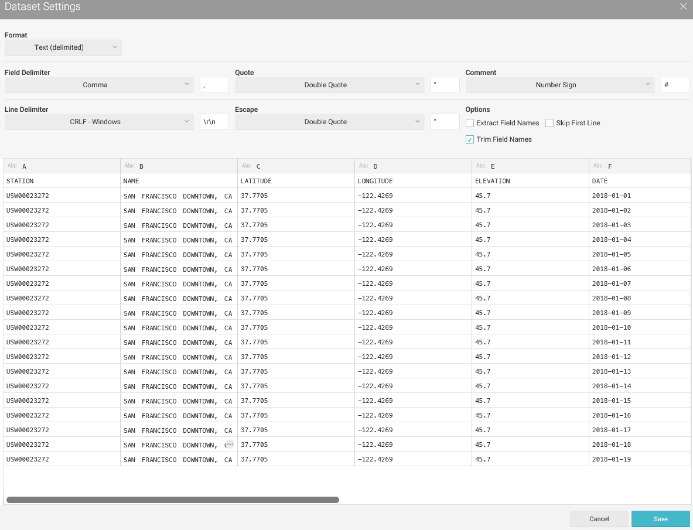
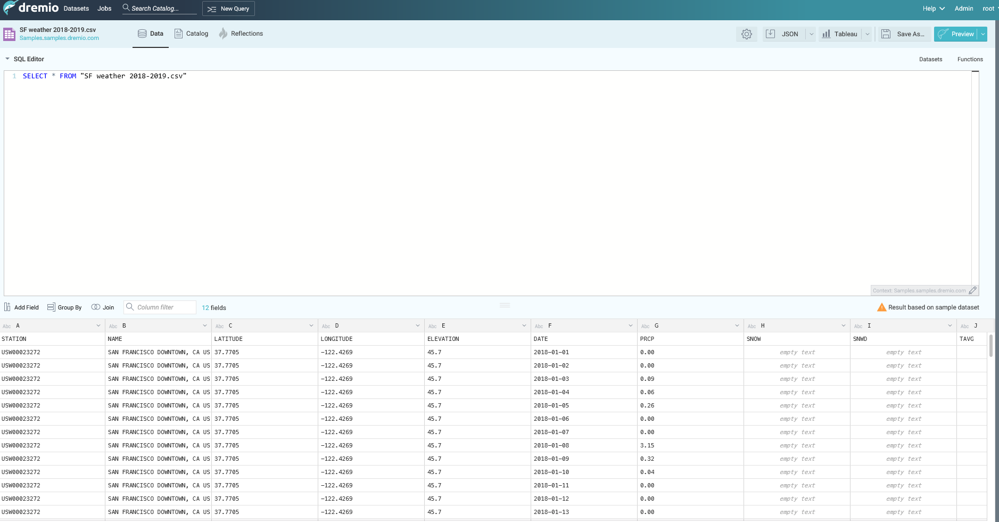
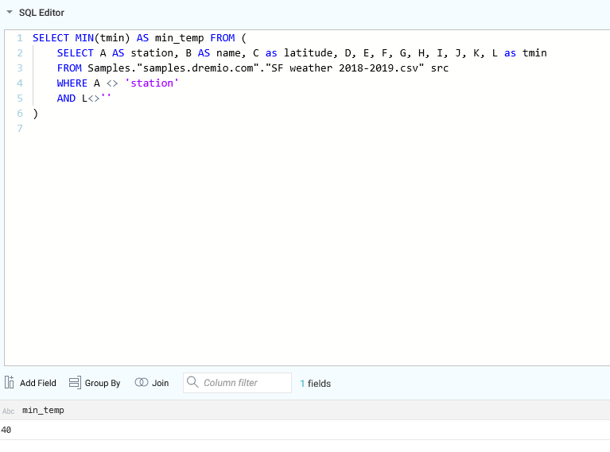

# Dremio

## 定义

Dremio is a next-generation data lake engine that liberates your data with live, interactive queries directly on cloud data lake storage.

Dremio是一个非常灵活，功能强大的Query Engine。后端可以对接多种数据源（如Oracle，Hadoop，S3，或者直接从文件读取，如Parquet，JSON），前端可以对接多种展示平台（如Power BI，Tableau）。

## 特点

它的特点主要就是快，灵活

- Lightning-fast queries: 100x faster BI queries
  - 快
- Flexibility and open source technology: no vendor lock-in
  - 灵活
- Self-service semantic layer
  - 通过创建Virtual datasets，相当于创建了一个View，可以让用户更加直观地query数据。
- Powerful JOIN capability
  - 比如我在S3上面有数据源A，在Oracle上有数据源B，用Dremio可以把这两个直接join起来看数据，从而省去了ETL的过程。

https://docs.dremio.com/

## 竞争对手

- Presto
- Denodo
- Snowflake

## OLTP and OLAP

在分析Dremio的原理之前，先花点时间解释下OLTP和OLAP的概念。

- OLTP: Online transaction processing (OLTP) captures, stores, and processes data from transactions in real time. In OLTP, the emphasis is on fast processing, because OLTP databases are read, written, and updated frequently.
- OLAP: Online analytical processing (OLAP) uses complex queries to analyze aggregated historical data from OLTP systems. In OLAP, the emphasis is on response time to these complex queries.
- ETL: The data from one or more OLTP databases is ingested into OLAP systems through a process called extract, transform, load (ETL). With an ETL tool, users can collect data from several sources and send it to a destination, such as an OLAP data warehouse, where it is queried by analytics and business intelligence tools for insights.

简言之，首先，数据写入OLTP系统，然后，通过ETL过程，汇总到OLAP系统中，最后，分析师通过一些BI工具从OLAP系统中查看数据。

- https://www.stitchdata.com/resources/oltp-vs-olap/

## 原理

为什么快？官网上是这么写的：

- Apache Arrow: Dremio’s execution engine is built on Apache Arrow, the standard for columnar, in-memory analytics, and leverages Gandiva to compile queries to vectorized code that’s optimized for modern CPUs.
- Predictive Pipelining: fetches data just before the execution engine needs it.
- Columnar Cloud Cache(C3): automatically caches data on local NVMe as it’s being accessed, enabling NVMe-level performance on your data lake storage.
- Data Reflections: Dremio lets you create a Data Reflection, a physically optimized data structure that can accelerate a variety of query patterns.

总结起来，主要有两个因素：

- 列式存储
  - 列存储将相同字段集中排列在一起，提高了过滤查询的效率。列存储的数据库更适合OLAP，行存储的数据库更适合OLTP。
- 空间换时间的策略
  - 不论是Cache，还是Data Reflection，都是把结果存起来（内存或者磁盘），从而加速查询。

- https://www.zhihu.com/question/29380943
- https://developer.aliyun.com/article/715004
- https://www.infoq.cn/article/columnar-databases-and-vectorization/

## 数据源

## 数据类型

## 实战

注：The 64-bit Java Development Kit version 1.8 is required.

首先，我们需要装好JAVA，然后，下载Dremio。
- 如果是Windows，就是exe文件
- 如果是Mac，就是dmg文件
- 如果是Linux，就是rpm或者tar文件

参考这个链接 https://docs.dremio.com/quickstart/standalone-quickstart.html

装好之后，就可以启动了，

如果是Linux，使用命令`sudo service dremio start`，如果是Windows，可以打开Dremio的应用。下面演示的是Windows环境下的启动。

启动界面

第一次使用需要注册一个新用户，之后再使用就是登陆界面。

然后，我们需要添加一些source，这里使用的是自带的sample文件。

可以点开来看里面的具体内容。

添加好后，我们就可以在Dremio里面query。这个表是存储的是SF一年里面每天温度的情况。

比如，我们想知道一年中的最低气温，可以这样写：

- https://www.dremio.com/tutorials/working-with-your-first-dataset/
- https://blog.csdn.net/vkingnew/article/details/89009086

## 参考

- [Dremio Tutorials](https://www.dremio.com/tutorials/)
- [Dremio - working with your first dataset](https://www.dremio.com/tutorials/working-with-your-first-dataset/)
- [Dremio简述](https://developer.aliyun.com/article/713454)
- [Dremio 使用](https://blog.csdn.net/vkingnew/article/details/89009086)
