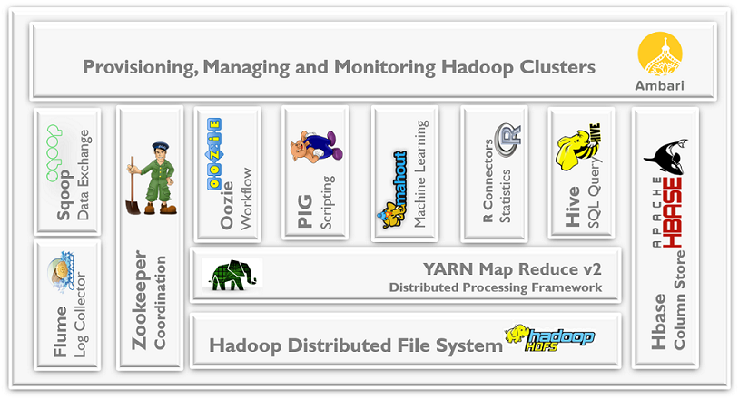
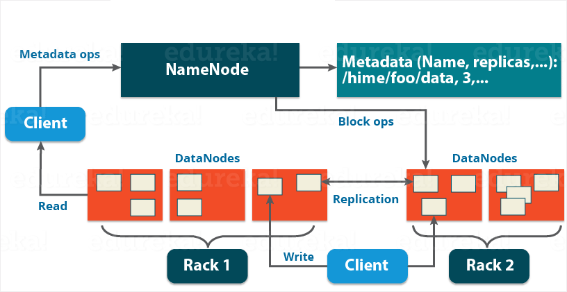
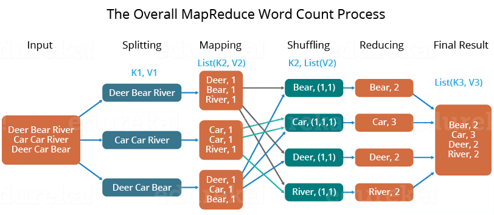

# Hadoop

## Big Data概述

three types of big data
- Structured data − Relational data.
- Semi Structured data − XML data.
- Unstructured data − Word, PDF, Text, Media Logs.

大数据的四个特征
- Volumn数据量
- Value高度分析价值
- Variety多样性
- Velocity速度

大数据带来的技术变革
- 存储：文件存储 -> 分布式存储
- 计算：单机计算 -> 分布式计算
- 数据库：RDB -> NoSQL(Hbase/Redis)
- 网络：带宽提高

大数据的常用技术
- 数据采集：Flume, Sqoop
- 数据存储：Hadoop
- 数据处理、分析、挖掘：Hadoop, Spark, Flink...
- 可视化

大数据的典型应用
- 报表
- 用户细分（标签）
- 指标监控
- 指标报警

## Hadoop概述

Hadoop：提供分布式的**存储**（一个文件被拆分成很多个块，并且以副本的方式存储在各个节点中）和**计算**，是一个分布式的系统基础架构，用户可以在不了解分布式底层细节的情况下进行使用。

模块
- 分布式文件系统：`HDFS`实现将文件分布式存储在很多的服务器上
	- [[hdfs]]
		- [[hdfsjavaapi]]
		- [[hdfswindows]]
	- [[hbase]]
	- [[hive]]
- 分布式计算框架：`MapReduce`实现在很多机器上分布式并行计算
	- [[mapreduce]]
- 分布式资源调度框架：`YARN`实现集群资源管理以及作业的调度
	- [[yarn]]

优势
- 高可靠
- 易扩展
- 低成本
- 成熟的生态圈

历史
- 2006年 2月，Apache Hadoop项目正式启动以支持 MapReduce和 HDFS**** 的独立发展。
- 2007年 10月，第一个 Hadoop**** 用户组会议召开，社区贡献开始急剧上升。
- 2008年 1月，Hadoop成为 Apache顶级项目。
- 2008年 8月，第一个 Hadoop商业化公司 Cloudera成立。
- 2009 年 3月，Cloudera推出世界上首个 Hadoop发行版——CDH（Cloudera’s Distribution including Apache Hadoop）平台，完全由开放源码软件组成。
- 2010年 -2011年，扩大的 Hadoop社区忙于建立大量的新组件（Crunch，Sqoop，Flume**，Oozie等）来扩展 Hadoop的使用场景和可用性。
- 2011年 5月，Mapr Technologies公司推出分布式文件系统和 MapReduce引擎——MapR Distribution for Apache Hadoop。
- 2011年 7月，Yahoo!和硅谷风险投资公司 Benchmark Capital创建了 Hortonworks 公司，旨在让 Hadoop更加可靠，并让企业用户更容易安装、管理和使用 Hadoop。
- 2014年 2月，Spark逐渐代替 MapReduce成为 Hadoop的缺省执行引擎，并成为 Apache基金会顶级项目。

<https://www.infoq.cn/article/hadoop-ten-years-interpretation-and-development-forecast>

生态圈

常用版本
- Apache
  - 优点：纯开源
  - 缺点：不同版本/不同框架之间整合可能有冲突
- CDH: Cloudera’s Distribution including Apache Hadoop
  - 优点：提供CM(cloudera manager)，通过页面一键安装各种框架、升级，支持impala
  - 缺点：CM不开源、与社区版本有些许出入
- HDP: Hortonworks
  - 优点：原装Hadoop，纯开源，支持tez，企业发布自己的数据平台可以直接基于页面框架进行改造
  - 缺点：企业级安全框架不开源，文档不多
- MapR

## HDFS

Hadoop File System，负责分布式存储。

HDFS是GFS的克隆版，GFS源于Google的论文，发表于2003年。

特点：扩展性，容错性，海量数据存储。

举例：一个文件（200M），切分成两个块block（128M+72M），存在3个副本node上。即使一个node宕机，也不影响系统可用性。

~~~
node1：blk1
node2：blk2
node3：blk1  blk2
~~~

基本架构如下：

## Map Reduce

Map Reduce，负责分布式计算。

Map Reduce是Google Map Reduce的克隆版，源自Google Map Reduce论文，发表于2014年。

特点：扩展性，容错性，海量数据离线处理。

经典案例word count：

## Yarn

Yet Another Resource Negotiator，负责整个集群资源的管理和调度。

特点：扩展性，容错性，多框架资源统一调度。

