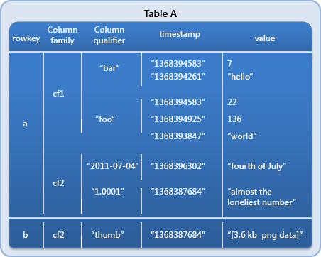

# Hadoop - Hbase

Use Apache HBase when you need random, realtime read/write access to your Big Data.

主要特性

- 支持**随机**+**实时**的大数据读写
- 适合数据量非常**大**的场景，亿级别的数据
- 数据（可以）存储在HDFS上（支持**分布式**）
- 是**面向列**的非关系型数据库 NoSQL

其它属性

- 开源
- 多版本
- 来源自Google的Bigtable

参考 -> <https://hbase.apache.org/>

## 技术特点

- 面向列：列族（可以存放多个列），列族/列独立索引
- 稀疏：对于空的列，不会占用存储空间
- 数据类型单一： byte / string
- 无模式：每一行的的数据对应的列不一定相同，每行的列可以动态添加
- 数据多版本

## HBase v.s RDBMS

- 数据类型不同 （HBase只支持String）
- 数据操作不同 （HBase不支持关联查询 join ）
- 存储模式不同 （HBase是行式存储）
- 事务操作不同
- 数据量不同

## HBase数据结构

- Row Key 行键
- Column Family 列族
- Column Qualifier 列
- Timestamp 时间戳
- Value 值

## 实战 - Hello World

参考 -> <http://abloz.com/hbase/book.html>

### 下载 + 解压

`wget https://downloads.apache.org/hbase/stable/hbase-2.2.5-bin.tar.gz`

<http://www.apache.org/dyn/closer.cgi/hbase/>

### 配置

`.bash_profile`

~~~
export HBASE_HOME=/root/hbase/hbase-2.2.5
export PATH=$HBASE_HOME/bin:$PATH
~~~

`conf/hbase-site.xml`

~~~ xml
<?xml version="1.0"?>
<?xml-stylesheet type="text/xsl" href="configuration.xsl"?>

<!--单机模式-->
<configuration>
	<property>
		<name>hbase.rootdir</name>
		<value>file:///home/hbase/save</value>
	</property>
</configuration>

<!--伪分布式模式-->
<configuration>
	<property>
		<name>hbase.rootdir</name>
		<value>hdfs://hadoop000:9000/hbase</value>
		<description>The directory shared by RegionServers.
		</description>
	</property>
	<property>
		<name>dfs.replication</name>
		<value>1</value>
		<description>The replication count for HLog & HFile storage. 
			Should not be greater than HDFS datanode count.
		</description>
	</property>
</configuration>

<!--完全分布式模式-->
<configuration>
	<property>
		<name>hbase.rootdir</name>
		<value>hdfs://hadoop000:9000/hbase</value>
		<description>The directory shared by RegionServers.
		</description>
	</property>
	<property>
		<name>hbase.cluster.distributed</name>
		<value>true</value>
		<description>The mode the cluster will be in. Possible values are
			false: standalone and pseudo-distributed setups with managed Zookeeper
			true: fully-distributed with unmanaged Zookeeper Quorum (see hbase-env.sh)
		</description>
	</property>
	<property>
		<name>hbase.zookeeper.quorum</name>
		<value>hadoop000:2181</value>
		<description>The directory shared by region servers.</description>
	</property>
</configuration>
~~~

`conf/hbase-env.sh`

~~~
export JAVA_HOME=/home/java/jdk_1.8
export HBASE_MANAGES_ZK=false
~~~

`regionservers`

~~~
hadoop000
~~~

### Shell访问

启/停 Server

~~~
$ ./bin/start-hbase.sh
$ ./bin/stop-hbase.sh

-> HMaster
-> HRegionServer
~~~

启/停 Client

~~~
$ ./bin/hbase shell
> exit
~~~

常用命令

~~~
version
status
~~~~

Create table

~~~
> list
> create 'member', 'info'
> count 'member'
> desc 'member'

> put 'member', 'alice', 'info:name', 'Alice Wang'
> put 'member', 'alice', 'info:age', '20'
> put 'member', 'alice', 'info:addr', 'BJ'
~~~

Scan + Get

~~~
> scan 'member'
> get 'member', 'alice'
~~~

Disable + Drop

~~~
> delete 'member', 'info:addr'
> deleteall 'member', 'alice'

> disable 'member'
> drop 'member'

> truncate 'member'
~~~

### Web访问

version <  0.98, port: `16010`

version >= 0.98, port: `60010`

## 实战 - Java API

pom.xml

~~~ xml
<dependency>
  <groupId>org.apache.hbase</groupId>
  <artifactId>hbase-client</artifactId>
  <version>${hbase.version}</version>
</dependency>

<dependency>
  <groupId>org.apache.hbase</groupId>
  <artifactId>hbase-hadoop2-compat</artifactId>
  <version>${hbase.version}</version>
</dependency>

<dependency>
  <groupId>org.apache.hbase</groupId>
  <artifactId>hbase-server</artifactId>
  <version>${hbase.version}</version>
</dependency>
~~~

App - Basic

~~~ java
import org.apache.hadoop.conf.Configuration;
import org.apache.hadoop.hbase.*;
import org.apache.hadoop.hbase.client.*;
import org.apache.hadoop.hbase.filter.*;
import org.apache.hadoop.hbase.util.Bytes;
import org.junit.After;
import org.junit.Assert;
import org.junit.Before;
import org.junit.Test;

import java.io.IOException;
import java.util.ArrayList;
import java.util.List;

public class HBaseApp {

    Connection connection = null;
    Table table = null;
    Admin admin = null;

    String tableName = "my_hbase_java_api";

    @Before
    public void setUp() {
        Configuration configuration = new Configuration();
        configuration.set("hbase.rootdir", "hdfs://hadoop000:8020/hbase");
        configuration.set("hbase.zookeeper.quorum", "hadoop000:2181");

        try {
            connection = ConnectionFactory.createConnection(configuration);
            admin = connection.getAdmin();

            Assert.assertNotNull(connection);
            Assert.assertNotNull(admin);
        } catch (IOException e) {
            e.printStackTrace();
        }
    }

    @Test
    public void getConnection() {

    }

	private void printResult(Result result) {
        for (Cell cell : result.rawCells()) {
            System.out.println(Bytes.toString(result.getRow()) + "\t "
                    + Bytes.toString(CellUtil.cloneFamily(cell)) + "\t"
                    + Bytes.toString(CellUtil.cloneQualifier(cell)) + "\t"
                    + Bytes.toString(CellUtil.cloneValue(cell)) + "\t"
            + cell.getTimestamp());
        }
    }

    @After
    public void tearDown() {
        try {
            connection.close();
        } catch (IOException e) {
            e.printStackTrace();
        }
    }
	
}
~~~

CRUD

~~~ java
    @Test
    public void createTable() throws Exception {
        TableName table = TableName.valueOf(tableName);
        if (admin.tableExists(table)) {
            System.out.println(tableName + " 已经存在...");
        } else {
            HTableDescriptor descriptor = new HTableDescriptor(table);
            descriptor.addFamily(new HColumnDescriptor("info"));
            descriptor.addFamily(new HColumnDescriptor("address"));
            admin.createTable(descriptor);
            System.out.println(tableName + " 创建成功...");
        }
    }

    @Test
    public void queryTableInfos() throws Exception {
        HTableDescriptor[] tables = admin.listTables();
        if (tables.length > 0) {
            for (HTableDescriptor table : tables) {
                System.out.println(table.getNameAsString());
                HColumnDescriptor[] columnDescriptors = table.getColumnFamilies();
                for (HColumnDescriptor hColumnDescriptor : columnDescriptors) {
                    System.out.println("\t" + hColumnDescriptor.getNameAsString());
                }
            }
        }
    }

    @Test
    public void testPut() throws Exception {
        table = connection.getTable(TableName.valueOf(tableName));

        List<Put> puts = new ArrayList<>();

        Put put1 = new Put(Bytes.toBytes("jepson"));
        put1.addColumn(Bytes.toBytes("info"), Bytes.toBytes("age"), Bytes.toBytes("18"));
        put1.addColumn(Bytes.toBytes("info"), Bytes.toBytes("birthday"), Bytes.toBytes("xxxx"));
        put1.addColumn(Bytes.toBytes("info"), Bytes.toBytes("company"), Bytes.toBytes("apple"));
        put1.addColumn(Bytes.toBytes("address"), Bytes.toBytes("country"), Bytes.toBytes("CN"));
        put1.addColumn(Bytes.toBytes("address"), Bytes.toBytes("province"), Bytes.toBytes("SHANGHAI"));
        put1.addColumn(Bytes.toBytes("address"), Bytes.toBytes("city"), Bytes.toBytes("SHANGHAI"));

        Put put2 = new Put(Bytes.toBytes("xingxing"));
        put2.addColumn(Bytes.toBytes("info"), Bytes.toBytes("age"), Bytes.toBytes("19"));
        put2.addColumn(Bytes.toBytes("info"), Bytes.toBytes("birthday"), Bytes.toBytes("xxxx"));
        put2.addColumn(Bytes.toBytes("info"), Bytes.toBytes("company"), Bytes.toBytes("PDD"));
        put2.addColumn(Bytes.toBytes("address"), Bytes.toBytes("country"), Bytes.toBytes("CN"));
        put2.addColumn(Bytes.toBytes("address"), Bytes.toBytes("province"), Bytes.toBytes("SHANGHAI"));
        put2.addColumn(Bytes.toBytes("address"), Bytes.toBytes("city"), Bytes.toBytes("SHANGHAI"));

        puts.add(put1);
        puts.add(put2);

        table.put(puts);
    }

    @Test
    public void testUpdate() throws Exception {
        table = connection.getTable(TableName.valueOf(tableName));
        Put put = new Put(Bytes.toBytes("xingxing"));
        put.addColumn(Bytes.toBytes("info"), Bytes.toBytes("age"), Bytes.toBytes("20"));
        table.put(put);
    }

    @Test
    public void testGet01() throws Exception {
		table = connection.getTable(TableName.valueOf(tableName));
		Get get = new Get("jepson".getBytes());
        get.addColumn(Bytes.toBytes("info"), Bytes.toBytes("age"));
        Result result = table.get(get);
        printResult(result);
    }

    @Test
    public void testScan01() throws Exception {
        table = connection.getTable(TableName.valueOf(tableName));

        //Scan scan = new Scan();
        //scan.addFamily(Bytes.toBytes("info"));
        //scan.addColumn(Bytes.toBytes("info"), Bytes.toBytes("company"));

        Scan scan = new Scan(Bytes.toBytes("jepson"),Bytes.toBytes("xingxing")); // [)
		ResultScanner rs = table.getScanner(scan);
		
        for(Result result : rs){
            printResult(result);
            System.out.println("~~~~~~~~~~~~~");
        }
    }

    @Test
    public void testFilter() throws Exception {
        table = connection.getTable(TableName.valueOf(tableName));
        Scan scan = new Scan();
        
		//String reg = "^*ing";
        //Filter filter = new RowFilter(CompareFilter.CompareOp.EQUAL, new RegexStringComparator(reg));
        //scan.setFilter(filter);

        FilterList filters = new FilterList(FilterList.Operator.MUST_PASS_ONE);
        Filter filter1 = new PrefixFilter("p".getBytes());
        Filter filter2 = new PrefixFilter("j".getBytes());

        filters.addFilter(filter1);
        filters.addFilter(filter2);
        scan.setFilter(filters);

        ResultScanner rs = table.getScanner(scan);
        for(Result result : rs){
            printResult(result);
            System.out.println("~~~~~~~~~~~~~");
        }
    }
~~~

## 参考

- HBase详解 <https://blog.csdn.net/lukabruce/article/details/80624619>
- HBase 性能分析 <https://gitbook.cn/books/5b12bdeb01094b21bfbc7714/index.html>
