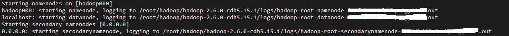
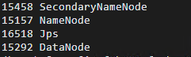

# Hadoop - HDFS

## 概述

HDFS是一个分布式的文件系统。
1. 分布式
2. 使用廉价的机器 commodity hardware
3. 高容错 fault-tolerant
4. 高吞吐 high throughput
5. 支持大文件 large data sets

什么是文件系统？
- 主流的文件系统有两种形式：一种是Windows，一种是Unix/Linux
- 目的：存放文件或者文件夹
- 对外提供服务：创建、修改、删除、查看、移动等等

普通文件系统 v.s. 分布式文件系统
- 一种是单机
- 一种是横跨N个机器

## 设计目标

HDFS的设计，是为了解决以下问题

- Hardware Failure
- Streaming Data Access  流式数据访问
  - The emphasis is on high throughput of data access
  - rather than low latency of data access
- Large Data Sets
- Moving Computation is Cheaper than Moving Data
  - 移动计算比移动数据更划算。前者就是做一个路由，后者有拷贝数据的消耗（网络IO+硬盘IO）。

## 架构

HDFS采用master/slave的架构

- master - NameNode
  - regulates the file system namespace, determines the mapping of blocks to DataNodes
  - regulates access to files by clients, like CRUD
- slave - DataNodes
  - storage

最重要的特性：将一个文件切分为多块，然后复制多份，存放在不同机器上（HDFS默认采用3副本机制，每个blocksize=128M）

~~~
举例：X切分为3块，然后复制了三份

X -> A1, B1, C1
  -> A2, B2, C2
  -> A3, B3, C3

然后放到4个不同的机器上

M1: A1, B2, C3
M2: A2, B3
M3: A3, C1
M4: B1, C2

比如，M1挂了，但是并不会影响我们使用X，因为其它机器上还是可以拿到A，B，C的
~~~

通常情况下，1个单机部署一个组件（NameNode或者DataNode）。

- <https://hadoop.apache.org/docs/r2.9.2/hadoop-project-dist/hadoop-hdfs/HdfsDesign.html>

## 安装 - 前置要求

- Java 1.8+
  - 为什么要配置Java：因为Hadoop中用到了Java
- ssh（配置无密码登陆）
  - 为什么要配置ssh：因为Hadoop起namenode或者datanode，会登录到指定服务器上

Java

~~~
1. 上传jdk并解压
  拷贝本地软件包到服务器：scp jdk-8u91-linux-x64.tar.gz hadoop@192.168.199.233:~/software/
  解压jdk到~/app/：tar -zvxf jdk-8u91-linux-x64.tar.gz -C ~/app/

2. 配置环境变量
  把jdk配置系统环境变量中： ~/.bash_profile
    export JAVA_HOME=/home/hadoop/app/jdk1.8.0_91
    export PATH=$JAVA_HOME/bin:$PATH
  使得配置修改生效：source .bash_profile

3. 验证
  java -version
~~~

ssh

~~~
在这个位置 ~/.ssh

local上存一个private key
	ssh-keygen -t rsa
	-> id_rsa
server上存一个public key
	cat id_rsa.pub >> authorized_keys
	chmod 600 authorized_keys
~~~

## 安装 - 环境搭建

下载：`wget http://archive.cloudera.com/cdh5/cdh/5/hadoop-2.6.0-cdh5.15.1.tar.gz`
	
- Hadoop源：CDH（http://archive.cloudera.com/cdh5/cdh/5/）
- Hadoop使用版本：`hadoop-2.6.0-cdh5.15.1`
- Hive使用版本：`hive-1.1.0-cdh5.15.1`（后缀要与Hadoop一致）

软件包常见目录说明

~~~
bin：hadoop客户端名单
etc/hadoop：hadoop相关的配置文件存放目录
sbin：启动hadoop相关进程的脚本
share：常用例子
~~~

Hadoop(HDFS)安装

- 解压：~/app
- 添加HADOOP_HOME/bin到系统环境变量(edit `.bash_profile` or `.bashrc` or `.profile`)
- 修改Hadoop配置文件(locate here: $HADOOP_HOME/etc/hadoop)

~~~
hadoop-env.sh
	export JAVA_HOME=/home/hadoop/app/jdk1.8.0_91

core-site.xml
	<property>
		<name>fs.defaultFS</name>
		<value>hdfs://hostname:8020</value>
	</property>

hdfs-site.xml
	<property>
		<name>dfs.replication</name>
		<value>1</value>
	</property>

	<property> 
    		<name>dfs.secondary.http.address</name>
    		<value>hostname:50090</value>
	</property>

	<property>
		<name>hadoop.tmp.dir</name>
		<value>/home/hadoop/app/tmp</value>
	</property>

slaves
	hostname
~~~

## 实战

启动HDFS：

- 第一次执行的时候一定要格式化文件系统，不要重复执行: `hdfs namenode -format` 
  - result -> `20/08/31 14:13:24 INFO common.Storage: Storage directory /home/hadoop/app/tmp/dfs/name has been successfully formatted.`
- 启动：`$HADOOP_HOME/sbin/start-dfs.sh`
- 停止：`$HADOOP_HOME/sbin/stop-dfs.sh`

注：`start/stop-dfs.sh`内部是调用了多个`hadoop-daemons.sh`

~~~
hadoop-daemons.sh start namenode
hadoop-daemons.sh start datanode
hadoop-daemons.sh start secondarynamenode
~~~

验证1：`jps`查看进程

~~~
[hadoop@hadoop000 sbin]$ jps
60002 DataNode
60171 SecondaryNameNode
59870 NameNode
~~~

验证2：浏览器打开Hadoop页面

~~~
http://192.168.199.233:50070
~~~

如果发现jps ok，但是浏览器不OK，十有八九是防火墙问题

- 查看防火墙状态：sudo firewall-cmd --state
- 关闭防火墙: sudo systemctl stop firewalld.service

## 命令行操作

It is shell-like.

常用命令：

~~~
hadoop fs -ls /
hadoop fs -put
hadoop fs -copyFromLocal
hadoop fs -moveFromLocal
hadoop fs -cat
hadoop fs -text
hadoop fs -get
hadoop fs -mkdir 
hadoop fs -mv
hadoop fs -getmerge
hadoop fs -rm
hadoop fs -rmdir
hadoop fs -rm -r
~~~

## 参考

- <https://hadoop.apache.org/docs/stable/hadoop-project-dist/hadoop-common/SingleCluster.html>

