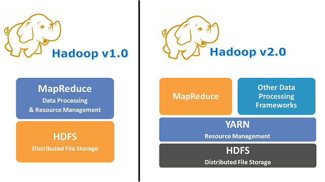
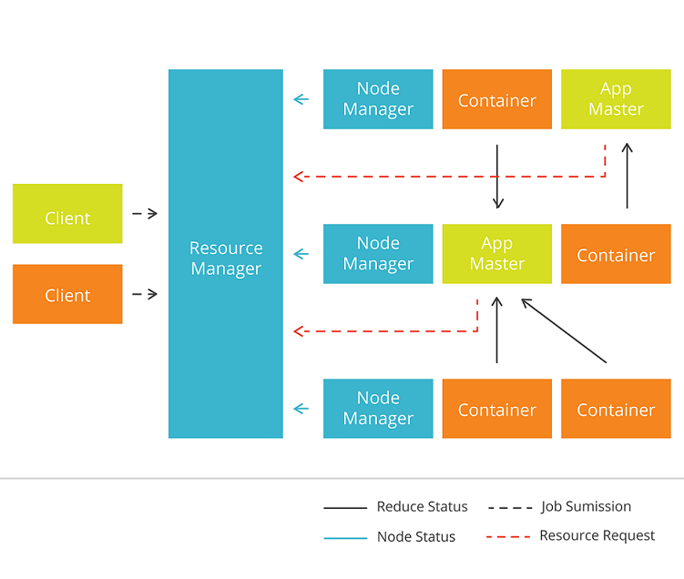
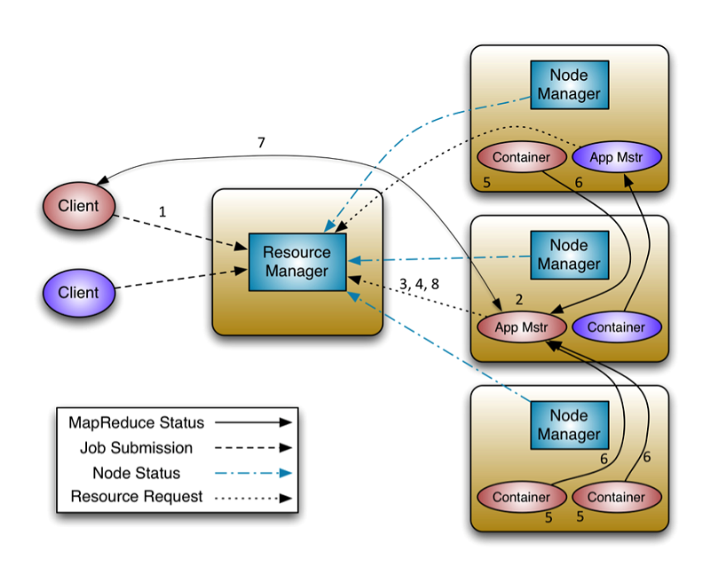
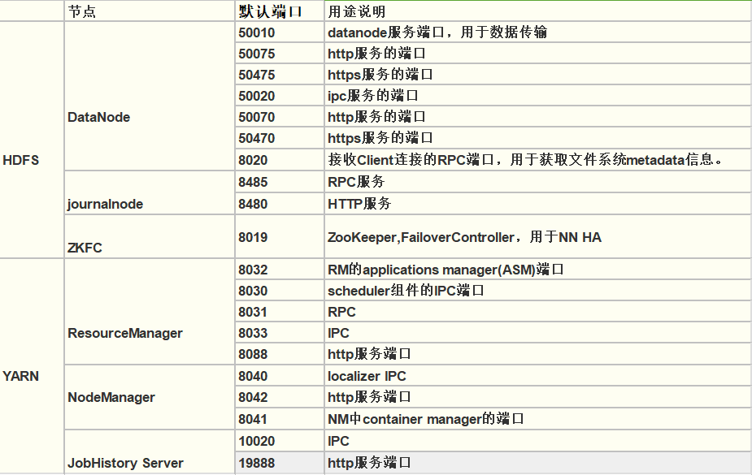

# Hadoop - Yarn

## 起源

Apache Yarn - Yet Another Resource Negotiator

Hadoop Map Reduce 1 还不是很成熟，有各种各样的问题。

Hadoop Map Reduce 2 这个版本引出了Yarn。

它的核心思想是：统一管理整个集群的资源调度，从而提高资源利用率。

此外，还有以下特点：
- 支持其它计算框架，比如Spark
- 扩展性好，可以弹性伸缩
- 支持高可用

## 架构

总体上是 master / slave 结构，在整个资源管理框架中， ResourceManager 为 master， NodeManager 是 slave。

- ResourceManager
- NodeManager
- ApplicationMaster
- Container

## ResourceManager

RM是一个全局的资源管理器，集群只有一个，负责整个系统（所有节点）的资源管理和监控。
- 处理 Client 请求
- 启动/监控 ApplicationMaster
- 监控 NodeManager
- 资源调度

它主要由两个组件构成：调度器 Scheduler 和应用程序管理器 Applications Manager, ASM 。

Scheduler
- FIFO Scheduler：先进先出，不考虑作业优先级和范围，适合低负载集群
- Capacity Scheduler：将资源分为多个队列，允许共享集群，有保证每个队列最小资源的使用
- Fair Scheduler：公平的将资源分给应用的方式，使得所有应用在平均情况下随着时间得到相同的资源份额

ApplicationManager
- 主要负责接收job的提交请求，为应用分配第一个Container来运行ApplicationMaster
- 还有就是负责监控ApplicationMaster，在遇到失败时重启ApplicationMaster运行的Container

## ApplicationMaster

相当于这个Application的监护人和管理者。负责监控、管理这个Application的在集群上的运行。一个Application对应一个ApplicationMaster。

## NodeManager

管理这个 Node 节点的资源分配和监控运行情况。

## Container

Container 是 YARN 中的**资源抽象**。

它封装了某个节点上的多维度资源，如内存、CPU、磁盘、网络等。当 AM 向 RM 申请资源时，RM 为 AM 返回的资源便是用 Container 表示的。
YARN 会为每个任务分配一个 Container，且该任务只能使用该 Container 中描述的资源。

## 流程

启动 AM

~~~
1. Client -> RM，提交应用并请求一个 AM 实例
2. RM 找到一个 NM，（启动 Container，）并启动 AM
3. AM 向 RM 注册
~~~

启动 Container

~~~
4. AM 向 RM 发送 resource-request 请求
5. 获得资源后，AM 向 NM 发送信息，启动 Container
~~~

工作中

~~~
6. Container <-> AM，应用程序在 Container 中，把运行状态等信息报告给AM
7. Client <-> AM，交流应用的运行状态等信息
~~~

结束

~~~
8. 应用跑完之后， AM 向 RM 取消注册然后关闭，归还 Container
~~~

## 实战

### 配置

`etc/hadoop/mapred-site.xml`

~~~ xml
<configuration>
    <property>
        <name>mapreduce.framework.name</name>
        <value>yarn</value>
    </property>
</configuration>
~~~

`etc/hadoop/yarn-site.xml`

~~~ xml
<configuration>
    <property>
        <name>yarn.nodemanager.aux-services</name>
        <value>mapreduce_shuffle</value>
    </property>
</configuration>
~~~

### 启停

ResourceManager + NodeManager

~~~
sbin/start-yarn.sh
sbin/stop-yarn.sh
~~~

### 提交作业

~~~
hadoop jar example.jar wordccount /input/hello.txt /output/helloCount.txt
~~~

## 端口号

## 参考

- 文档 <https://hadoop.apache.org/docs/current/hadoop-yarn/hadoop-yarn-site/YARN.html>
- YARN 详细解析 <https://www.jianshu.com/p/f50e85bdb9ce>
