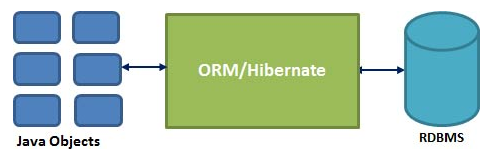
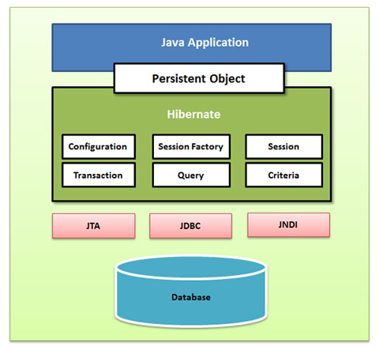
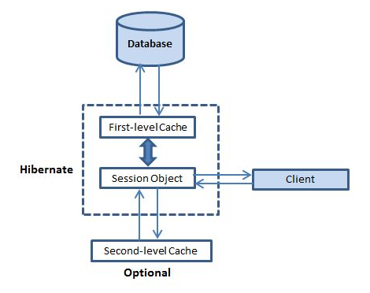

# Hibernate

## ORM

Object Relational Mapping

converting data between **relational databases** and **object oriented programming languages** such as Java



## Advantages

- takes care of mapping Java classes to database tables using XML files and without writing any line of code
- Provides simple APIs for storing and retrieving Java objects directly to and from the database.
- Minimize database access with smart fetching strategies.

## Architecture

Hibernate.Properties(hibernate.cfg.xml) -> link hibernate to database

XML Mapping(Entity.xml or using Annotation) -> link object to table




## Steps to use Hibernate

- pre
  - create persisted classes
  - create database tables
- core
  - jar & import
  - create hibernate.cfg.xml
  - mapping (xml / annotation)
  - create transaction class

**Persistent Class**

Java classes whose objects or instances will be stored in database tables are called persistent classes in Hibernate.

- All Java classes that will be persisted need a default constructor.
- All classes should contain an ID in order to allow easy identification of your objects within Hibernate and the database. This property maps to the primary key column of a database table.
- All attributes that will be persisted should be declared private and have getXXX and setXXX methods defined in the JavaBean style.

e.g. <code>Employee.java</code>

~~~ java
public class Employee {
   private int id;
   private String firstName; 

   public Employee() {}
   public Employee(String fname) {
      this.firstName = fname;
   }
   public int getId() {
      return id;
   }
   public void setId( int id ) {
      this.id = id;
   }
   public String getFirstName() {
      return firstName;
   }
   public void setFirstName( String first_name ) {
      this.firstName = first_name;
   }
}
~~~

**Hibernate Configuration**

link hibernate to database

e.g. `hibernate.cfg.xml`

~~~ xml
<?xml version="1.0" encoding="utf-8"?>
<!DOCTYPE hibernate-configuration SYSTEM 
"http://www.hibernate.org/dtd/hibernate-configuration-3.0.dtd">

<hibernate-configuration>
   <session-factory>
	   
	   <property name="hibernate.dialect">
		  org.hibernate.dialect.MySQLDialect
	   </property>
	   <property name="hibernate.connection.driver_class">
		  com.mysql.jdbc.Driver
	   </property>
	   <!-- Assume test is the database name -->
	   <property name="hibernate.connection.url">
		  jdbc:mysql://localhost/test
	   </property>
	   <property name="hibernate.connection.username">
		  root
	   </property>
	   <property name="hibernate.connection.password">
		  root123
	   </property>

	   <!-- List of XML mapping files -->
	   <mapping resource="Employee.hbm.xml"/>
	   
	</session-factory>
</hibernate-configuration>
~~~

**Mapping Files (xml/annotation)**

map persistent class to database table

e.g. `employee.xml`

~~~ xml
<?xml version="1.0" encoding="utf-8"?>
<!DOCTYPE hibernate-mapping PUBLIC 
 "-//Hibernate/Hibernate Mapping DTD//EN"
 "http://www.hibernate.org/dtd/hibernate-mapping-3.0.dtd"> 

<hibernate-mapping>
   <class name="Employee" table="EMPLOYEE">
      <meta attribute="class-description">
         This class contains the employee detail. 
      </meta>
      <id name="id" type="int" column="id">
         <generator class="native"/>
      </id>
      <property name="firstName" column="first_name" type="string"/>
      <property name="lastName" column="last_name" type="string"/>
      <property name="salary" column="salary" type="int"/>
   </class>
</hibernate-mapping>
~~~

**Transanction Class**

~~~ java
Configuration cfg = new Configuration();
cfg.configure("hibernate.cfg.xml");

SessionFactory factory = cfg.buildSessionFactory();
Session session=factory.openSession();
Transaction t=session.beginTransaction();

// do something ...

t.commit();
session.close();
~~~

## O/R Mapping

**Collection Mapping**

- java.util.Set -> `<set>`
- java.util.List -> `<list>`
- java.util.Map -> `<map>`
- Arrays -> `<array>` or `<primitive-array>`

**Association Mapping**
- many-to-one
- one-to-one
- one-to-many
  - using `<set>`
- many-to-many

**Component Mapping**

mapping a component of an object

e.g.

~~~ java
public class Employee {  
	private int id;  
	private String name;  
	private Address address; // has-a relationship
	...
}
~~~

~~~ xml
<class name="com.XXX.Employee" table="emp">  
	<id name="id">
		<generator class="increment"></generator>  
	</id>
	
	<property name="name"></property>  
	  
	<component name="address" class="com.XXX.Address">  
		<property name="city"></property>  
		<property name="country"></property>  
		<property name="pincode"></property>  
	</component>
</class>  
~~~

## Annotations

**@Entity**

specify the entity class

**@Table**

specify the table used in the database

attributes: name

**@Id & @GenarateValue**

specify the primary key

by default, @id will automatically determine the most appropriate primary key generation strategy
but you can override this by applying the @GeneratedValue annotation which takes two parameters strategy and generator

**@Column**

attributes

- name
- length
- nullable
- unique

```
import javax.persistence.*;

@Entity
@Table(name = "EMPLOYEE")
public class Employee {
     @Id @GeneratedValue
     @Column(name = "id")
     private int id;

     @Column(name = "first_name")
     private String firstName;
     ...
}
```

**Logger**

in the hibernate configuration file

`<property name="show_sql">true</property>`

## HQL

Hibernate Query Language, HQL works with persistent objects and their properties.

**FROM**

load a complete persistent object

```
String hql = "FROM Employee";
Query query = session.createQuery(hql);
List results = query.list();
```

**AS**

assign aliases to the classes in your HQL queries

```
String hql = "FROM Employee AS E";

```

**SELECT**

obtain properties of objects

```
String hql = "SELECT E.firstName FROM Employee E";

```

**WHERE**

narrow the specific objects

```
String hql = "FROM Employee E WHERE E.id = 10";
```

**ORDER BY**

set either ascending (ASC) or descending (DESC)

```
String hql = "FROM Employee E WHERE E.id > 10 ORDER BY E.salary DESC";
```

**GROUP BY**

use the result to include an aggregate value

```
String hql = "SELECT SUM(E.salary), E.firtName FROM Employee E " +
"GROUP BY E.firstName";
```

**Using Named Parameter**

accept input from the user easy

```
String hql = "FROM Employee E WHERE E.id = :employee_id";
Query query = session.createQuery(hql);
query.setParameter("employee_id",10);
List results = query.list();
```

**UPDATE**

update properties of objects

```
String hql = "UPDATE Employee set salary = :salary "  + 
             "WHERE id = :employee_id";
Query query = session.createQuery(hql);
query.setParameter("salary", 1000);
query.setParameter("employee_id", 10);
int result = query.executeUpdate();
System.out.println("Rows affected: " + result);
```

**DELETE**

```
String hql = "DELETE FROM Employee "  + 
             "WHERE id = :employee_id";
```

**INSERT**

```
String hql = "INSERT INTO Employee(firstName, lastName, salary)"  + "SELECT firstName, lastName, salary FROM old_employee";
```

**Aggregate Methods**

- avg()
- count()
- max()
- min()
- sum()

**Pagination**

- Query setFirstResult(int startPosition)
- Query setMaxResults(int maxResult)

## Caching



**First Level**

The first-level cache is the **Session** cache and is a mandatory cache through which all requests must pass.

**Second Level**

The second-level cache can be configured on a per-class and per-collection basis and mainly responsible for caching objects across sessions. It is **Session Factory** cache.

Step 1: decide which concurrency strategy to use

```
<hibernate-mapping>
   <class name="Employee" table="EMPLOYEE">
      ...
      <cache usage="read-write"/>
     ...
   </class>
</hibernate-mapping>
```

Step 2: configure cache expiration and physical cache attributes using the cache provider

Cache provider

- EHCache
- OSCache
- warmCache
- JBoss Cache

e.g. choose EHCache as our second-level cache provider

```
<hibernate-configuration>
    <session-factory>
        <property name="hibernate.cache.provider_class">
         org.hibernate.cache.EhCacheProvider
        </property>
    </session-factory>
</hibernate-configuration>
```

e.g. specify the properties of the cache regions, like the code below

(EHCache has its own configuration file, ehcache.xml, which should be in the CLASSPATH of the application.)

```
<diskStore path="java.io.tmpdir"/>
<defaultCache
maxElementsInMemory="1000"
eternal="false"
timeToIdleSeconds="120"
timeToLiveSeconds="120"
overflowToDisk="true"
/>

<cache name="Employee"
maxElementsInMemory="500"
eternal="true"
timeToIdleSeconds="0"
timeToLiveSeconds="0"
overflowToDisk="false"
/>
```

use `Big Memory Go(Ehcache)` in hibernate as second level cache

- Download and install BigMemory Go into your project
- Configure BigMemory Go as a cache provider in your project's Hibernate configuration.
- Configure second-level caching in your project's Hibernate configuration.
- Configure Hibernate caching for each entity, collection, or query you wish to cache.
- Configure the `ehcache.xml` file as necessary for each entity, collection, or query configured for caching.

## Load Type

The fetch type essentially decides whether or not to load all of the relationships of a particular object/table as soon as the object/table is initially fetched.

- (fetch=FetchType.EAGER): load it in the first place
- (fetch=FetchType.LAZY): load it only when the object is needed

by default, primitive values are fetched EAGER, collection objects are fetched LAZY.

e.g.

```
  import javax.persistence.FetchType;
  //....
  @OneToOne(fetch=FetchType.EAGER)
  @JoinColumn(name="user_profile_id")
  private Profile getUserProfile()
  {
    return userProfile;
  }
```
see more here: http://stackoverflow.com/questions/2990799/difference-between-fetchtype-lazy-and-eager-in-java-persistence

## Connection Pooling

Hibernate comes with internal connection pool, but not suitable for production use. 
It's recommended to use a third party connection pool such as C3P0.

e.g. hibernate.cfg.xml

```
hibernate.connection.driver_class = org.postgresql.Driver
hibernate.connection.url = jdbc:postgresql://localhost/mydatabase
hibernate.connection.username = myuser
hibernate.connection.password = secret

hibernate.c3p0.min_size=5
hibernate.c3p0.max_size=20
hibernate.c3p0.timeout=1800
hibernate.c3p0.max_statements=50

hibernate.dialect = org.hibernate.dialect.PostgreSQLDialect
```

- https://docs.jboss.org/hibernate/orm/3.3/reference/en-US/html/session-configuration.html
- http://www.mkyong.com/hibernate/how-to-configure-the-c3p0-connection-pool-in-hibernate/

## Misc

hibernate query.list() does not return null, instead it returns an empty list

## Links

- [viralpatel hibernate tutorial](http://viralpatel.net/blogs/introduction-to-hibernate-framework-architecture/)
- [mkyong hibernate tutorial](http://www.mkyong.com/tutorials/hibernate-tutorials/)
