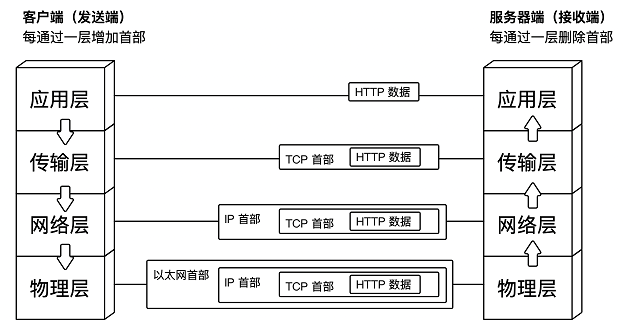
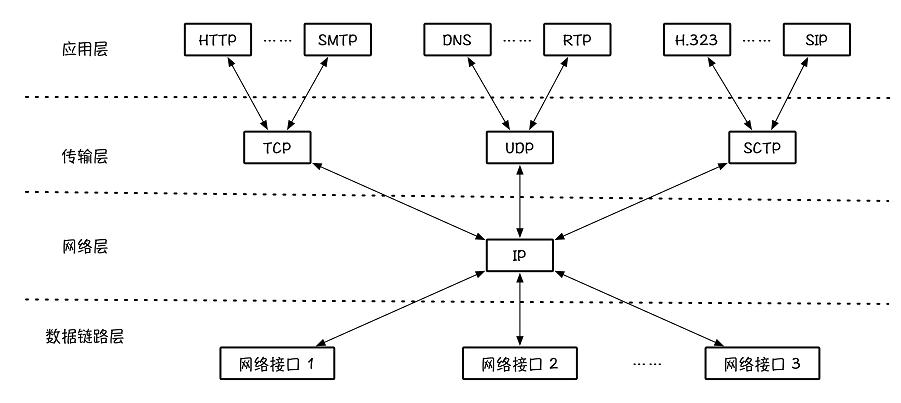

# Web - Http

## HTTP协议

`HyperText Transfer Protocol`，超文本传输协议。处于应用层。

HTTP描述的是：客户端（比如，浏览器）和服务器（比如，淘宝网站）是以什么**文本格式**进行通信的。

下面是一个典型的例子：

Client request

~~~
GET / HTTP/1.1
Host: www.example.com
~~~

Server response

~~~
HTTP/1.1 200 OK
Date: Mon, 23 May 2005 22:38:34 GMT
Content-Type: text/html; charset=UTF-8
Content-Length: 155
Last-Modified: Wed, 08 Jan 2003 23:11:55 GMT
Server: Apache/1.3.3.7 (Unix) (Red-Hat/Linux)
ETag: "3f80f-1b6-3e1cb03b"
Accept-Ranges: bytes
Connection: close

<html>
  <head>
    <title>An Example Page</title>
  </head>
  <body>
    
Hello World, this is a very simple HTML document.

  </body>
</html>
~~~

解读：比如我作为Client要向Server发一个请求：我想看淘宝网的主页。怎么写？
把这句话"I want to see Taobao's main page."直接发给服务器可以吗？应该是不行的吧。
正确的做法是：遵循HTTP协议的格式，按照上面的例子来写，这样服务器端收到了才能读懂。

## TCP协议

`Transmission Control Protocol` 一个可靠的数据传输协议。处于传输层。

### 三次握手

为什么可靠？**三次握手**保证数据送达。

~~~
A -> B 发送一个带SYN的数据包：你在吗？
B -> A 发送一个带SYN/ACK的数据包：我在呀。
A -> B 发送一个ACK的数据包：好的，收到。
~~~

总结：三次握手的本质其实就是，测试管道是否通畅。

- 通过1，2步，证明 A->B 的管道通畅
- 通过第3步，证明 B->A 的管道通畅

问：假设有10个包，前5个都成功传输了，但是中途网络断了，后5个无法送达，怎么办？

答：如果这10个包都是独立的个体，那没有关系，后面的没有了就没有了，不互相影响。
如果10个包是一个整体，那一般第1个包会指明，我有哪些组成部分。只有当所有包都成功传输之后，才能正确解析，否则全部丢弃。

### 四次握手

四次握手，关闭连接

- 主动结束方：你好，我的数据发送完毕了，我要进入准备断开的状态了。（此时它虽然不再发送数据了，但是可以接受数据）
  - Client发送一个FIN，用来关闭Client到Server的数据传送，Client进入FIN_WAIT_1状态
- 另一方：我知道了，我还没有发送完毕的，你等着吧。
  - Server收到FIN后，发送一个ACK给Client，确认序号为收到序号+1，Server进入CLOSE_WAIT状态
- 另一方：我也发送完毕了，可以断开链接了。（此时它也进入准备断开的状态）
  - Server发送一个FIN，用来关闭Server到Client的数据传送，Server进入LAST_ACK状态
- 主动结束方：好的，那断开吧。
  - Client收到FIN后，Client进入TIME_WAIT状态，接着发送一个ACK给Server，确认序号为收到序号+1，Server进入CLOSED状态

SYN攻击：攻击客户端在短时间内伪造大量不存在的IP地址，向服务器不断地发送SYN包，服务器回复确认包，并等待客户的确认。由于源地址是不存在的，服务器需要不断的重发直至超时，这些伪造的SYN包将长时间占用未连接队列，正常的SYN请求被丢弃，导致目标系统运行缓慢，严重者会引起网络堵塞甚至系统瘫痪

防御SYN攻击方法
- 缩短超时时间
- 过滤网关防护

## IP协议

`Internet Protocol`，网际协议。处于网络层，用于传送数据包。
它的作用是：通过IP地址和MAC地址将数据包从地址A传送到地址B。

## 网络分层模型

`TCP/IP` 协议族按层次分为 4 层：应用层，传输层，网络层，物理层（有的时候也分为链路层+物理层）。

- 应用层 (Application Layer)
  - 作用：规定了不同应用的数据格式，如网页，文件传输，电子邮件等
  - 格式：HTTP/FTP/SMTP
  - 连接：N/A
- 传输层 (Transport Layer)
  - 作用：区分不同应用可用的数据接口
  - 格式：UDP or TCP
  - 连接：port to port
- 网络层 (Internet Layer)
  - 作用：区分不同的计算机是否属于同一个子网络
  - 传播：IP协议
  - 连接：IP address to IP address
- 链路层 (Link Layer)
  - 作用：确定0/1分组方式
  - 传播：以太网协议(Ethernet)，给出目标的Mac地址，在子网络内广播
  - 连接：Mac address to Mac address
- 物理层 (Physical Layer)
  - 作用：传输0/1信号
  - 传播：用电缆，光缆，无线电波等方式
  - 连接：电脑与电脑

`OSI` 则分为 7 层：应用层、表示层、会话层、运输层、网络层、数据链路层和物理层。

实际记住`TCP/IP`的4层的模型就可以了，现在主流的网络传输协议都是按照这个来的。

其实，这个分层模型主要做了这件事：数据从一个层移动到另一层时，给它加一个`tag`，方便接收方识别和解析。
- HTTP把data做了一次封装，加了URL，IP，端口号，浏览器，语言等信息，在浏览器和服务器之间传输
- TCP在HTTP基础上做了一次封装，加了端口号，具有一定可靠性，保证数据被收到
- IP在TCP基础上做了一次封装，用来在IP地址之间通信，传输没有可靠性
- Ethernet在IP基础上做了一次封装，用来在Mac Address之间通信

总结：

- 应用层：首先，我通过HTTP协议，将要说的话写成一个服务器可以识别的格式。
- 传输层：然后，TCP协议三次握手，保证数据传输的可靠性。
- 网络层：然后，IP协议，保证这个数据能从机器A传到机器B。
- 物理层：最后，Ethernet协议，可以理解为是A到B的中间那根网线。

### TCP/IP协议族

TCP/IP协议族常见的协议包括：TCP、IP、HTTP、FDDI、FTP、DNS、UDP、SNMP等。

分层模型的优点是：改动方便。如上图，我可以不用HTTP+TCP，而是使用DNS+UDP或者其它组合，以应对不同的使用场景。

举例：上网当然是用HTTP协议啦。但是打网络游戏，用什么模型呢？肯定不是HTTP吧。

## DNS协议

DNS是域名Domain和IP地址相互映射的一个分布式数据库

- 先去本地DNS服务器（缓存）找，若没找到
- 再去DNS根服务器找，若没找到
- 再去顶级DNS服务器找，若没找到
- 再去下属区域的DNS服务器找，若没找到则返回错误提示

注：本地DNS服务器一般指电脑IPv4或者IPv6设置中填的那个DNS地址对应的服务器

参考 -> [域名解析流程图](https://baike.baidu.com/item/域名解析)

## 网络参数设置

- IP地址
  - 两部分组成：网络地址+主机地址
- 子网掩码
  - 将子网掩码和IP地址做AND运算，可以得出某机器的网络地址，从而判断两个机器是否位于同一网络下
- 网关
  - 如果两台电脑不在同一个子网络，就无法知道对方的MAC地址，必须通过网关（gateway）转发
  - 如果两台电脑在同一网络，可以直接传输，不需要经过网关/路由。

## 一次网络请求的流程

- 输入URL，查询域名服务器（DNS）找到对应的IP地址
- 主机IP端口对目标IP端口发起握手，并建立TCP连接
- 向服务器发送数据
- 服务器解析，处理并返回
- 浏览器解析HTML

参考 -> [一次网络请求的流程](http://www.jianshu.com/p/f184b8cee0a4)

## Cookie

概述：Cookie + Session，用来**跟踪用户的整个会话**。
Cookie通过在客户端记录信息确定用户身份，Session通过在服务器记录确定用户身份。

Cookie实际上是一小段的文本信息。
客户端请求服务器，如果服务器需要记录该用户状态，就使用response向客户端浏览器颁发一个Cookie。
客户端浏览器会把Cookie保存起来。当浏览器再次请求该网站时，浏览器把请求的网址连同该Cookie一同发送给服务器。
服务器检查该Cookie，以此来辨别用户状态。
服务器还可以根据需要修改Cookie的内容。

比如：用户A访问某网站B，B可能每个小时收到成千上万条请求，它怎么知道哪几条是用户A发来的？进而个性化定制内容（广告）呢？
一个方式是用Cookie，A在发给B的请求中，使用`SetCookie`，表明：我是A+一串约定好的密钥字符串。
这样B收到之后，就知道这个信息一定来自于真正的A。

## Session

HttpSession 是服务端的技术。
服务器会为每一个用户，创建一个独立的HttpSession。

~~~
当用户第一次访问Servlet时,服务器端会给用户创建一个独立的Session
并且生成一个SessionID,这个SessionID在响应浏览器的时候会被装进cookie中,从而被保存到浏览器中
当用户再一次访问Servlet时,请求中会携带着cookie中的SessionID去访问
服务器会根据这个SessionID去查看是否有对应的Session对象
有就拿出来使用;没有就创建一个Session(相当于用户第一次访问)
~~~

Session相当于程序在服务器上建立的一份客户档案，客户来访时只需要检查客户的档案表就可以了。

问：客户端不支持Cookie，怎么办？

答：URL重写，把Cookie写进URL地址中。

### 分布式环境Session一致性问题

问题：服务器集群一共有10台机器，用户M登录时，请求经过负载均衡被分配到服务器A，建立了Session_M。
下次，如果请求被导向服务器B怎么办？用户还需要再登录一遍吗？

解决：

- Session复制，把Server_A的Session_M复制到Server_B上。（缺点是当集群很大，或者Session数量很多的时候，效率低）
- Session粘滞（Sticky Sessions），使用某一特定的负载均衡策略，保证同一 IP 的请求都落在同一台 Server 上。
- Session保存在一个公共的 内存服务器/数据库 中

参考 -> 4 种分布式一致性 Session 实现方式 <https://www.cnblogs.com/goodAndyxublog/p/13327412.html>

## HTTP 进阶

### HTTP方法

- `GET`（获取资源）：请求访问已被 URI 标识的资源。响应返回经服务器解析后的内容
- `POST`（传输实体主题）：GET 和 POST 都可以传输实体的主题，但一般使用 POST 方法来传输。区别在意 POST 的主要目的并不是获取响应的主体内容。
- `PUT`（传输文件）：用来传输文件。将文件内容放到请求报文的主题之中，然后放到请求的 URI 中
- `HEAD`（获得报文首部）：HEAD 方法和 GET 方法一样，但不返回报文主体的部分。用于确认 URI 是否有效及更新资源的时间等。
- `DELETED`（删除文件）：用来删除文件，与 PUT 方法相反。DELETED 根据请求删除 URI 内指定的资源
- `OPTIONS`（询问支持的方法）：查询根据请求 URI 指定的资源支持方法
- `TRACE`（路径追踪）：让 Web 服务器端将之前的请求返回个客户端的方法
- `CONNECT`（用隧道协议连接代理）：与代理服务器通信时建立隧道，使用 SSL 和 TLS 协议把加密后的通信内容经网络隧道进行传输。

GET 和 POST 的区别是什么？
- 从服务器获取信息一般使用 GET，想服务器发送信息一般用 POST。
- GET 和 POST 数据提交方式不同，GET 通过在 URL 请求后面增加 filed=value 的封装形式来进行；POST 则利用协议 BODY 来进行数据的封装。
- GET 传输数据量比较小，效率也不高；而 POST 可以传输比较大的数据量。
- GET 不安全，可以被外部看见，造成信息泄露的风险，POST 相对来说安全一些。

POST v.s. PUT
- use POST to create, use PUT to update
- PUT is idempotent(same request repeating is OK), POST is not
- both unsafe

### HTTP状态码

1XX Informational（信息性状态码）： 服务器正在处理当前的请求。

2XX Success（成功状态码）：请求被服务器正确接收，并正确执行。

3XX Redirection（重定向状态码）：需要再次操作，才能完成整个访问操作。

4XX Client Error（客户端错误状态码）：客户端的请求出现问题，服务端无法响应（例如，访问不存在的资源）。

5XX Server Error（服务器错误状态码）：服务器内部处理访问请求的时候出现异常。

### HTTP 2.0

HTTP 2.0 与 HTTP 1.1 的区别
- HTTP 2.0 没有采用文本格式，采用的是二进制格式。
- HTTP 2.0 采用的是完全多路复用机制，而非有序并阻塞的。
- HTTP 2.0 将报头进行压缩，降低了成本。
- HTTP 2.0 服务器主动将响应“推送”到客户端的缓存里面

### HTTPS

HTTP的缺点

- 明文形式通信，**未加密**，极可能被盗取数据。
- 没有验证**访问者的合法身份**，会遇到被伪装欺骗可能。
- 报文**完整性**无法进行验证，所以内容信息会被篡改的可能。

HTTP + SSL （加密 + 认证 + 完整性保护） = HTTPS

HTTPS通过公钥（Public Key）+私钥（Private Key）的机制保证安全性。

## 网络安全

### SQL Injection

SQL注入

攻击者通过将破坏性 SQL 代码进行数据库查询，使攻击者能控制数据库资源。
比如登录界面，输入用户名的框框，输入`"delete * from user"`会发生什么？

防御：
- 不要使用动态 SQL，使用完整的语句和参数化方式来查询。
- 合理设置数据库的权限。
- 禁止直接向用户显示数据库错误。
- 对访问数据库的 Web 服务，使用 Web 应用程序防火墙。

### XSS

Cross Site Scripting 跨站脚本攻击

在HTML页面中注入恶意代码，比如，攻击者发送以下链接给受害者

~~~
http://www.attack.com/search.asp?input=
~~~~

受害者点击后，就会访问攻击者建立网站，并提交当前浏览器的Cookie。然后，攻击者就可以冒充受害者了。

防御：
- 在信息提交或者 url 参数传递前，对需要的参数进行过滤
- 过滤用户输入，检查用户输入的内容中是否有非法内容。如 <>（尖括号）、""（引号）、''（单引号）

### CSRF

Cross-site request forgery 跨站请求伪造

举例：用户登录了安全的某银行网站A，浏览器保存了Cookie_A。
用户访问了木马网站B，然后点点点，在这个过程中，网站B使用Cookie_A假装用户，发送伪造的请求，在网站A上进行了一笔转账操作。

防御：
- 验证码与二次验证（转账操作时要再输一遍手机验证码）
- 对请求的 referer 进行检测（从技术角度来说，网站B伪造的访问网站A的请求，其实是从网站B重新定向到网站A的，一般银行不会允许类似的跳转）
- 添加随机 token 校验

## 链接

- HTTP四十问 <https://gitbook.cn/books/5df64c51981db64f3a4580d1/index.html>
- [互联网协议入门1](http://www.ruanyifeng.com/blog/2012/05/internet_protocol_suite_part_i.html)
- [互联网协议入门2](http://www.ruanyifeng.com/blog/2012/06/internet_protocol_suite_part_ii.html)
- [网络协议系统图解](https://zh.wikipedia.org/wiki/File:IP_stack_connections.svg)
- [UDP Frame组成](https://zh.wikipedia.org/wiki/File:UDP_encapsulation.svg)
- [你应该知道的计算机网络知识](http://blog.jobbole.com/105402)
- [TCP协议详解](http://www.jianshu.com/p/ef892323e68f)
- [网络请求过程扫盲](http://www.jianshu.com/p/8a40f99da882)
