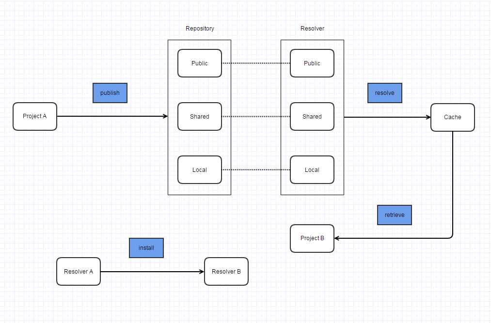

# Ivy

Ivy is a tool for managing (recording, tracking, resolving and reporting) project dependencies.

## Setup

Download
<br>
unpack zip file -> copy the jar file into ANT_HOME/lib

Run
<br>
If you use ant 1.6.0 or superior, you can then simply:
go to the `src/example/hello-ivy` dir and run `ant`
(if the build is successful, you have successfully installed Ivy!)

## Repository

- Local
- Shared
- Public

## Resolver

Function

- decide network or file-system protocol to access the repository
- locate and fetch the Ivy file/artifacts which may follow different layout/naming in different repositories

There are two types of resolvers:

- standard – these resolvers are used by Ivy for actual resolve task
- composite – these resolvers delegate the work to standard resolvers

Default Resolvers:

```
local	standard	Filesystem resolver points to $HOME/.ivy2/local
shared	standard	Filesystem resolver points to $HOME/.ivy2/shared
public	standard	Ibiblio resolver points http://repo1.maven.org/maven2
main	composite	Chain and Dual resolver to shared and public
default	composite	Chain resolver to local and main
```

Searching Priority:

- first tries the local
- on failure looks for shared
- finally public

## Ant-Ivy Tasks

- Resolve: Resolves the dependencies described in ivy.xml and places the resolved dependencies in ivy cache.
- Retrieve: Copies the resolved dependencies from cache to a specified directory.
- Install: Installs a module to a specified repository.
- Publish: Publish a module to a repository.

Workflow



- <http://www.codetab.org/apache-ivy-tutorial/apache-ivy-ant-tasks/>
- <http://ant.apache.org/ivy/history/latest-milestone/tutorial/defaultconf.html>

## Dependency Management

Ivy uses the maven 2 repository by default.

- One Project, default local repository (download from m2)
- One Project, local repository (external jars)
- One Project, local (jars) + public repository (cloud repo)
- Multiple Project dependency

## Using Ivy Module Configuration

It allows you to group artifacts and give the group a meaning.

For example, you have a project with 2 parts: A and B. Alice have another project with 3 parts: Alice-X, Alice-Y, Alice-Z.

- Alice-X just needs A.
- Alice-Y just needs B.
- Alice-Z needs A and B.

So you create a module configuration: 

- only-a
- only-b
- both-a-and-b. 

e.g. your project `ivy.xml`

``` xml
<ivy-module version="1.0">
    <info organisation="org.apache" module="my-project"/>
    <configurations>
    	<conf name="only-a" description="only provide part a"/>
    	<conf name="only-b" description="only provide part b"/>
    	<conf name="both-a-and-b" extends="only-a; only-b" description="provide both part a and b"/>
    </configurations>
    <publications>
    	<artifact name="my-project-part-a" type="jar"  conf="only-a" ext="jar"/>
    	<artifact name="my-project-part-b" type="jar"  conf="only-b" ext="jar"/> 	
    </publications>
    <dependencies>
        <dependency org="junit" name="junit" rev="3.8"/>
    </dependencies>
</ivy-module>
```

When Alice pull dependencies from your project, she can specify which part they want.

- Alice-X want only-a
- Alice-Y want only-b
- Alice-Z want both-a-and-b

e.g. Alice's project `ivy.xml`

``` xml
<ivy-module version="1.0">
    <info organisation="org.apache" module="alice-app"/>
    
    <configurations>
       	<conf name="alice-x" visibility="private" description="only need A" />
    	<conf name="alice-y" description="only need B" />
    	<conf name="alice-z" description="need A and B" />    
    </configurations>
    
    <dependencies>
        <dependency org="org.apache" name="filter-framework" rev="latest.integration" 
            conf="alice-x -> only-a; alice-y -> only-b; alice-z -> both-a-and-b"/>
    </dependencies>
</ivy-module>
```

<http://ant.apache.org/ivy/history/latest-milestone/tutorial/conf.html>

## Links

- <http://www.codetab.org/apache-ivy-tutorial/>
- <http://ant.apache.org/ivy/history/latest-milestone/tutorial.html>
