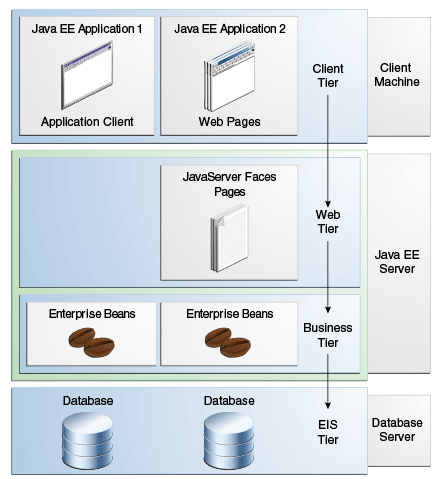
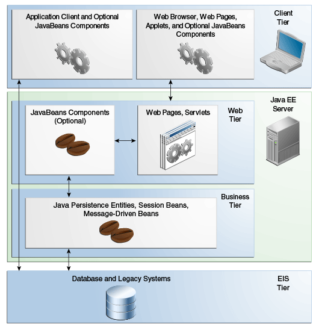
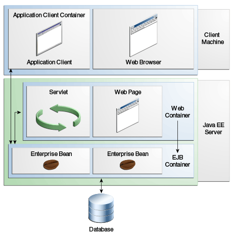

# J2EE

## Distributed Multitiered Applications (Architecture)

Web Pages(HTML) -> JSP, Servlet(Spring MVC) -> EJB(Spring Bean) -> JDBC(Hibernate)

## Java EE Components

- Application clients and applets are **(client) components** that run on the client.
- Java Servlet, JavaServer Faces, and JavaServer Pages (JSP) technology components are **web components** that run on the server.
- EJB components (enterprise beans) are **business components** that run on the server.

## Java EE Container

Containers are the interface between a component and the low-level, platform-specific functionality that supports the component. 
Before it can be executed, a web, enterprise bean, or application client component must be assembled into a Java EE module and deployed into its container.

EXAMPLE:
- Tomcat, Jetty -> JSP/Servlet Container
- WebLogic, WebSphere, JBoss, GlassFish -> EJB Container

## J2EE API
- EJB
- Servlet
- Java Message Service (JMS) -> [[jms]]
- Java Server Faces (JSF)
- Java Server Pages (JSP)
- Java Server Tag Library (JSTL)
- Java Persistence API (JPA) -> [[jpa]]
- Java Transaction API (JTA)
- Java API for Web Services (JAX-RS)
- Java Message Service API (JMS)
- Java API for JSON Process (JSON-P)

## Links
- <https://docs.oracle.com/javaee/7/tutorial/>
