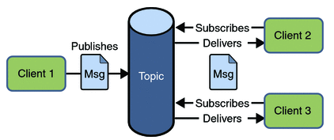

# J2EE - JMS

## Pre - Message Queue

**什么是消息队列**

消息队列(Message Queue)是一种进程间通信或同一进程的不同线程间的通信方式。

**实现**

消息队列常常保存在链表结构中，拥有权限的进程可以向消息队列中写入或读取消息。

**特点**

- 主要特点是异步处理
- 主要目的是减少请求响应时间和解耦
- 主要的使用场景就是将比较耗时而且不需要即时（同步）返回结果的操作作为消息放入消息队列

## Pre - Usage

**使用场景1：用户注册**

- 校验用户名等信息，如果没问题会在数据库中添加一个用户记录（同步）
- 如果是用邮箱注册会给你发送一封注册成功的邮件，手机注册则会发送一条短信（异步）
- 分析用户的个人信息，以便将来向他推荐一些志同道合的人，或向那些人推荐他（异步）
- 发送给用户一个包含操作指南的系统通知（异步）

**使用场景2：秒杀活动**

比如服务器一秒能处理100个订单，但秒杀活动1秒进来1000个订单，持续10秒，在后端能力无法增加的情况下， 可以用消息队列将总共10000个请求压在队列里，后台consumer按原有能力处理，100秒后处理完所有请求（而不是直接宕机丢失订单数据）。

（再次强调，主要就是将可分割的流程/操作**解耦**，使其可以**异步**处理。）

## Intro - JMS

JMS (Java Message Service) is an **API** that provides the facility to create, 
send and read messages from one application to another.

解读：JMS和JDBC一样，都是一套标准，具体的实现还是要看各大厂商。比如常见的实现有以下这些：

- Spring JMS
- Apache ActiveMQ
- RabbitMQ

## JMS - Messaging Domains

1.Point-to-Point (PTP) Messaging Domain

In PTP model, one message is delivered to one receiver only. 
Here, Queue is used as a message oriented middleware (MOM).


2.Publisher/Subscriber (Pub/Sub) Messaging Domain

In Pub/Sub model, one message is delivered to all the subscribers. 
It is like broadcasting. Here, Topic is used as a message oriented middleware that is responsible to hold and deliver messages.



## JMS - Programming Model


Note: The destination can be either Queue or Topic.

## JMS - General Implementation Steps

- register elements: ConnectionFactory, destination(Queue or Topic)
- register Connection and Session
- start the connection
- create MessageProducer and send message
- create MessageConsumer and receive message

## JMS - Receiving Model

消费者有两种接受消息的模式：
- Synchronous
  - `consumer.receive()`/`consumer.receive(int timeout)`
  - 消费者会一直等待直到消息到达或超时
- Asynchronous
  - using `MessageListener`
  - 消费者注册一个监听器，当接到消息时进行callback操作

## In Practice - ActiveMQ

Elements
- producer: create producer and send message
- synch-consumer1: create synch-consumer1 and receive message
- asynch-consumer2: create asynch-consumer2 and receive message
- application context: manage connection and session
- main(): start the app

App：主程序
~~~ java
public class App {
    public static void main(String[] args) throws Exception {

        AppContext appContext = new AppContext();
        appContext.startSession();

        new Thread(new Producer(appContext)).start();
        new Thread(new Consumer(appContext)).start();
        Thread.sleep(2000);
        new Thread(new Producer(appContext)).start();
        new Thread(new Consumer2(appContext)).start();
        Thread.sleep(2000);

        appContext.endConnection();
    }
}
~~~

AppContext：用来初始化及保存连接对象
~~~ java
import org.apache.activemq.ActiveMQConnection;
import org.apache.activemq.ActiveMQConnectionFactory;

import javax.jms.Connection;
import javax.jms.Destination;
import javax.jms.Session;

public class AppContext {
    private static final String USERNAME = ActiveMQConnection.DEFAULT_USER;
    private static final String PASSWORD = ActiveMQConnection.DEFAULT_PASSWORD;
    private static final String BROKEURL = ActiveMQConnection.DEFAULT_BROKER_URL;

    private ActiveMQConnectionFactory connectionFactory;
    private Connection connection;
    private Session session;
    private Destination destination;

    public void startSession() {
        try {
            // Create a ConnectionFactory
            connectionFactory = new ActiveMQConnectionFactory(this.USERNAME, this.PASSWORD, this.BROKEURL);
            // Create a Connection
            connection = connectionFactory.createConnection();
            // Create a Session
            session = connection.createSession(false, Session.AUTO_ACKNOWLEDGE);
            // Create the destination (Topic or Queue)
            destination = session.createQueue("TEST.FOO");
            // start the connection
            connection.start();
        } catch(Exception e) {
            e.printStackTrace();
        }
    }

    public void endConnection() {
        try {
            session.close();
            connection.close();
        } catch(Exception e) {
            e.printStackTrace();
        }
    }

    public ActiveMQConnectionFactory getConnectionFactory() {
        return connectionFactory;
    }

    public void setConnectionFactory(ActiveMQConnectionFactory connectionFactory) {
        this.connectionFactory = connectionFactory;
    }

    public Connection getConnection() {
        return connection;
    }

    public void setConnection(Connection connection) {
        this.connection = connection;
    }

    public Session getSession() {
        return session;
    }

    public void setSession(Session session) {
        this.session = session;
    }

    public Destination getDestination() {
        return destination;
    }

    public void setDestination(Destination destination) {
        this.destination = destination;
    }
}
~~~

Producer
~~~ java
import javax.jms.*;

public class Producer implements Runnable {

    private Session session;
    private Destination destination;

    public Producer(AppContext appContext) {
        this.session = appContext.getSession();
        this.destination = appContext.getDestination();
    }

    public void run() {
        try {
            // Create a MessageProducer from the Session to the Topic or Queue
            MessageProducer producer = session.createProducer(destination);
            producer.setDeliveryMode(DeliveryMode.NON_PERSISTENT);

            // Create a messages
            String text = "Hello world! From: " + Thread.currentThread().getName() + " : " + this.hashCode();
            TextMessage message = session.createTextMessage(text);

            // Tell the producer to send the message
            System.out.println("Sent message: "+ message.hashCode() + " : " + Thread.currentThread().getName());
            producer.send(message);
        }
        catch (Exception e) {
            System.out.println("Caught: " + e);
            e.printStackTrace();
        }
    }
}
~~~

Consumer1: using Synchronous Receive
~~~ java
import javax.jms.*;

public class Consumer implements Runnable {

    private Session session;
    private Destination destination;

    public Consumer(AppContext appContext) {
        this.session = appContext.getSession();
        this.destination = appContext.getDestination();
    }

    public void run() {
        try {
            // Create a MessageConsumer from the Session to the Topic or Queue
            MessageConsumer consumer = session.createConsumer(destination);
            // Wait for a message
            Message message = consumer.receive(1000);
            // Deal with message
            if (message instanceof TextMessage) {
                TextMessage textMessage = (TextMessage) message;
                String text = textMessage.getText();
                System.out.println("C1, received: " + text);
            } else {
                System.out.println("C1, received: " + message);
            }
            consumer.close();
        } catch (Exception e) {
            e.printStackTrace();
        }
    }
}
~~~

Consumer2: using Asynchronous Receive
~~~ java
import javax.jms.*;

public class Consumer2 implements Runnable {

    private Session session;
    private Destination destination;

    public Consumer2(AppContext appContext) {
        this.session = appContext.getSession();
        this.destination = appContext.getDestination();
    }

    public void run() {
        try {
            // Create a MessageConsumer from the Session to the Topic or Queue
            MessageConsumer consumer2 = session.createConsumer(destination);
            consumer2.setMessageListener(new MessageListener() {
                public void onMessage(Message msg) {
                    TextMessage textMsg = (TextMessage) msg;
                    try {
                        System.out.println("C2, received: " + textMsg.getText());
                    } catch (JMSException e) {
                        e.printStackTrace();
                    }
                }
            });
            Thread.sleep(1000);
            consumer2.close();
        } catch (Exception e) {
            e.printStackTrace();
        }
    }
}
~~~

Note: the example uses ActiveMQ, you need to start it first.

```
cd [activemq_install_dir]
bin\activemq start
check the result in web console: http://127.0.0.1:8161/admin/
```

## Links

- [Note-Spring-JMS](http://chennanni.github.io/note-tech/archive/spring/jms/)
- [Javapoint - JMS Tutorial](http://www.javatpoint.com/jms-tutorial)
- [ActiveMQ - Hello World Example](http://activemq.apache.org/hello-world.html)
- [Oracle - Writing Simple JMS Applications](https://docs.oracle.com/javaee/6/tutorial/doc/bncfa.html)
- [CSDN - JMS简单例子](http://blog.csdn.net/wl_ldy/article/details/7884534)
- [CSDN - ActiveMQ简单的HelloWorld实例](http://blog.csdn.net/jiuqiyuliang/article/details/48608237)
