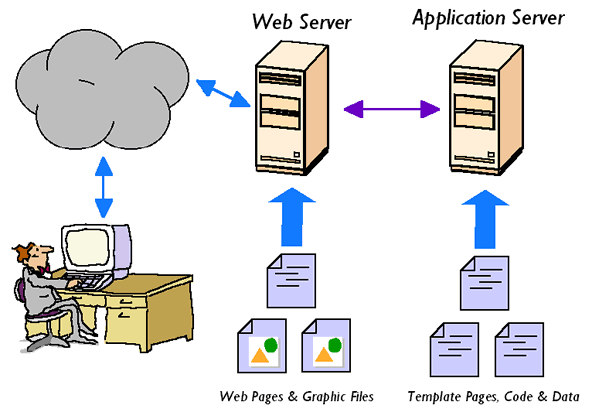

# J2EE - Servlet

## Folder Structure

```
myWebApp/
  WEB-INF/
    web.xml
    weblogic.xml
    lib/
      MyLib.jar
    classes/
      MyPackage/
        MyServlet.class
  jsp/
  scripts/
```

## Server

### Web Server



A Web server exclusively handles HTTP requests. 主要负责收发Web请求，做一些简单的处理逻辑，复杂的逻辑转发给Application Server。
- Java Web Server
  * Tomcat
  * httpd
  
### Application server

An application server serves business logic to application programs through any number of protocols. 主要负责复杂的business逻辑处理。
- Java App Server
  * JBoss
  * Glassfish
  * WebSphere
  * WebLogic

## Servlets

Servlet is a small Java program that runs within a web server.
- Servlets receive and respond to requests from Web clients, usually across HTTP


## Servlet life cycle

- initialization -> `init()`
  - The container initializes the servlet and executes all the statements from this method(Connecting to DB, initializing some objects, etc)
- servicing -> `service()`
  - Accepting http request, precessing and sending the http response to the browser
- destroying -> `destroy()`
  - Unload from container


## Class Structure

~~~
javax.servlet
     |
Servlet - Super interface for Java Servlet API
ServletContext - Provides runtime env for servlet
ServletConfig - Provides info about parameters
ServletRequest - super interface for all the requset objects
ServletResponse - super interface for all the response objects
GenericServlet - Non-http based servlets creation

javax.servlet.http
     |
HttpServletRequest
     - setAttribute()
     - getAttribute()
     - getSession()
     - getParameter()
     - getParameterValues()
     - getInitParameter()
     - getInitParameterNames()
HttpServletReponse
     - setContentType()
     - sendRedirect()
HttpServlet (class)
     - public void init()
     - public void service(HttpServletRequest, HttpServletResponse)
     - public void destroy()
     - public void doGet(HttpServletRequest, HttpServletResponse)
     - public void doPost(HttpServletRequest, HttpServletResponse)
HttpSession
     - setAttribute()
     - getAttribute()
     - getId()
     - getLastAccessedTime()
Cookie
~~~

## Steps to compile and run servlet in cmd

Set the classpath for servlet.jar from tomcat folder

- `set classpath=%classpath%; ...\tomcatXXX\lib\servlet.jar`;

Copy the servlet .class file to the tomcat server folder

- `tomcat-XXX\webapps\ROOT\WEB-INF\classes`

Register the servlet in web.xml

~~~ xml
<servlet>
	<servlet-name>HelloServlet</servlet-name>
	<servlet-class>HelloServlet</servlet-class>
</servlet>

<servlet-mapping>
	<servlet-name>HelloServlet</servlet-name>
	<url-pattern>/HelloServlet</url-pattern>
</servlet-mapping>
~~~

Start the tomcat in cmd

- tomcat\bin > `catalina.bat run`


Open the browser and visit the URL

- `http://localhost:8080/HelloServlet`

## Session

### Transport data between 2 or more request

- HttpSession
  - `javax.servlet.http.HttpSession session = request.getSession(true);`
  - `Product product = (Product) session.getAttribute("myproduct");`
- URL parameters
- Cookies

### Transfer request/response to another sourse

- `requestDispatcher` - `forward()`
- `SendRediret`

### Cookies vs Session

- Sessions are server-side files that contain user information, while Cookies are client-side files that contain user information. 
- Sessions have a unique identifier that maps them to specific users. This identifier can be passed in the URL or saved into a session cookie.

<http://stackoverflow.com/questions/359434/differences-between-cookies-and-sessions>
