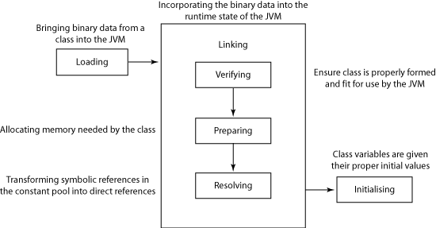
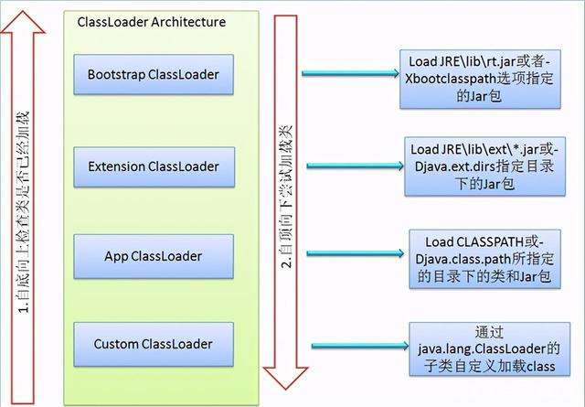

# Java - JVM Class Loading

Java类加载机制

## 编译加载流程

- 编译：通过javac将java源文件编译为class字节码文件。
- 加载：jvm将class file读到内存中，对其进行校验、转换解析、初始化，最终在堆heap分配内存，形成可以被jvm直接使用的类型。

## 类的生命周期

五步：

- 加载 Loading
  - 加载 class 文件
- 验证 Verification
  - 检查 class 文件格式
- 准备 Preparation
  - 分配内存空间
- 解析 Resolution
  - 将（常量池中的）符号引用变为直接引用
- 初始化 Initialization
  - 对 static 变量/常量赋予初始化值
  

## 加载

简单来说，就是把Java文件“读”进JVM中。

- 读取：类加载器通过类的全路径限定名读取类的二进制字节流，
- 转化：将二进制字节流代表的类结构转化到运行时数据区的方法区中，
- 生成实例：在jvm堆中生成代表这个类的java.lang.Class实例(不是这个类的实例)。

### 类加载器
- 启动类加载器 `Bootstrap classloader`：用c++实现为jvm的一部分(仅指sun的hotspot)，负责`JAVA_HOME/lib`下面的类库中的类的加载
- 扩展类加载器 `Extension classloader`：由`sun.misc.Launcher$ExtClassLoader`类实现，负责`JAVA_HOME/lib/ext`和`java.ext.dir`中类库的加载
- 应用类加载器 `App classloader`：由`sun.misc.Louncher$AppClassLoader`实现，负责加载用户类路径中类库中的类（如果没有自定义的加载器，这个就是默认的加载器）
- 用户自定义加载器

### Parent First 模型

双亲委托模型：优先由父加载器尝试加载，不行的话再一级一级往下

- 加载一个类时，类加载器首先检查自己是否已经加载了该类，如果已加载，则返回；否则请父加载器**代理**；
- 父加载器重复1的操作一直到最顶层的`Bootstrap Class Loader`；
- 如果`Bootstrap Class Loader`也没有加载该类，将尝试进行加载，加载成功则返回；如果失败，抛出`ClassNotFoundException`；
- 子类加载器**捕捉异常**后尝试加载，如果成功则返回，如果失败则抛出`ClassNotFoundException`，一路向下，直到发起加载的子类加载器。

为什么采用Parent First代理模式？为了保证Java核心库都是由Java自己的加载器`Bootstrap classloader`加载完成的。
因为判断两个类是否相同，有两个因素：1是类文件的内容，2是由什么加载器加载。

### Parent Last 模型

- 子加载器首先尝试加载，如果加载失败才会请父加载器
- 比如 IBM Web Sphere Portal Server 实现的一些类加载器

## 验证

加载完了Class文件，需要验证，主要有两个方面：一是内容规范检验，二是安全性检验（是否会危害虚拟机自身的安全）。

验证字节码文件是否合格：
- 文件格式：参看class文件格式详解；
- 元数据验证：是否符合java语言规范；
- 字节码验证：数据流和控制流的分析，这一步最复杂；
- 符号引用验证：符号引用转化为直接引用时（解析阶段），检测对类自身以外的信息进行存在性、可访问性验证。

## 准备

正式为类变量（被static修饰的变量）分配内存并设置类变量**初始值**的阶段，这些变量所使用的内存都将在方法区中进行分配。

~~~
public static int value=123;
~~~

经过准备阶段，value = 0，经过初始化阶段后，value = 123。

~~~
public final static int value=123;
~~~

经过准备阶段，value = 123

## 解析

解析阶段是JVM将常量池（Constant Pool）内的符号引用替换为直接引用的过程。

解析动作主要针对类或接口、字段、类方法、接口方法、方法类型、方法句柄和调用点限定符7类符号引用进行。

## 初始化

对Class Variables进行初始化赋值。

## Links

- <http://blog.csdn.net/radic_feng/article/details/6897898>
- <http://blog.csdn.net/tangdong3415/article/details/53768099>
- <https://blog.csdn.net/qq_39682377/article/details/80548802>
