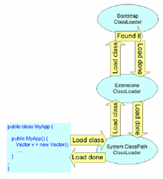

# Java - Class Loading

Java类加载机制

## 编译加载流程

- 编译：通过javac将java源文件编译为class字节码文件。
- 加载：jvm将class file读到内存中，对其进行校验、转换解析、初始化，最终在堆heap分配内存，形成可以被jvm直接使用的类型。

## 类的生命周期

- 加载 Loading
- 验证 Verification
- 准备 Preparation
- 解析 Resolution
- 初始化 Initialization
- 使用 Using
- 卸载 Unloading

## 加载

- 读取：类加载器通过类的全路径限定名读取类的二进制字节流，
- 转化：将二进制字节流代表的类结构转化到运行时数据区的方法区中，
- 生成实例：在jvm堆中生成代表这个类的java.lang.Class实例(不是这个类的实例)。

类加载器
- 启动类加载器 Bootstrap classloader：用c++实现为jvm的一部分(仅指sun的hotspot)，负责JAVA_HOME/lib下面的类库中的类的加载
- 扩展类加载器 Extension classloader：由sun.misc.Launcher$ExtClassLoader类实现，负责JAVA_HOME/lib/ext和java.ext.dir中类库的加载
- 应用类加载器 App classloader：由sun.misc.Louncher$AppClassLoader实现，负责加载用户类路径中类库中的类（如果没有自定义的加载器，这个就是默认的加载器）
- 用户自定义加载器

双亲委托模型 - Parent First
- 加载一个类时，类加载器首先检查自己是否已经加载了该类，如果已加载，则返回；否则请父加载器代理；
- 父加载器重复1的操作一直到Bootstrap Class Loader；
- 如果Bootstrap Class Loader也没有加载该类，将尝试进行加载，加载成功则返回；如果失败，抛出ClassNotFoundException，则由子加载器进行加载；
- 子类加载器捕捉异常后尝试加载，如果成功则返回，如果失败则抛出ClassNotFoundException，直到发起加载的子类加载器。

Parent Last模型
- 子加载器首先尝试加载，如果加载失败才会请父加载器
- 比如 IBM Web Sphere Portal Server 实现的一些类加载器

## 验证

验证字节码文件是否合格：
- 文件格式：参看class文件格式详解；
- 元数据验证：是否符合java语言规范；
- 字节码验证：数据流和控制流的分析，这一步最复杂；
- 符号引用验证：符号引用转化为直接引用时（解析阶段），检测对类自身以外的信息进行存在性、可访问性验证。

## Links
- <http://blog.csdn.net/radic_feng/article/details/6897898>
- <http://blog.csdn.net/tangdong3415/article/details/53768099>