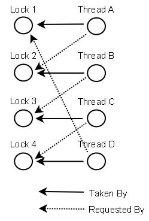

# Java Concurrency

让计算机在同一时间进行多项任务，一般有两种手段：多线程（Thread）和多进程(Process)。一般谈到并发(Concurrency)的时候，是在讨论多线程的情况，因为它更容易编程实现，效率更高。

Thread v.s. Process

- A Process usually contains multiple threads at the same time.
- Threads (of the same process) run in a shared memory space, while processes run in separate memory spaces.

## Benefits and Costs of Multi-Threading

Benefit
- better resource utilization 资源利用率高
- more responsive design 系统更高的响应率

Cost
- more complex design 设计复杂度增加
- context switching overhead 线程切换负担
- increase resource assumption 资源必须是多线程安全的
- issues with multi-threading 未保证多线程安全的情况下可能会带来问题

## Java Thread Example

Steps:

- create a thread object
  - create some object with thread features (**implement Runnable / extends Thread**)
  - create a thread object
- define the function of the thread
  - override `run()`
  - (optional) override `start()` ; usually the thread instantiation happens here
- start the thread
  - call `start()`

e.g.

```
// Part 1
Class SomeClass implements Runnable { // or extends Thread
     private Thread t;
     public void run() {...}
     public void start() {
          if (t == null) {
               t = new Thread(this, "threadName");
               t.start();
          }
     }
}
...
{
     SomeClass example = new SomeClass(...);
     example.start();
}

// Part 2: using anonymous class
Thread t=new Thread(){  
  public void run(){  
       obj.method();  
  }  
};
```

**Immutability**: immutable object is thread-safe, but the use/reference of it may not be

## Problems with Multi-threading

多线程共享内存空间，即Thread之间资源共享，一个Thread可以access到另一个Thread的资源，这里就可能会出问题。

- **Race Condition**竞争: race condition occurs when multiple threads update shared resources
- **Deadlock**死锁: two or more threads are blocked forever, waiting for each other

为了防止出现这些问题，需要在设计开发的时候特别注意，保证Thread Safe。

- **Thread safety**: if a resource is created, used and disposed within the control of the same thread, and never escapes the control of this thread, the use of that resource is thread safe

## Synchronization

Problem: thread interference and memory consistency errors

Lock: Every object has an lock associated with it. By convention, a thread that needs consistent access to an object's fields has to acquire the object's lock before accessing them, and then release the lock when it's done with them.

Synchronization

 - Process Synchronization
 - Thread Synchronization

Multual Exclusive

 - by synchronized method
 - by synchronized block
 - by static synchronization

e.g. usage

```
synchronized method() {...}
synchronized (object reference expression) {...} ; 
//Notice: in this case, the object's all fields are not available
```

## Deadlock Prevention

**Lock Ordering**: make sure that all locks are always taken in the same order by any thread

```
Situation:
	Thread 1:
	  lock A
	  lock B
	Thread 2:
	   wait for A
	   lock C (when A locked)
	Thread 3:
	   wait for A
	   wait for B
	   wait for C

Solve:
	Neither Thread 2 or Thread 3 can lock C until they have locked A first.
```

**Lock Timeout**: if a thread does not succeed in taking all necessary locks within the given timeout, it will backup, free all locks taken, wait for a random amount of time and then retry.

**Deadlock Detection**: every time a thread takes a lock it is noted in a data structure (map, graph etc.) of threads and locks. Additionally, whenever a thread requests a lock this is also noted in this data structure.

When a thread requests a lock but the request is denied, the thread can traverse the lock graph to check for deadlocks.



Tools: jps, jconsole, jstack, JMX API

## Misc

Daemon Thread
- Daemon thread in java is a service provider thread that provides services to the user thread. Its life depend on the mercy of user threads i.e. when all the user threads dies, JVM terminates this thread automatically.
- There are many java daemon threads running automatically, e.g. gc, finalizer etc.

Gargage Collection
- `finalize()`: The finalize method is called when an object is about to get garbage collected. That can be at any time after it has become eligible for garbage collection.

## Links
- http://tutorials.jenkov.com/java-concurrency/index.html

