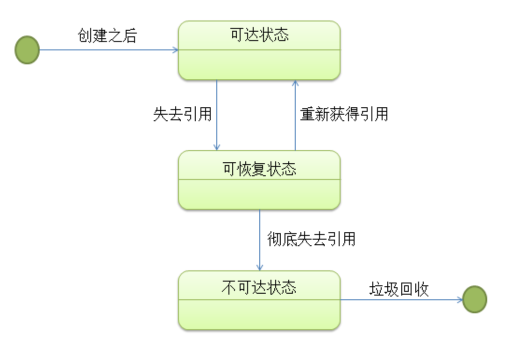
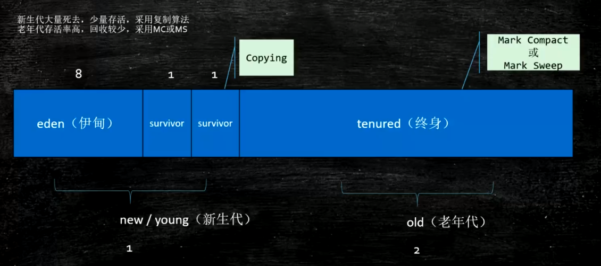
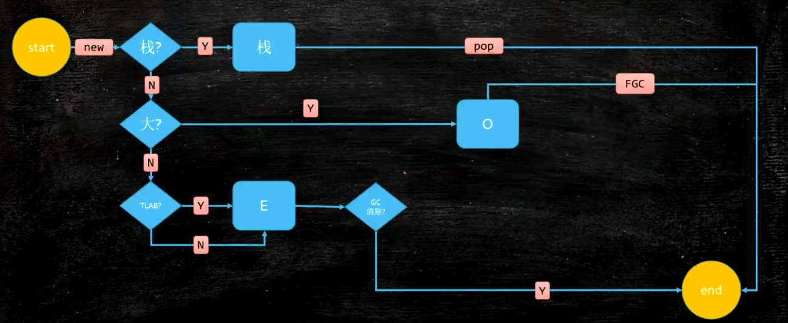
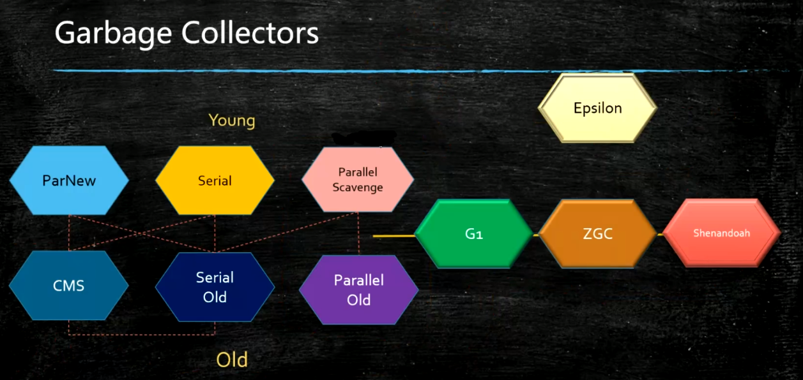

# Java - GC

## 什么是GC

Garbage Collection，垃圾回收，就是通过某些算法，将不再使用，不需要的内存空间释放。

主要分为几个步骤：
- 找到需要回收的对象
- 进行回收
- 碎片整理（可选）

在C语言中，GC是需要程序员手动进行的（malloc free），十分繁琐。而在Java，Python等语言中，GC是由程序自动执行的，减轻了程序员的负担。

## 为什么要做GC

- 获得更多空闲的内存
- 可以有效的防止因内存泄露（指该内存空间使用完毕后未回收）而导致的一系列问题

## 什么是Garbage

在Java中，如果一个（或者一群）对象没有其它的对象引用到它（们），就是垃圾。

## 怎么找到Garbage

- Reference Count:引用计数
  - 对于某个对象，计算它被其它对象引用到的次数。
  - 但是，RC没有办法处理循环引用的情况。例：`A<->B`，A,B只被对方互相引用到，而没有其它引用，其实也可以算作Garbage。
- Root Searching: 根可达算法
  - 以根对象为起点，逐一标记其引用到的对象，如果某些对象没有被标记到，就是Garbage。

注：HotSpot采用的是Root Searching。

### 根可达算法进阶

程序运行后，它在内存中的状态可以看成是有向图，分为三种：
- 可达状态：在一个对象创建后，有一个以上的引用变量引用它。在有向图中可以从起始顶点导航到该对象，那它就处于可达状态。
- 可恢复状态：如果程序中某个对象不再有任何的引用变量引用它，它将先进入可恢复状态，此时从有向图的起始顶点不能再导航到该对象。在这个状态下，系统的垃圾回收机制准备回收该对象的所占用的内存，在回收之前，系统会调用`finalize()`方法进行资源清理，如果资源整理后重新让一个以上引用变量引用该对象，则这个对象会再次变为可达状态；否则就会进入不可达状态。
- 不可达状态：当对象的所有关联都被切断，且系统调用`finalize()`方法进行资源清理后依旧没有使该对象变为可达状态，则这个对象将永久性失去引用并且变成不可达状态，系统才会真正的去回收该对象所占用的资源。

可以作为 GC ROOTS 的对象包括下面几种：

- Java Method 里引用的对象。
- Native Method 里引用的对象。
- Method Area 的类静态属性(static)引用的对象。
- Method Area 的常量(final)引用的对象。

## GC的三种算法

- `mark-sweep` 标记-清除
  - 非常简单，把Gargabe标记出来，然后回收
  - 缺点：位置不连续，产生碎片
- `mark-compact` 标记-压缩
  - 在标记清除的基础上，加了一步压缩，把内存碎片连续化
  - 优点：没有碎片
  - 缺点：处理效率比较低
- `copy` 复制
  - 把内存一分二，只用一半。需要GC时，把用到的对象拷贝到另一半，不用的直接丢弃
  - 优点：没有碎片
  - 缺点：内存使用率低

## JVM内存分代模型

内存分代模型是部分JVM（如Hotspot）使用的模型

新生代 + 老年代 + 永久代(1.7) `PermGen space` / 元数据区(1.8) `Metaspace`
- 永久代/元数据 - Class
- 永久代必须指定大小限制，元数据可以设置，也可以不设置，无上限（受限于物理内存）
- 字符串常量 1.7 - 永久代，1.8 - 堆

注：MinorGC = YGC, MajorGC = FGC

### 新生代 

组成：Eden + 2个suvivor区
- （大多数）采用**复制**算法
- YGC回收之后，大多数的对象会被回收，活着的进入s0
- 再次YGC，活着的对象eden + s0 -> s1
- 再次YGC，eden + s1 -> s0
- 年龄足够（默认15） -> 老年代
- （大对象）s区装不下 -> 老年代

### 老年代

- 一般采用**标记-清除**或者**标记-压缩**算法
- 老年代满了FGC Full GC

## GC流程

首先，关于一个概念：应用程序停止，stop-the-world：除了GC所需的线程以外，所有线程都处于等待状态，直到GC完成。它会发生在任何一个GC算法中，不同的算法，不同的优化策略，一定程度上就是减少系统等待时间。

### Escape Analysis

特别注意：在JDK1.6以后，当new一个新的object之后，JVM会做一个Escape Analysis，判断是否可以将这个obj分配到栈Stack上，如果不可以，再放在堆Heap中。
当然，不是所有obj都可以放到栈上的，是要满足特定条件才行。
这样带来的最大好处是：GC的效率特别高。

举例分析：每次调用`Point::toString`方法，就要创建一个`StringBuilder`对象，而当方法调用完了之后，这个`StringBuilder`对象就没用了。
把`StringBuilder`放到栈中，用完就弹出，无疑高效了许多。（E.A.能大大优化函数式编程Lambdas的执行效率）

~~~ java
public class Point {
    private final int x, y;
    public Point(int x, int y) {
        this.x = x;
        this.y = y;
    }
    @Override
    public String toString() {
        final StringBuilder sb = new StringBuilder()
                .append("(")
                .append(x)
                .append(", ")
                .append(y)
                .append(")");
        return sb.toString();
    }
}
~~~

- 参考 -> Do Not Let Your Java Objects Escape <https://minborgsjavapot.blogspot.com/2015/12/do-not-let-your-java-objects-escape.html>
- 文档 -> <https://docs.oracle.com/javase/7/docs/technotes/guides/vm/performance-enhancements-7.html>

## JVM垃圾回收器的类型

垃圾回收器的发展是随着内存不断扩大而不断演进的。
一开始，使用的是串行策略，慢慢地，变成了并行策略。

根据JVM内存分代模型，新生代和老年代采用了不同的垃圾回收器。具体如下：

~~~
Serial + SerialOld

ParallelScavenge + ParallelOld

ParNew + CMS(Concurrent Mark & Sweep) / G1 (Garbage First)
~~~

1.8默认的垃圾回收：PS + ParallelOld

## 可能发生内存泄露的情况

即使有了GC机制，还是可能发生内存泄露问题，如下：
- 静态集合类像HashMap，Vector等的使用，即使其元素被赋值为null，还是不会被GC。
- 数据库连接，网络连接，IO连接等没有显示调用close关闭。
- 监听器的使用，在释放对象的同时没有相应删除监听器。

## JVM GC 调优

JVM参数分类

- 标准：`-` 开头，所有的HotSpot都支持
- 非标准：`-X` 开头，特定版本HotSpot支持特定命令
- 不稳定：`-XX` 开头，下个版本可能取消

查看参数命令

~~~
-XX:+PrintCommandLineFlags
-XX:+PrintFlagsFinal 最终参数值
-XX:+PrintFlagsInitial 默认参数值
~~~

GC常用参数

- `-Xmn -Xms -Xmx -Xss`: 年轻代 最小堆 最大堆 栈空间
- `-XX:+UseTLAB`
- `-XX:+PrintTLAB`
- `-XX:TLABSize`
- `-XX:+PrintGC`
- `-XX: PrintGCDetails`
- `-XX: PrintHeapAtGC`
- `-XX: PrintGCTimeStamps`

了解生产环境下的垃圾回收器组合: `java -XX:+PrintFlagsInitial | grep GC | grep true`

开源工具：Arthas

产生了CPU爆增加的问题，如何定位？
- 首先，查看是系统哪个进程
- 然后，查看是进程下的哪个线程
  - 业务线程：排查业务逻辑
  - JVM线程：可能是GC问题

注：JVM的命令行参数参考：https://docs.oracle.com/javase/8/docs/technotes/tools/unix/java.html

## Links
- <http://www.importnew.com/15330.html>
- <http://www.importnew.com/1993.html>
- <http://www.cnblogs.com/andy-zcx/p/5522836.html>
- <http://www.oracle.com/webfolder/technetwork/tutorials/obe/java/gc01/index.html>
- <https://www.dynatrace.com/resources/ebooks/javabook/how-garbage-collection-works/>
