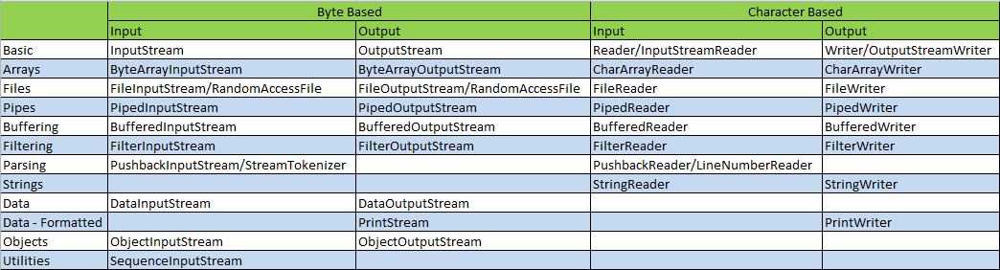

# Java I/O

## Source and Destination

```
Source -> Program -> Destination

Source -> InputStream/Reader -> Program -> OutputStream/Writer -> Destination
```

The most common sources and destinations are these:

- Files
- Pipes
- Network Connections (Socket)
- In-memory Buffers
- System.in, System.out, System.error

## Class Hierarchy

Java IO streams are typically either byte based or character based.

- mostly [XXX]InputStream/OutputStream is **byte based**
- mostly [XXX]Reader/Writer is **character based**



## Release resource

Streams and Readers / Writers need to be closed properly when you are done using them.

~~~ java
try{
  ...
}catch(IOException e){
  ...
} finally {
  try{
    if(input != null) input.close();
  } catch(IOException e){
    ...
  }
}
~~~

## Example

### Keyboard in -> Console out

~~~ java
Scanner scanner = new Scanner(System.in);
int data = scanner.nextInt();
System.out.println(data);
~~~

### File in -> Socket out

~~~ java
// input
Reader reader = new FileReader("c:\\data\\myfile.txt");
int data = reader.read();
StringBuilder inputString = new StringBuilder();
while(data != -1){
  inputString.append((char) data);
  data = reader.read();
}
// output
Socket socket = new Socket(serverName, port);
DataOutputStream output = new DataOutputStream(socket.getOutputStream());
output.writeUTF(StringBuilder);
~~~

### Pipe in -> Pipe out

~~~ java
import java.io.IOException;
import java.io.PipedInputStream;
import java.io.PipedOutputStream;

public class PipeExample {
    public static void main(String[] args) throws IOException {
        final PipedOutputStream output = new PipedOutputStream();
        final PipedInputStream  input  = new PipedInputStream(output);

        Thread thread1 = new Thread(new Runnable() {
            @Override
            public void run() {
                try {
                    output.write("Hello world, pipe!".getBytes());
                } catch (IOException e) {
                }
            }
        });

        Thread thread2 = new Thread(new Runnable() {
            @Override
            public void run() {
                try {
                    int data = input.read();
                    while(data != -1){
                        System.out.print((char) data);
                        data = input.read();
                    }
                } catch (IOException e) {
                }
            }
        });

        thread1.start();
        thread2.start();
    }
}
~~~

## Links

- <http://tutorials.jenkov.com/java-io/overview.html>
