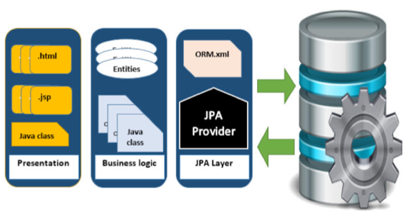

# Java - JPA

## Problems

Mismatches between relational and object models

## What is JPA

Java Persistence API is a collection of classes and methods (interfaces/specification) to persistently store 
the vast amounts of data into a database which is provided by the Oracle Corporation.

JPA shows how to define a Plain Oriented Java Object (POJO) as an entity and how to manage entities with relations.

## JPA Provider

- Hibernate
- Eclipselink
- Toplink

Difference between JPA and Hibernate

- JPA is just a specification, meaning there is no implementation. Hibernate is the Hibernate's JPA implementation.
- JPA tells you how to dance, Hibernate is the dancer.

## ORM Architecture

three phase: Object data -> Mapping -> Relational data

## Spring JPA Example

- <http://chennanni.github.io/note-tech/archive/spring/jpa/>
- <https://spring.io/guides/gs/accessing-data-jpa/>

## Links

- [Spring Data JPA Tutorial](http://www.petrikainulainen.net/spring-data-jpa-tutorial/)
- [JPA Tutorialpoint](http://www.tutorialspoint.com/jpa/)

