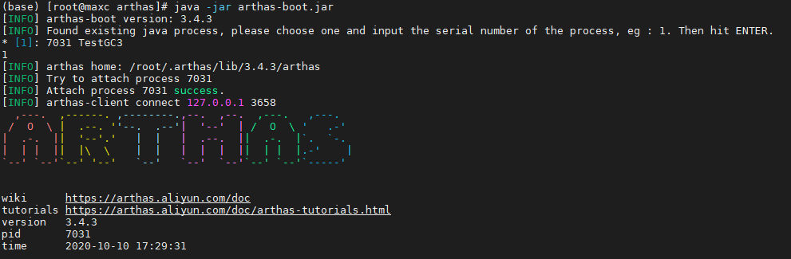
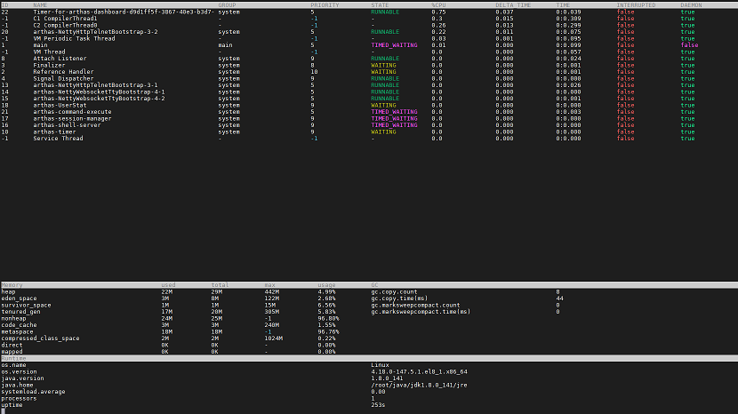
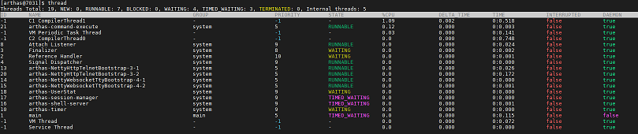
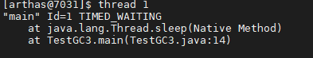
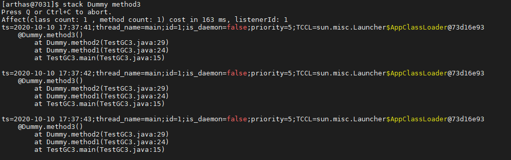
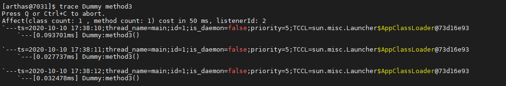
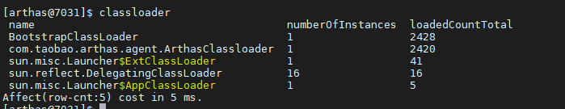

# Java - Monitor - Arthas

Arthas是Alibaba开源的Java诊断工具，深受开发者喜爱。

## 安装

安装很简单，下载一个jar就行了。

~~~
curl -O https://arthas.aliyun.com/arthas-boot.jar
~~~

参考 -> <https://arthas.aliyun.com/doc/install-detail.html>

## 运行

~~~
java -jar arthas-boot.jar <java_process_id>
~~~

欢迎界面 ->

## 使用

### dashboard

`dashboard`：查看整个进程的运行情况，线程、内存、GC、运行环境信息

它这个是每间隔一段时间刷新一次，看起来像是图形界面，其实是打印在命令行的。

### thread

`thread`: 可以查看线程详细情况

`thread <thread_id>`: 可以查看线程堆栈

`thread -b`: 可以**查看线程死锁**

结果 -> `No most blocking thread found!`

### jad

`jad <class_name>`：可以反编译，方便我们查看线上代码是否是正确的版本

### stack

`stack <full_class_name> <method_name>`：查看方法的调用栈

### trace

`trace <full_class_name> <method_name>`：查看方法的调用时间

### classloader

`classloader`：查看当前系统中有多少类加载器，以及每个加载器加载的类数量，判断是否有类加载器泄露。

### redefine

`redefine`：用新的class文件替换原有的class文件

~~~
jad --source-only com.example.demo.arthas.user.UserController > /tmp/UserController.java
mc /tmp/UserController.java -d /tmp
redefine /tmp/com/example/demo/arthas/user/UserController.class
~~~

注：
- 不允许新增加field/method
- 正在跑的函数，没有退出不能生效

<https://arthas.aliyun.com/doc/redefine.html>

### ognl

`ognl`：可以查看线上系统变量的值，（甚至）可以修改变量的值

~~~
$ ognl '@demo.MathGame@random'
@Random[
    serialVersionUID=@Long[3905348978240129619],
    seed=@AtomicLong[125451474443703],
    multiplier=@Long[25214903917],
    addend=@Long[11],
    mask=@Long[281474976710655],
    DOUBLE_UNIT=@Double[1.1102230246251565E-16],
    BadBound=@String[bound must be positive],
    BadRange=@String[bound must be greater than origin],
    BadSize=@String[size must be non-negative],
    seedUniquifier=@AtomicLong[-3282039941672302964],
    nextNextGaussian=@Double[0.0],
    haveNextNextGaussian=@Boolean[false],
    serialPersistentFields=@ObjectStreamField[][isEmpty=false;size=3],
    unsafe=@Unsafe[sun.misc.Unsafe@28ea5898],
    seedOffset=@Long[24],
]
~~~

<https://arthas.aliyun.com/doc/ognl.html>

## 参考

- 官方文档 <https://arthas.aliyun.com/doc/>
- 阿里重磅开源在线分析诊断工具Arthas <https://blog.csdn.net/xiao_jun_0820/article/details/82774796>
