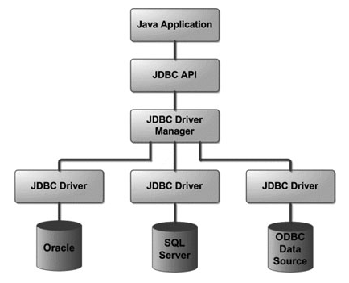
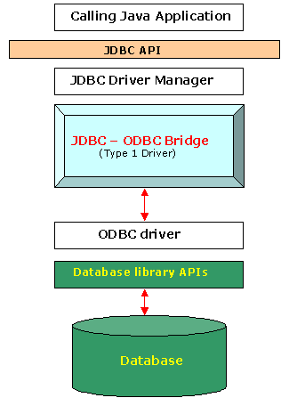

# JDBC

Java Database Connectivity

It is an API for the connection between Java programming language and Databases.

## JDBC Architecture

- JDBC API: This provides the application-to-JDBC Manager connection.
- JDBC Driver API: This supports the JDBC Manager-to-Driver Connection.

## What is JDBC Drivers

A JDBC driver is a software component enabling a Java application to interact with a database.

Type 1 Deiver: JDBC-ODBC Bridge (JDK)

Flow: `.class`(byte code)  ->  `JDBC`  ->  `ODBC`  -> `DB`

## JDBC API

Packages
- java.sql
- javax.sql

It describes the model of Common JDBC Components (Objects)

~~~
Connection <- DriverManager -> Driver <-> DB
    |
  input -> Statement
      processing...
  output <- ResultSet
~~~

Driver
- This interface handles the communications with the database server. You will interact directly with Driver objects very rarely. Instead, you use DriverManager objects, which manages objects of this type.

DriverManager
- `Connection getConnection(String, String, String)`

Connection
- This interface with all methods for contacting a database. The connection object represents communication context, i.e., all communication with database is through connection object only.
- `Statement createStatement()`
- `PreparedStatement prepareStatement()`
- `commit()`
- `rollback()`

Statement
- You use objects created from this interface to submit the SQL statements to the database. Some derived interfaces accept parameters in addition to executing stored procedures.
 - `boolean execute()`
 - `int executeUpdate()`
 - `ResultSet executeQuery()`

ResultSet
- These objects hold data retrieved from a database after you execute an SQL query using Statement objects. It acts as an iterator to allow you to move through its data.
- `boolean next()`
- `int getInt()`

SQLException
- This class handles any errors that occur in a database application.

## Connect to Database Steps

Step 1
- Add ojdbc jar
- Import jdbc packages

Step 2
- Register jdbc driver
- Open a connection
- Execute a query
- Extract data from result set

Step 3
- Clean up the environment

<http://www.tutorialspoint.com/jdbc/jdbc-sample-code.htm>

## Examples

connect db, update db

~~~ java
import java.sql.*;

public class JDBCDemo {
	
	Connection conn;
	
	public Connection connectDB() {
		// register jdbc driver
		try {
			   Class.forName("oracle.jdbc.driver.OracleDriver");
		} catch(ClassNotFoundException ex) {
			   System.out.println("Error: unable to load driver class!");
			   System.exit(1);
		}
		
		// connect to db
		String URL = "jdbc:oracle:thin:@localhost:1521:XE";
		String USER = "hr";
		String PASS = "123";
		try {
			Connection conn = DriverManager.getConnection(URL, USER, PASS);
			System.out.println("connect successfully :)");
			return conn;
		} catch (SQLException e) {
			e.printStackTrace();
		}
		return null;
	}
	
	public void closeDB() {
		try {
			conn.close();
			System.out.println("connection closed, bye...");
		} catch(SQLException e) {
			e.printStackTrace();
		}
	}
	
	public void updateData() {
		PreparedStatement ps;
		try {
			ps = conn.prepareStatement("UPDATE books SET price=?");
			ps.setDouble(1, 120.00);
			//ps.setString(2, "Java");
			int count = ps.executeUpdate();
			System.out.println(count + " rows updated!");
			ps.close();
		} catch(SQLException e) {
			e.printStackTrace();
		}
	}
	
	public void selectData() {
		if(conn != null) {
			try {
				Statement st;
				ResultSet rs;
				st = conn.createStatement();
				rs = st.executeQuery("select * from books");
				ResultSetMetaData rsmd = rs.getMetaData();
				int count = rsmd.getColumnCount();
				for(int i=1;i<=count;i++) {
					System.out.print(rsmd.getColumnName(i) + "\t");
				}
				System.out.println();
				while(rs.next()) {
					for(int i=1;i<=count;i++)
						System.out.print(rs.getString(i) + "\t");
					System.out.println("\n");
				}
				rs.close();
				st.close();
			} catch (SQLException e) {
				e.printStackTrace();
			}
		}
	}
}
~~~

createTable()

~~~ java
public void createTable() {
	if(conn != null) {
		Statement st;
		try {
			st = conn.createStatement();
			st.execute("CREATE TABLE books (bid number, title varchar(15), price number(8,2))");
			System.out.println("Table is created!");
			int num = st.executeUpdate("INSERT INTO books VALUES (1, 'Java', 123.45)");
			num = num + st.executeUpdate("INSERT INTO books VALUES (2, 'C++', 22.12)");
			num = num + st.executeUpdate("INSERT INTO books VALUES (3, 'JSP', 34.56)");
			System.out.println(num + " rows inserted!");
			st.close();
		} catch (SQLException e) {
			e.printStackTrace();
		}
	}
}
~~~

main()

~~~ java
public static void main(String args[]) {
	JDBCDemo db = new JDBCDemo();
	db.conn = db.connectDB();
	//db.createTable();
	db.updateData();
	db.selectData();
	db.closeDB();
}
~~~

## Links

- [Java中JDBC的使用详解](https://blog.csdn.net/qq_22172133/article/details/81266048)
- [JDBC Tutorial](http://www.tutorialspoint.com/jdbc/jdbc-introduction.htm)
- [Oracle Database 11g Express Edition Getting Started Guide](http://docs.oracle.com/cd/E17781_01/admin.112/e18585/toc.htm)
