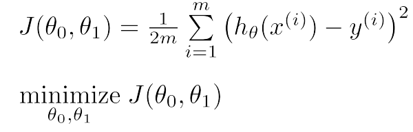
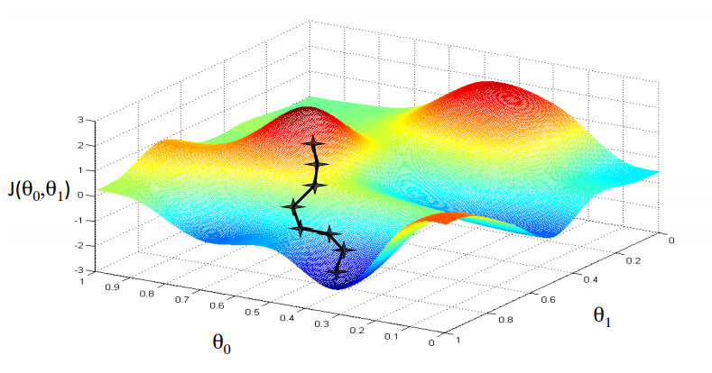
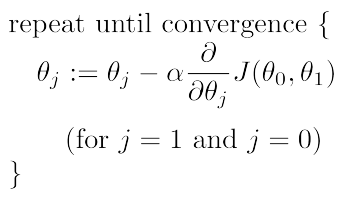
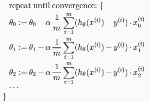
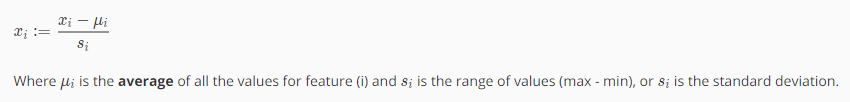
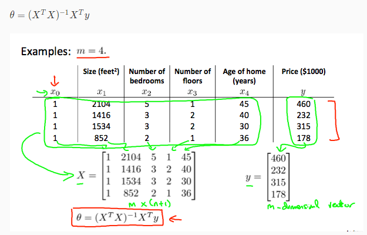

# Week 1 - Introduction

## What is Machine Learning

Arthur Samuel described it as: "the field of study that gives computers the ability to learn without being explicitly programmed."

Example
- Database mining
  - Large datasets from growth of automation/web, web click data, medical records, biology, engineering
- Applications can’t program by hand.
  - Autonomous helicopter, handwriting recognition, Natural Language Processing (NLP)
- Self-customizing programs
  - Amazon, Netflix product recommendations

## Supervised Learning

Know what our correct output should look like, having the idea that there is a relationship between the input and the output.

Two types
- Regression: predict continuous valued output (price)
- Classification: discrete valued output (0 or 1)

## Unsupervised Learning

Approach problems with little or no idea what our results should look like.

# Week 1 - Model and Cost Function

## Model Representation

build a mathematic model to represent the real problem

Example: y(x)=ax+b

## Cost Function

a way to evaluate the distance between estimate and real values

# Week 1 - Parameter Learning

## Gradient Descent

Have cost function: J(s0,s1), want to get min(J) -> keep change s0,s1 to achive the local minimum.

Intuition

Algorithm

# Week 2 - Multivariate Linear Regression

## Gradient Descent For Multiple Variables

## Gradient Descent - Feature Scaling

Feature scaling involves dividing the input values by the range (i.e. the maximum value minus the minimum value) of the input variable, resulting in a new range of just 1. 

Mean normalization involves subtracting the average value for an input variable from the values for that input variable resulting in a new average value for the input variable of just zero.

## Gradient Descent - Learning Rate

If \alphaα is too small: slow convergence.

If \alphaα is too large: may not decrease on every iteration and thus may not converge.

## Gradient Descent - Polynomial Regression

Our hypothesis function need not be linear (a straight line) if that does not fit the data well.

We can change the behavior or curve of our hypothesis function by making it a quadratic, cubic or square root function (or any other form).

## Normal Equation

In the "Normal Equation" method, we will minimize J by explicitly taking its derivatives with respect to the θj ’s, and setting them to zero. This allows us to find the optimum theta without iteration. The normal equation formula is given below:

# Source
- All materials come from [Machine Learning](https://www.coursera.org/learn/machine-learning) offered by Andrew Ng, Stanford University
