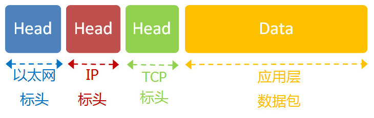
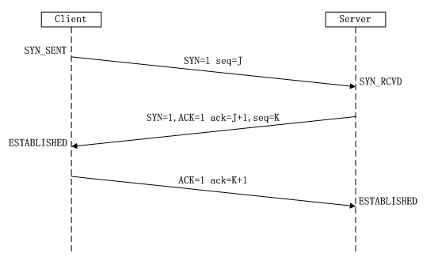
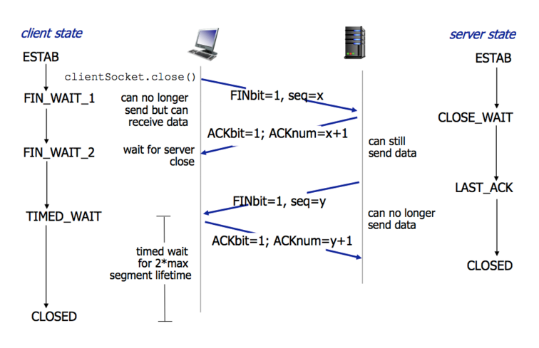
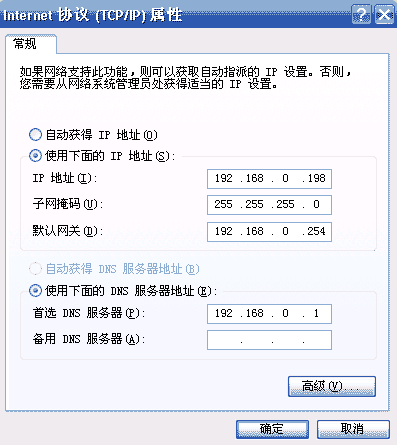

# Networking

## 网络协议体系

Internet protocol suite

- 物理层 (Physical Layer)
  - 作用：传输0/1信号
  - 传播：用电缆，光缆，无线电波等方式
  - 连接：电脑与电脑
- 链路层 (Link Layer)
  - 作用：确定0/1分组方式
  - 传播：以太网协议(Ethernet)，给出目标的Mac地址，在子网络内广播
  - 连接：Mac address to Mac address
- 网络层 (Internet Layer)
  - 作用：区分不同的计算机是否属于同一个子网络
  - 传播：IP协议
  - 连接：IP address to IP address
- 传输层 (Transport Layer)
  - 作用：区分不同应用可用的数据接口
  - 格式：UDP or TCP
  - 连接：port to port
- 应用层 (Application Layer)
  - 作用：规定了不同应用的数据格式，如网页，文件传输，电子邮件等
  - 格式：HTTP/FTP/SMTP
  - 连接：N/A

- HTTP把data做了一次封装，加了URL，IP，端口号，浏览器，语言等信息，在浏览器和服务器之间传输
- TCP在HTTP基础上做了一次封装，加了端口号，具有一定可靠性，保证数据被收到
- IP在TCP基础上做了一次封装，用来在IP地址之间通信，传输没有可靠性
- Ethernet在IP基础上做了一次封装，用来在Mac Address之间通信

- [互联网协议入门1](http://www.ruanyifeng.com/blog/2012/05/internet_protocol_suite_part_i.html)
- [互联网协议入门2](http://www.ruanyifeng.com/blog/2012/06/internet_protocol_suite_part_ii.html)
- [网络协议系统图解](https://zh.wikipedia.org/wiki/File:IP_stack_connections.svg)
- [UDP Frame组成](https://zh.wikipedia.org/wiki/File:UDP_encapsulation.svg)
- [你应该知道的计算机网络知识](http://blog.jobbole.com/105402)

## 一次网络请求的流程

- 输入URL，查询域名服务器（DNS）找到对应的IP地址
- 主机IP端口对目标IP端口发起握手，并建立TCP连接
- 向服务器发送数据
- 服务器解析，处理并返回
- 浏览器解析HTML

[一次网络请求的流程](http://www.jianshu.com/p/f184b8cee0a4)

## 域名解析流程

DNS是域名Domain和IP地址相互映射的一个分布式数据库

- 先去本地DNS服务器（缓存）找，若没找到
- 再去DNS根服务器找，若没找到
- 再去顶级DNS服务器找，若没找到
- 再去下属区域的DNS服务器找，若没找到则返回错误提示

注：本地DNS服务器一般指电脑IPv4或者IPv6设置中填的那个DNS地址对应的服务器

- [域名解析流程图](https://baike.baidu.com/item/域名解析)

## HTTP协议

请求/响应报文
- 200：成功
- 300：重新定向
- 400：请求错误
- 500：服务器错误

请求种类
- GET
- POST
- PUT
- DELETE

会话跟踪
- URL重写
- 隐藏表单
- Cookie+Session

安全性
- CSRF：跨站请求伪造 (Cross-site request forgery)
  - 用户登录某网站浏览器获得Cookies，然后点击了其它网站的恶意链接，后台伪造用户发送请求
  - 服务器端防范：验证码
- XSS：跨站脚本攻击 (Cross-site scripting)
  - 在网站/链接中插入恶意代码，盗取用户信息
  - 服务器端防范：过滤输入
  - 用户端防范：不要接受来自不可信任来源的JavaScript代码然后运行

## TCP/IP协议

三次握手：建立连接
- 连接请求：浏览器说，你好服务器，我是浏览器A
  - 客户端发送SYN包（SYN=i）到服务器，并进入到SYN-SEND状态，等待服务器确认
- 授予连接：服务器说，你好浏览器A，我是服务器B - SYN_RECV
  - 服务器收到SYN包，生成ack包（ack=i+1），同时生成一个syn包（syn=k），发送syn+ack包，此时服务器进入SYN-RECV状态
- 确认：浏览器说，你好服务器B - ESTABLISHED
  - 客户端收到服务器的syn+ack包，向服务器发送确认报ACK（ack=k+1），此包发送完毕，客户端和服务器进入ESTABLISHED状态

四次握手：关闭连接
- 主动结束方：你好，我的数据发送完毕了，我要进入准备断开的状态了。（此时它虽然不再发送数据了，但是可以接受数据）
  - Client发送一个FIN，用来关闭Client到Server的数据传送，Client进入FIN_WAIT_1状态
- 另一方：我知道了，我还没有发送完毕的，你等着吧。
  - Server收到FIN后，发送一个ACK给Client，确认序号为收到序号+1，Server进入CLOSE_WAIT状态
- 另一方：我也发送完毕了，可以断开链接了。（此时它也进入准备断开的状态）
  - Server发送一个FIN，用来关闭Server到Client的数据传送，Server进入LAST_ACK状态
- 主动结束方：好的，那断开吧。
  - Client收到FIN后，Client进入TIME_WAIT状态，接着发送一个ACK给Server，确认序号为收到序号+1，Server进入CLOSED状态

SYN攻击：攻击客户端在短时间内伪造大量不存在的IP地址，向服务器不断地发送SYN包，服务器回复确认包，并等待客户的确认。由于源地址是不存在的，服务器需要不断的重发直至超时，这些伪造的SYN包将长时间占用未连接队列，正常的SYN请求被丢弃，导致目标系统运行缓慢，严重者会引起网络堵塞甚至系统瘫痪

防御SYN攻击方法
- 缩短超时时间
- 过滤网关防护

- [TCP协议详解](http://www.jianshu.com/p/ef892323e68f)
- [网络请求过程扫盲](http://www.jianshu.com/p/8a40f99da882)

## 网络参数设置

- 本机的IP地址
  - 两部分组成：网络+主机
- 子网掩码
  - 子网掩码和IP地址做AND运算，得出其网络地址
- 网关的IP地址
  - 如果两台电脑不在同一个子网络，就无法知道对方的MAC地址，必须通过网关（gateway）转发
- DNS的IP地址
  - 域名服务器地址，用来解析URL

## Mac寻址

- 不同子网络：让gateway通过路由协议寻找到匹配的网络，然后进行转发
- 同一子网络：ARP协议
