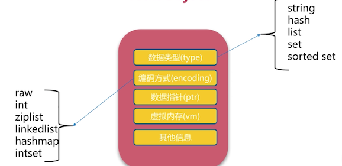
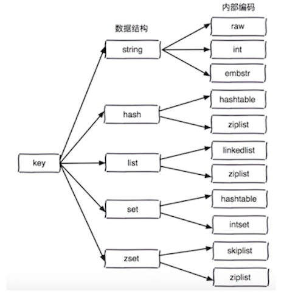
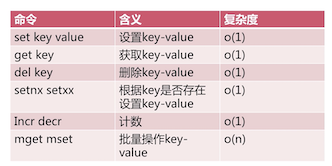
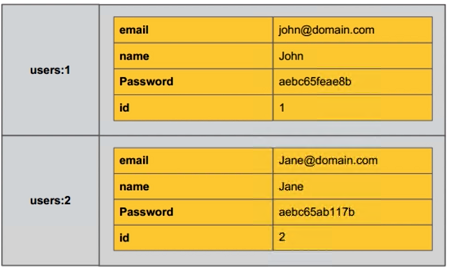
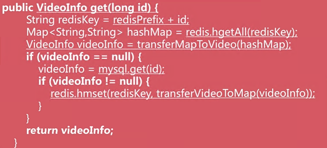
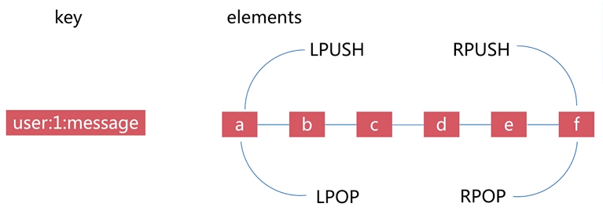
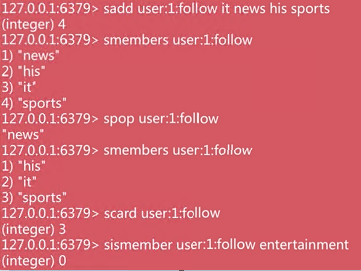
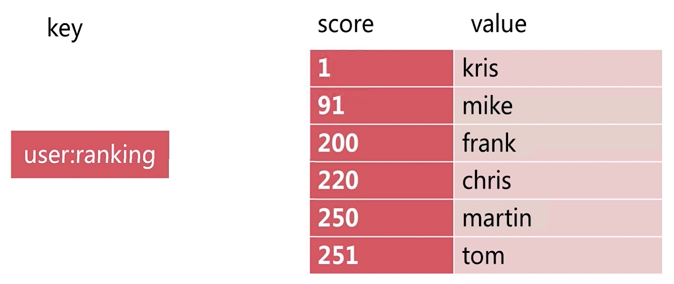
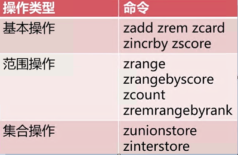

# Redis API

## 通用命令

keys：遍历所有的key，支持模糊匹配（注：这个命令比较heavy，在prod谨慎适用）

~~~
> keys *
1) "key1"
2) "key2"

> keys key1*
1) "key1"
~~~

dbsize：计算所有key的数量

~~~
> dbsize
(integer) 2
~~~

exists key：判断key是否存在（1-存在；0-不存在）

~~~
> exists key1
(integer) 1
> exists key3
(integer) 0
~~~

del key：删除key（1-成功；0-不成功）

~~~
> del key2
(integer) 1

> del key2
(integer) 0
~~~

expire key seconds：设置key在多少秒后过期

ttl key：查看key剩余的过期时间（-1代表永不过期，-2代表已经过期了）

persist key：设置key不过期

~~~
> set hello world
OK
> expire hello 10
(integer) 1
> ttl hello
(integer) 5
> ttl hello
(integer) -2
~~~

type key：返回key的类型
- string
- hash
- list
- set
- zset
- none

~~~
> set hello world
OK
> type hello
string
~~~

时间复杂度

## 数据结构和内部编码

redis中的对象，一个数据类型，可以有多种实现（编码方式）。

比如一个数据结构List，对应的内部编码方式有Linklist或者Ziplist。

## 单线程

Redis（大部分场景）是单线程的。

单线程为什么快？

1. 纯内存（主要）
2. 非阻塞IO
3. 避免线程切换和竞态消耗

注意点：
- 一次只运行一条命令
- 拒绝长慢命令（keys, flushall, flushdb, slow lua script, mutil/exec, etc.）

## 字符串

### 字符串键值类型

- String
- int
- bits (二进制0/1)
- jason格式

注：最大可以存放512MB的内容

### 使用场景

- 缓存
- 计数器
- 分布式锁

### 命令

get, set

~~~
get [key]

// 不管key存不存在都设置，相当于-add or override
set [key] [value]

// key不存在才设置，相当于-add only
setnx [key] [value]

// key存在才设置，相当于-update only
set [key] [value] xx

append [key] [value]

// 返回value的长度
strlen [key]
~~~

自增，自减

~~~
incr [key]

decr [key]

incrby [key] [k]

decrby [key] [k]
~~~

批量操作

~~~
mget [key1] [key2] [key3]

mset [key1] [value1] [key2] [value2] [key3] [value3]
~~~

注：对于获取n个key，可以调用一次mget，或者n次调用get，redis处理的速度是一样的，但是前者省去了（n-1次）网络传输时间。

### 时间复杂度

基本上都是O(1)

### 实战

用Redis缓存视频的基本信息，数据源是MySQL

分布式Id生成器

## Hash

redis中hash的组成和传统的键值对略微有所不同，它有三个组成部分：

- key (e.g. users:1)
- field (e.g. email, etc)
- value (e.g. john@domain.com, etc)

其实，相当于一个key对应一个obj，然后通过obj.field得到value。

注：field不能相同，value可以相同。

### 命令

`hget`, `hset`, `hdel`：对一个key的一个field进行操作，时间复杂度都是O(1)

~~~
hset user:1:info age 23
-> (integer)1

hset user:1:info name alex
-> (integer)1

hget user:1:info age
-> "23"

hgetall user:1:info
-> 1) "age"
   2) "23"
   3) "name"
   4) "alex"

hdel user:1:info age
-> (integer)1
~~~

`hexists`, `hlen`：时间复杂度都是O(1)

~~~
hexists user:1:info age
-> (integer)1

// 注：hlen返回的是field的个数
hexists user:1:info
-> (integer)2
~~~

`hmget`, `hmset`：批量操作一个key的多个field，时间复杂度都是O(n)

~~~
hmset user:2:info age 30 name bob
-> OK

hmget user:2:info age name
-> 1) "30"
   2) "bob"
~~~

`hgetall`, `hvals`, `hkeys`：时间复杂度都是O(n)

~~~
hkeys user：2：info
-> 1) "age"
   2) "name"

hvals user：2：info
-> 1) "30"
   2) "bob"
~~~

### 实战

使用redis缓存视频的基本信息，数据源在mysql中，下面演示的是读取数据的过程

## List

重点理解：Reids的基本数据格式是key-value。而数据类型，是针对value而言的。比如String，是指value是一个广义的String，再比如，hash，是指value是一个'hashmap'，再比如list，是指value是一个'linklist'。

### 命令

增 `rpush` O(1-n), `lpush` O(1-n), `linsert` O(n)

~~~
rpush listkey a b c
-> a-b-c

lpush listkey a b c
-> c-b-a

linsert listkey before b X
a-b-c -> a-X-b-c

linsert listkey after b Y
a-b-c -> a-b-Y-c
~~~

删 `lpop` O(1), `rpop` O(1), `lrem` O(n), `ltrim` O(n)

~~~
lpop listkey
a-b-c -> b-c

rpop listkey
a-b-c -> a-b

lrem [key] [count] [value]
//count=0, delete all matches values
//count>0, start from left, delete matching values up to count
//count<0, start from right, delete ...

ltrim [key] [start] [end]
// trim the list and save from start position to end position, inclusive
~~~

查 `lrange` O(n), `lrange` O(n), `llen` O(1)

~~~
lrange listkey 1 3
a-b-c-d-e -> b-c-d

lrange listkey 1 -1
a-b-c-d-e -> b-c-d-e

lindex listkey 2
a-b-c-d-e -> c

llen listkey
a-b-c-d-e -> 5
~~~

改 `lset` O(n)

~~~
lset listkey 2 X
a-b-c-d-e -> a-b-X-d-e
~~~

### 组合功能

- LPUSH + LPOP = Stack
- LPUSH + RPOP = Queue
- LPUSH + LTRIM = Capped Collection
- LPUSH + BRPOP = Message Queue

## Set

`sadd`：添加 O(1)

`srem`：删除 O(1)

`scard`：计算集合大小

`sismember`：判断是否在集合中

`srandmember`：从集合中随机挑选几个元素展示

`spop`：从集合中随机"弹出"一个元素

`smembers`：获取集合所有元素

`sdiff`：差集

`sinter`：交集

`sunion`：并集

### 组合功能

- SADD = Tagging
- SPOP/SRANDMEMBER = Random item
- SADD + SINTER = Social Graph

### 实战

- 抽奖
- 点赞
- 关注

## Zset

有序集合

### 命令

`zadd` O(logN)

~~~
zadd user:1:ranking 255 tom
~~~

`zrem` O(1)

~~~
zrem user:1:ranking 255 tom
~~~

`zscore` O(1) 返回元素的分数

~~~
zscore user:1:ranking tom
~~~

`zincrby` O(1) 增加或减少元素的分数

~~~
zincrby user:1:ranking 9 mike
~~~

`zcard` O(1) 返回元素的总数

~~~
zcard user:1:ranking
~~~

`zrange` O(log(n)+m) 返回index position范围内的升序元素

~~~
zrange user:1:ranking 1 3 withscores
~~~

`zrangebyscore` O(log(n)+m) 返回score范围内的升序元素

~~~
zrangebyscore user:1:ranking 90 200 withscores
~~~

`zcount` O(log(n)+m) 返回score范围内的元素个数

~~~
zcount user:1:ranking 90 200
~~~

### 实战

排行榜
