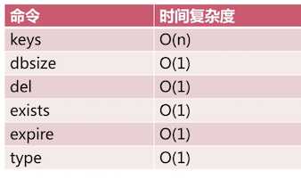
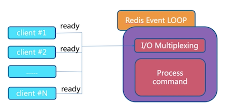
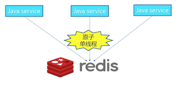

# Redis API 1

## 通用命令

keys：遍历所有的key，支持模糊匹配（注：这个命令比较heavy，在prod谨慎适用）

~~~
> keys *
1) "key1"
2) "key2"

> keys key1*
1) "key1"
~~~

dbsize：计算所有key的数量

~~~
> dbsize
(integer) 2
~~~

exists key：判断key是否存在（1-存在；0-不存在）

~~~
> exists key1
(integer) 1
> exists key3
(integer) 0
~~~

del key：删除key（1-成功；0-不成功）

~~~
> del key2
(integer) 1

> del key2
(integer) 0
~~~

expire key seconds：设置key在多少秒后过期

ttl key：查看key剩余的过期时间（-1代表永不过期，-2代表已经过期了）

persist key：设置key不过期

~~~
> set hello world
OK
> expire hello 10
(integer) 1
> ttl hello
(integer) 5
> ttl hello
(integer) -2
~~~

type key：返回key的类型
- string
- hash
- list
- set
- zset
- none

~~~
> set hello world
OK
> type hello
string
~~~

时间复杂度

## 数据结构和内部编码

redis中的对象，一个数据类型，可以有多种实现（编码方式）。

比如一个数据结构List，对应的内部编码方式有Linklist或者Ziplist。

## 单线程

Redis（大部分场景）是单线程的。

单线程为什么快？

1. 纯内存（主要）
2. 非阻塞IO
3. 避免线程切换和竞态消耗

注意点：
- 一次只运行一条命令
- 拒绝长慢命令（keys, flushall, flushdb, slow lua script, mutil/exec, etc.）

## 字符串

### 字符串键值类型

- String
- int
- bits (二进制0/1)
- jason格式

注：最大可以存放512MB的内容

### 使用场景

- 缓存
- 计数器
- 分布式锁

### 命令

get, set

~~~
get [key]

// 不管key存不存在都设置，相当于-add or override
set [key] [value]

// key不存在才设置，相当于-add only
setnx [key] [value]

// key存在才设置，相当于-update only
set [key] [value] xx

append [key] [value]

// 返回value的长度
strlen [key]
~~~

自增，自减

~~~
incr [key]

decr [key]

incrby [key] [k]

decrby [key] [k]
~~~

批量操作

~~~
mget [key1] [key2] [key3]

mset [key1] [value1] [key2] [value2] [key3] [value3]
~~~

注：对于获取n个key，可以调用一次mget，或者n次调用get，redis处理的速度是一样的，但是前者省去了（n-1次）网络传输时间。

### 时间复杂度

基本上都是O(1)

### 实战

用Redis缓存视频的基本信息，数据源是MySQL

分布式Id生成器

## Hash

## List

## Set

## Zset
