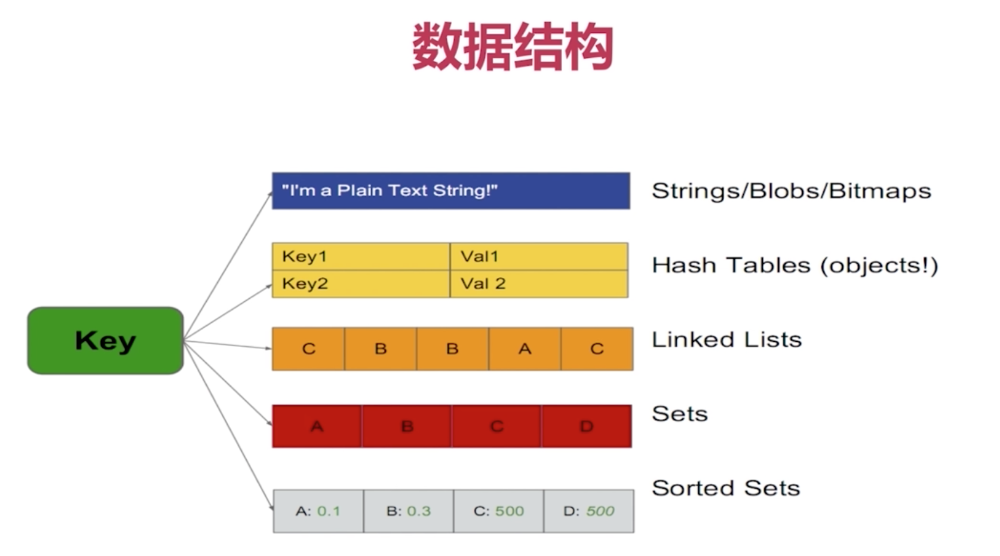
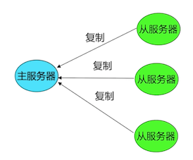
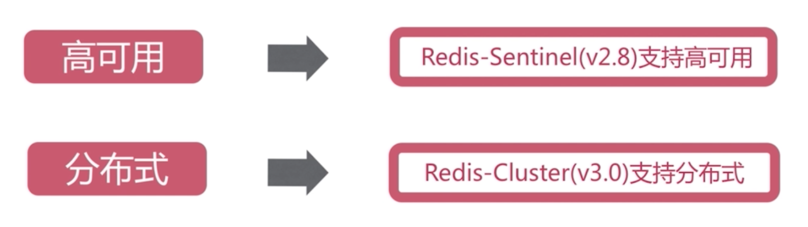
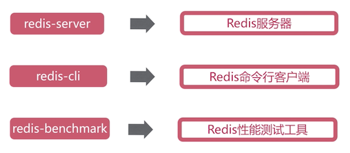
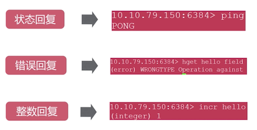
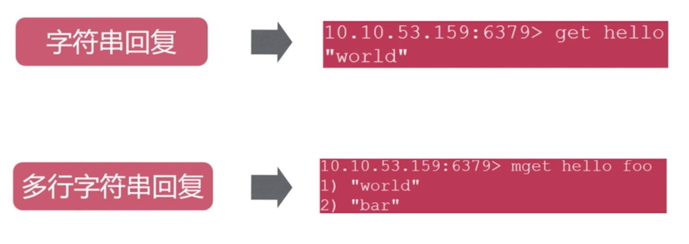
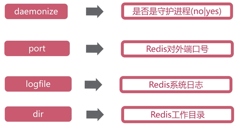

## Redis是什么

- 基于键值（Key Value）的存储服务系统
- 性能高
- 开源

便于理解，它的替代方案一般是：DB，Gemfire等。

## 特性总结

- 基本
  - 速度快
  - 持久化
- 高并发
  - 主从复制
  - 高可用，分布式
- 兼容性
  - 支持多种数据结构
  - 支持多种编程语言
- 其它
  - 简单
  - 功能丰富

## 特性 - 速度快

速度：10w OPS

为什么快：因为数据读写是在内存中

## 特性 - 持久化

所有数据存储在内存中，对数据的更新将异步保存到磁盘上

具体怎么保证断点不丢数据的呢？- RDB，AOF

## 特性 - 数据结构

5种主要数据结构
- String
- Hash table
- Linked List
- Set
- Sorted Set

# 特性 - 功能丰富

- 发布订阅
- 事务
- pipeline
- Lua脚本

# 特性 - 主从复制

# 特性 - 高可用

## 典型适用场景

- 缓存
- 计数器
- 消息队列
- 排行榜
- 社交网络
- 实施系统

## 安装

可执行文件（bin）介绍

最简启动

~~~
src/redis-server
~~~

动态参数启动

~~~
src/redis-server --port 6380
~~~

配置文件启动

~~~
src/redis-server configPath
~~~

查看启动情况

~~~
ps -ef | grep redis
redis-cli -h [ip] -p [port] ping
~~~

使用

~~~
$ src/redis-cli
redis> set foo bar
OK
redis> get foo
"bar"
~~~

## Redis客户端返回值

## 常用配置

~~~
daemonize yes
port 6382
dir "/Users/Max/Applications/redis-6.0.5/data"
logfile "6382.log"
~~~

