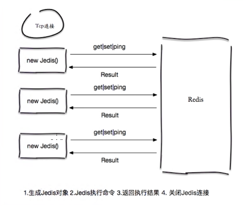
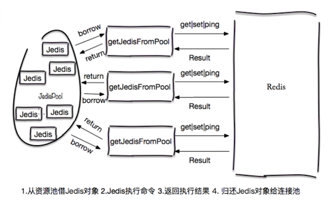
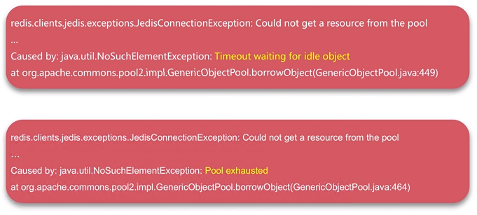

# Redis - Client

## Redis自带客户端 - redis-cli

官方自带的客户端，相当于shell操作。

启动命令为`src/redis-cli`。

## Java客户端 - Jedis

Maven依赖

~~~
<!-- https://mvnrepository.com/artifact/redis.clients/jedis -->
<dependency>
    <groupId>redis.clients</groupId>
    <artifactId>jedis</artifactId>
    <version>2.9.0</version>
</dependency>
~~~

### 连接方式

直连

~~~
Jedis jedis = new Jedis("127.0.0.1", 6379);

jedis.set("hello", "world");
String value = jedis.get("hello");
~~~

连接池

~~~
poolConfig = new GenericObjectPoolConfig();
JedisPool jedisPool = new JedisPool(poolConfig, "127.0.0.1", 6379);

Jedis jedis = null;
try {
    jedis = jedisPool.getResource();
	
	jedis.set("hello", "world");
	String value = jedis.get("hello");
} catch (Exception e) {
    e.printStackTrace();
} finally {
    if (jedis != null) jedis.close(); // return resource to pool instead of destory
}
~~~

### 实战

~~~
// example 1
jedis.hset("myhash", "f1", "v1");
jedis.hset("myhash", "f2", "v2");
jedis.hgetAll("myhash");
// result -> {f1=v1, f2=v2}

// example 2
jedis.rpush("mylist", "1");
jedis.rpush("mylist", "2");
jedis.rpush("mylist", "3");
jedis.lrange("mylist", 0, -1);
// result -> [1,2,3]
~~~

## Python客户端 - redis-py

### Install

Source: <https://github.com/andymccurdy/redis-py>

Two ways:
1. `pip install redis`
2. download packages from source and run cmd `python setup.py install`

### 实战

~~~
import redis

client = redis.StrictRedis(host='127.0.0.1', port=6379)
key = "hello"
setResult = client.set(key, "python-redis")
print setResult
value = client.get(key)
print key + " " + value
~~~

## Jedis配置优化

commons-pool配置参数

### 资源数控制

`maxTotal`，资源池最大连接数，默认8

`maxIdle`，资源池允许最大空闲连接数，默认8

`minIdle`，资源池确保最少空闲连接数，默认0

`jmxEnabled`，是否开启jmx监控，默认true

### 借还参数

`blockWhenExhausted`，当资源池连接用尽后，是否需要等待，默认true

`maxWaitMillis`，当资源池连接用尽后，最大等待时间，默认-1（永不超时），建议设置1000或其它

`testOnBorrow`，当借用连接时，是否需要检测有效性（ping），默认false

`testOnReturn`，当归还连接时，是否需要检测有效性（ping），默认false

### 如何确定maxTotal

举例
- 命令平均执行时间 0.1ms = `0.001`s（客户端执行命令时间）
- 业务需要 `50000` QPS（业务希望Redis并发量）
- node个数为100，redis的最大连接数(config get maxclients)为10000，所以最大可以支持的连接数为 10000 / 100 = `100`（Redis资源）
- 结论 -> maxTotal理论值 = `0.001` * `50000` = 50个，实际值要偏大一些，但是要小于`100`

### 如何确定maxIdle和minIdle

- 建议maxIdle = maxTotal，减少创建新连接的开销
- 建议预热minIdle(>0)，减少第一次启动后的新连接开销

### 常见问题

可能原因

- 慢查询阻塞：池子连接都被hang住
- 资源池参数不合理：例如QPS高，池子小
- 连接泄漏泄漏：比如没有close()，可以使用`client list`, `netstat`等查看
- DNS异常

解决思路：顺藤摸瓜，从log上入手，结合代码分析。
