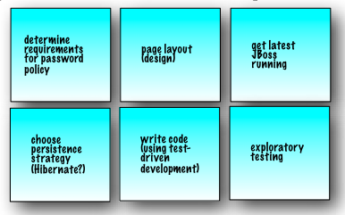

# Scrum / Agile

## Agile

- 以人为核心：强调面对面的沟通协作，而不是邮件/文档
- 拥抱变化：快速迭代，快速交付，增量式开发

### History

2001年，由Martin Fowler，Jim Highsmith等17位软件开发专家在美国犹他州召开了雪鸟会议，会议上正式提出了敏捷开发概念，并共同签署了敏捷宣言，敏捷联盟成立。

2003年，《 Lean Software Development: An Agile Toolkit 》出版，精益开发方法被业界广泛认知，并完善了敏捷开发方法。

2006年至今，Google、微软、IBM、亚马逊、华为等公司在大规模软件开发中开始应用敏捷，掀起敏捷应用热潮。

### Methods

- **Scrum**
- Kanban
- 水晶方法，Crystal
- 特性驱动开发，FDD/Feature Driven Development
- 精益软件开发，Lean Software Development
- 极限编程，XP Extreme Programming

参考 -> 什么是 Agile Software Development（敏捷软件开发）？<https://www.zhihu.com/question/23429937/answer/834334551>

## Scrum

a management framewrok for incremental product development

it's an alternative to waterfall

- Start
- Detailed Requirement ->
- Design & Analysis ->
- Implementation & Developer Testing ->
- QA / Acceptance Testing ->
- Evaluation / Prioritization (Deployment) ->
- Back to Start

## Scrum Roles

Product Owner: single person responsible for maximizing the return on investment of the development effort

Scrum Development Team: cross-functional, self-organizing/self-managing

Scrum Master: facilates the Scrum process

Scrum Meeting:

Sprint Planning Meeting: negotiate which Product Backlog Items whey will apptempt to convert to working product during the Sprint

Daily Scrum: everyday at the same time and place, team members spend 15 minutes reporting to each other

Sprint Review Meeting: demonstrate a working product increment to the Product Owner

Sprint Retrospective Meeting: inspect their behavior and take action to adapt it for future Sprints

Backlog Refinement Meeting: help prepare the Product Backlog for the next Sprint Planning Meeting

## Scrum Artifacts

Product Backlog

Product Backlog Item

Sprint Backlog

Sprint Task

Sprint Burndown Chart

## Links

- <http://scrummethodology.com/>
