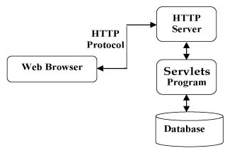
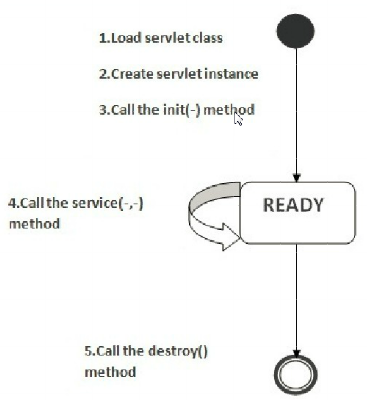

# Web - Servlet

## Project Folder Structure

```
myWebApp/
  WEB-INF/
    web.xml
    weblogic.xml
    lib/
      MyLib.jar
    classes/
      MyPackage/
        MyServlet.class
  jsp/
  scripts/
```

## Server


### Web Server

A Web server exclusively handles HTTP requests. 主要负责收发Web请求，做一些简单的处理逻辑，复杂的逻辑转发给Application Server。

Java Web Server
  * Tomcat
  * httpd
  
### Application Server

An application server serves business logic to application programs through any number of protocols. 主要负责复杂的business逻辑处理。

Java App Server
  * JBoss
  * Glassfish
  * WebSphere
  * WebLogic

## Servlets

Servlet is a small Java program that runs within a web server.
- Servlets receive and respond to requests from Web clients, usually across HTTP



### Servlet Life Cycle

很简单：初始化->工作中->销毁

- initialization -> `init()`
  - The container initializes the servlet and executes all the statements from this method(Connecting to DB, initializing some objects, etc)
- servicing -> `service()`
  - Accepting http request, precessing and sending the http response to the browser
- destroying -> `destroy()`
  - Unload from container



### Servlet Thread Safe Issue

Servlet的生命周期是由Web容器控制的，而Web容器一般会创造一个线程池，new多个Servlet。有request就从池子里拿Servlet出来处理。

- 同一时间，一个Servlet只能处理一个request。
- 处理完了之后，Servlet不会销毁/重新初始化，而是接着处理后续的request。

所以，如果代码写的不好，是有可能发生线程安全问题的。

-> 参考 servlet线程安全问题的详解 <https://blog.csdn.net/after_you/article/details/54173012>

### Java Class Structure

~~~
javax.servlet
     |
Servlet - Super interface for Java Servlet API
ServletContext - Provides runtime env for servlet
ServletConfig - Provides info about parameters
ServletRequest - super interface for all the requset objects
ServletResponse - super interface for all the response objects
GenericServlet - Non-http based servlets creation

javax.servlet.http
     |
HttpServletRequest
     - setAttribute()
     - getAttribute()
     - getSession()
     - getParameter()
     - getParameterValues()
     - getInitParameter()
     - getInitParameterNames()
HttpServletReponse
     - setContentType()
     - sendRedirect()
HttpServlet (class)
     - public void init()
     - public void service(HttpServletRequest, HttpServletResponse)
     - public void destroy()
     - public void doGet(HttpServletRequest, HttpServletResponse)
     - public void doPost(HttpServletRequest, HttpServletResponse)
HttpSession
     - setAttribute()
     - getAttribute()
     - getId()
     - getLastAccessedTime()
Cookie
~~~

### Example

~~~ java
// Import required java libraries
import java.io.*;
import javax.servlet.*;
import javax.servlet.http.*;

// Extend HttpServlet class
public class HelloWorld extends HttpServlet {
 
   private String message;

   public void init() throws ServletException {
      // Do required initialization
      message = "Hello World";
   }

   public void doGet(HttpServletRequest request, HttpServletResponse response)
      throws ServletException, IOException {
      
      // Set response content type
      response.setContentType("text/html");

      // Actual logic goes here.
      PrintWriter out = response.getWriter();
      out.println("<h1>" + message + "</h1>");
   }

   public void destroy() {
      // do nothing.
   }
}
~~~

### Quick Run Servlets in Tomcat

简单版本的，就是把classpath设好，把class文件放好，把xml改好，然后就可以run了。

Set the classpath for servlet.jar from tomcat folder

- `set classpath=%classpath%; ...\tomcatXXX\lib\servlet.jar`;

Copy the servlet .class file to the tomcat server folder

- `tomcat-XXX\webapps\ROOT\WEB-INF\classes`

Register the servlet in web.xml

~~~ xml
<servlet>
	<servlet-name>HelloServlet</servlet-name>
	<servlet-class>HelloServlet</servlet-class>
</servlet>

<servlet-mapping>
	<servlet-name>HelloServlet</servlet-name>
	<url-pattern>/HelloServlet</url-pattern>
</servlet-mapping>
~~~

Start the tomcat in cmd

- tomcat\bin > `catalina.bat run`


Open the browser and visit the URL

- `http://localhost:8080/HelloServlet`

## Session

### How to Share Data Between Multiple Requests

用户的发来多个请求，服务器应该有一个上下文Context的概念。这其实就是 “会话” Session 的功能。

- HttpSession
  - `javax.servlet.http.HttpSession session = request.getSession(true);`
  - `Product product = (Product) session.getAttribute("myproduct");`
- URL parameters（不常用）
- Cookies（不常用）

### Cookies v.s. Session

- Sessions are server-side files that contain user information, while Cookies are client-side files that contain user information. 
- Sessions have a unique identifier that maps them to specific users. This identifier can be passed in the URL or saved into a session cookie.

<http://stackoverflow.com/questions/359434/differences-between-cookies-and-sessions>
