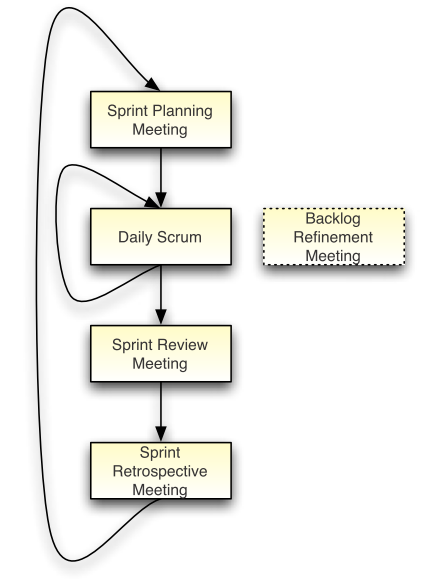
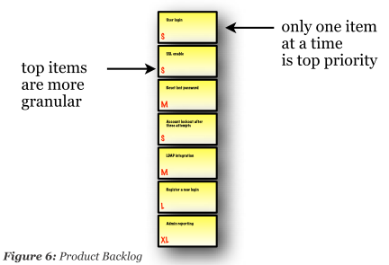
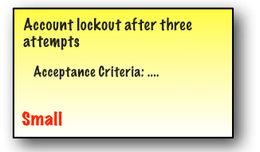
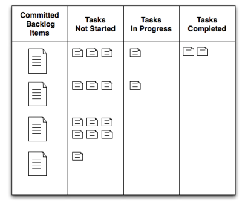
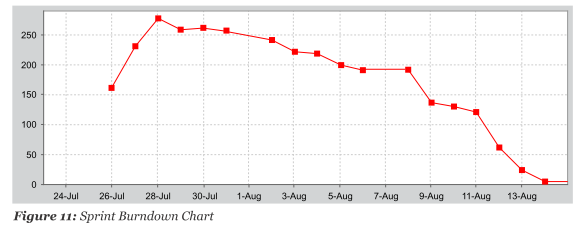

# Software Development - Scrum

a management framewrok for incremental product development

it's an alternative to waterfall

- Start
- Detailed Requirement ->
- Design & Analysis ->
- Implementation & Developer Testing ->
- QA / Acceptance Testing ->
- Evaluation / Prioritization (Deployment) ->
- Back to Start

## Scrum Roles

Product Owner: single person responsible for maximizing the return on investment of the development effort

Scrum Development Team: cross-functional, self-organizing/self-managing

Scrum Master: facilates the Scrum process

Scrum Meeting:

Sprint Planning Meeting: negotiate which Product Backlog Items whey will apptempt to convert to working product during the Sprint

Daily Scrum: everyday at the same time and place, team members spend 15 minutes reporting to each other

Sprint Review Meeting: demonstrate a working product increment to the Product Owner

Sprint Retrospective Meeting: inspect their behavior and take action to adapt it for future Sprints

Backlog Refinement Meeting: help prepare the Product Backlog for the next Sprint Planning Meeting

## Scrum Artifacts

Product Backlog

Product Backlog Item

Sprint Backlog

Sprint Task

Sprint Burndown Chart

## Links

- <http://scrummethodology.com/>
