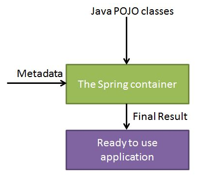
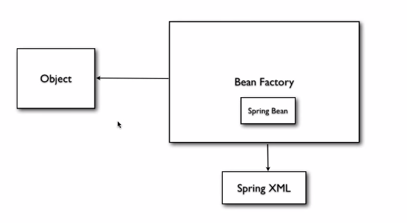

# Spring Basic

## What is Sping Framework?

The Spring Framework is **an open source application framework** and **IoC** for the Java platform.

> Spring is modular, allowing you to pick and choose which modules are applicable to you, without having to bring in the rest.

### Features

- D.I.
- Modular
- Spring MVC
- Spring AOP

### Topics

- Spring Annotation
- Spring JPA
- Spring Security
- Spring / RESTful Integration
- Spring / SOAP Integration

## Architecture


## Dependency Injection

### What is D.I.

you do not create your objects but describe how they should be created

> "One or more dependencies (or services) are injected, or passed by reference, into a dependent object (or client) and are made part of the client's state.
The pattern separates the creation of a client's dependencies from its own behavior."

### Three types

[Wikipedia Link](http://en.wikipedia.org/wiki/Dependency_injection#Without_dependency_injection)

- Constructor injection
- Setter injection
- Interface injection

### IoC Container



The container will create the objects, wire them together, configure them, and manage their complete lifecycle from creation till destruction.

Types

- Spring ApplicationContext Container
  - create the bean before calling getBean()
- Spring BeanFactory Container
  - create the bean when calling getBean()


##  Spring Bean

> "A bean is an object that is instantiated, assembled, and otherwise managed by a Spring IoC container. 
These beans are created with the configuration metadata that you supply to the container, for example, in the form of XML definitions."

### Properties

- class
- name
- scope
- constructor-arg
- properties
- autowiring mode
- lazy-inialization mode
- initialization method
- destruction method

### Inner Bean

Bean inside bean, object inside object

In the example, `PointA` is an inner bean of `square` referencing to `zeroPoint`. 
`PointB` is an inner bean defined inside `square`.

e.g. applicationContext.xml

```
<bean id="square" class="com.chennanni.learnspring.Square">
	<property name="pointA" ref="zeroPoint" />
	<property name="pointB">
		<bean class="com.chennanni.learnspring.Point">
			<property name="x" value="1" />
			<property name="y" value="1" />
		</bean>
	</property>
</bean>

<bean id="zeroPoint" class="com.chennanni.learnspring.Point">
	<property name="x" value="0" />
	<property name="y" value="0" />
</bean>
```

### Bean Scope

#### Basic

- singleton: a single instance per Spring IoC container (default)
  - container creates all beans when it is initialized, and then when an object called getBean(), container hands over the bean to the object
- prototyoe: new bean created with every request of reference
  - only when an object ask for the bean, container creates a bean and give it to the object

#### Web-aware Context

- request: new bean per servlet request
- session: new bean per session
- global-session: new Bean per global HTTP session (portlet context)

#### Syntax

```
<bean ... scope="singleton">
     ...
</bean>
```

### Bean Autowiring

#### When to use it

to autowire an inner bean

比如说有一个class `Person`，里面有一个inner class `Test`，
在做DI的时候，会把`Person`和`Test`都配置好，实例为`person_1`和`test_1`，但是怎么保证`test_1`就是`person_1`里面的那个对象呢？
这里就需要再配置一下，wire `test_1`到`person_1`上。但是怎么去mapping呢？有两种方式：byName和byType。具体的实现也有两种方式：Annotation和Configuration。

~~~ java
class Person {
	int id;
	String name;
	
	@Autowired
	Test test;
}
~~~

#### Annotation

Autowired on Properties

```
@Autowired
private Person person;
```

Autowired on Setter Methods

```
@Autowired
public void setPerson(Person person){
   this.person = person;
}
```

Autowired on Constructors

```
@Autowired
public Trip(Person person){
	this.person = person;
}
```

Autowired with (required=false) option

```
@Autowired(required=false)
```

if can not perform autowire for a property, set it to default value(null)

#### Configuration

autowire = "byName": class variable' name is the same as the name of bean

~~~ xml
<bean ... autowire = "byName">
     ...
</bean>
~~~

autowiring = "byType": class variables' type is the same as the type of bean

~~~ xml
<bean ... autowire = "byType">
     ...
</bean>
~~~

autowire = "constructor": similar to byType, but type applies to constructor arguments

Note: in the constructor the bean needs to be initiated

~~~ xml
<bean ... autowire = "constructor">
     ...
</bean>
~~~

~~~ java
public class Foo {
	private Moo moo;
	public Foo(Moo moo) {
		this.moo = moo;
	}
}
~~~

### Bean Life Cycle

we can define what should be done after the bean is initialized/destroied

(Take initialization for example, destruction is just the same.)

Two Steps:

- register a shut down hook in the main app
- write the init method

#### Register a shut down hook

```
AbstractApplicationContext context = new ClassPathXmlApplicationContext("Beans.xml");
context.registerShutdownHook();
```

#### Write the init method

The first way: implement `InitializingBean` and overwrite its `afterPropertiesSet()`

```
public class ExampleBean implements InitializingBean {
   public void afterPropertiesSet() {
      // do some initialization work
   }
}
```

The second way(recommeded): specify the `init-method` attribute in the XML configuratoin file to map it to your own init method

```
<bean id="exampleBean"
         class="examples.ExampleBean" init-method="init"/>

public class ExampleBean {
   public void init() {
      // do some initialization work
   }
}
```

## Bean Factory/Application Context



### Creation of a bean

Two ways of create a bean factory and get bean

e.g. using BeanFactory

```
import org.springframework.beans.factory.BeanFactory;
import org.springframework.beans.factory.xml.XmlBeanFactory;
import org.springframework.core.io.FileSystemResource;

BeanFactory factory = new XmlBeanFactory(new FileSystemResource("spring.xml"));
Square square = (Square) factory.getBean("square");
```

e.g. using ApplicationContext

```
import org.springframework.context.ApplicationContext;
import org.springframework.context.support.ClassPathXmlApplicationContext;

ApplicationContext context = new ClassPathXmlApplicationContext("spring.xml");
Square square = (Square) context.getBean("square");
```

Difference between BeanFactory and ApplicaitonContext

- `BeanFactory` only instantiates bean when you call `getBean()` method
- `ApplicationContext` instantiates Singleton bean when container is started,  It doesn't wait for `getBean()` to be called

### Injecting Fields/Objects/Colleciton

Spring  using setter() to set class variables' values

#### Fields

e.g. Square.java

```
private int height;
```

e.g. spring.xml

```
<bean id="square" class="com.chennanni.learnspring.Square">
     <property name="height" value="10"/>
</bean>
```

#### Objects

e.g. Square.java

```
private Point pointA;
```

e.g. spring.xml

```
<bean id="square" class="com.chennanni.learnspring.Square">
	<property name="pointA">
		<bean class="com.chennanni.learnspring.Point">
			<property name="x" value="1" />
			<property name="y" value="1" />
		</bean>
	</property>
</bean>
```

#### Collection

```
<bean id="triangle" class="com.chennanni.learnspring.Triangle">
	<property name="points">
		<list>
			<ref bean="Point1" />
			<ref bean="Porint2" />
		</list>
	</property>
</bean>
```

### Using Constructor Injection

Spring passes values to the constructor method

e.g. Square.java

```
private String type;
private int height;
private Square (String type, int height) {
	this.type = type;
	this.setHeight(height);
}
```

e.g. spring.xml:

```
<bean id="square" class="com.chennanni.learnspring.Square">
	<constructor-arg type="java.lang.String" index="0" value="type1" />
	<constructor-arg type="int" index="1" value="10" />
	<property name="type" value="type2" />
</bean>
```

## Steps to Create and Use a Spring Bean

- create a bean class (pojo class)
- register and configue it in `application.xml`
- get the bean use `applicationContext.getBean(...)`

## Misc

### Configuration

Two ways: one is to config the `.xml` file, another is using Annotation.

### ContextLoaderListener

When to use it: if you want to put your Servlet file in your custom location or with custom name, rather than the default name `"[servlet-name]-servlet.xml"` and path under `"Web-INF/"`

```
<context-param>
     <param-name>contextConfigLocation</param-name>
     <param-value>/MyLocation/myservlet-servlet.xml</param-value>
 </context-param>

<listener>
     <listener-class>org.springframework.web.context.ContextLoaderListener</listener-class>
</listener>
```

Purpose of `ContextLoaderListener`

- to tie the lifecycle of the `ApplicationContext` to the lifecycle of the `ServletContext`
- to automate the creation of the `ApplicationContext`

<http://stackoverflow.com/questions/11815339/role-purpose-of-contextloaderlistener-in-spring>
