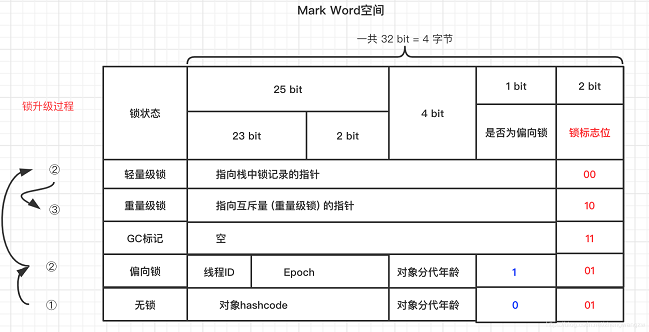
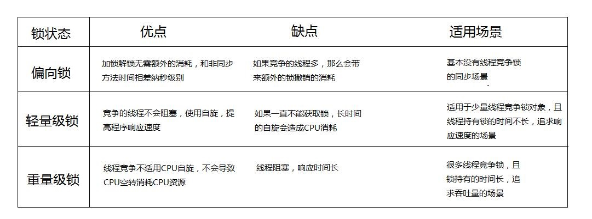
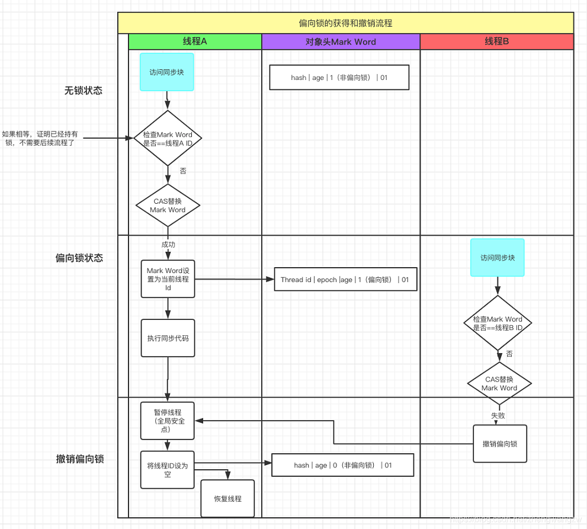

# Thread - Lock

锁的概念存在于各种编程语言中，不论是Java和还是DB，其本质也都类似。

## 各种类型的锁

一种最基本的分类方法为：共享锁，独享锁。除此之外还有很多其他各种划分方法。

### 共享锁 v.s. 独享锁

共享锁
- 该锁可被多个线程持有。
- 举例：Java中的`ReentrantReadWriteLock`的读锁。读共享。

独享锁
- 也叫：排他锁，互斥锁。
- 该锁一次只能被一个线程持有。
- 举例：Java中的`ReentrantReadWriteLock`的写锁。写互斥。

~~~ java
public class ReentrantReadWriteLockTest {

    private static ReentrantReadWriteLock reentrantLock = new ReentrantReadWriteLock();
    private static ReentrantReadWriteLock.ReadLock readLock = reentrantLock.readLock();
    private static ReentrantReadWriteLock.WriteLock writeLock = reentrantLock.writeLock();

    public static void read() {
        readLock.lock();
        try {
            System.out.println(Thread.currentThread().getName() + "###获取读锁，开始执行");
            Thread.sleep(1000);
        } catch (Exception e) {
            e.printStackTrace();
        } finally {
            readLock.unlock();
            System.out.println(Thread.currentThread().getName() + "###释放读锁");
        }
    }

    public static void write() {
        writeLock.lock();
        try {
            System.out.println(Thread.currentThread().getName() + "获取写锁，开始执行");
            Thread.sleep(1000);
        } catch (Exception e) {
            e.printStackTrace();
        } finally {
            writeLock.unlock();
            System.out.println(Thread.currentThread().getName() + "释放写锁");
        }
    }

    public static void main(String[] args) {
        new Thread(() -> read(), "Thread1").start();
        new Thread(() -> read(), "Thread2").start();
        new Thread(() -> write(), "Thread3").start();
        new Thread(() -> write(), "Thread4").start();
    }
}
~~~

参考 -> Java中的共享锁和排他锁 <https://blog.csdn.net/fanrenxiang/article/details/104312606>

### 公平锁 v.s. 非公平锁

（公平的意思是：允不允许插队）

公平锁：多个线程 按照 申请锁的顺序 来 获取锁。（背后的实现是一个队列）

非公平锁：多个线程 不一定 按照 申请锁的顺序 来 获取锁。（获取不到锁的时候，会自动加入队列，等待线程释放锁后所有等待的线程**同时去竞争**）

举例1：`ReentrantLock`，通过构造函数指定该锁是否是公平锁，默认是非公平锁。

举例2：`Synchronized`是非公平锁。

### 悲观锁 v.s. 乐观锁

悲观锁
- 总是假设最坏的情况，每次取数据都认为会被其它人修改，所以一定先加锁。

乐观锁
- 在操作时乐观，认为不会发生并发问题，因此不把资源锁住，而是最后写入的时候判断是否被修改过。一般使用 version 或者 CAS 实现。

参考 -> 乐观锁、悲观锁，这一篇就够了 <https://segmentfault.com/a/1190000016611415>

### 自旋锁 v.s. 阻塞锁

自旋锁
- 采用循环的方式（CAS）不停尝试获取锁。
- 好处是响应速度更快，缺点是（自旋）消耗性能。
- 举例：`Synchronized`中的 偏向锁 与 轻量级锁。

阻塞锁
- 使用 CPU 阻塞实现同步。
- 举例：`Synchronized`中的 重量级锁

参考
- [Java中的锁分类](https://www.cnblogs.com/qifengshi/p/6831055.html)
- [java自旋锁](http://ifeve.com/java_lock_see1)

### 分段锁

其实是一种锁的设计，将一个大的对象切分为多个小的对象，在细微粒度下加锁，即可达到并发操作这一整个对象的目的。

举例：`ConcurrentHashMap`。

## Java对象结构

为了分析加锁的底层实现，先看一下Java对象是怎么构成的。

- 对象头
  - Mark Word: 存储对象的hashCode，锁信息，分代年龄，GC标志等信息
  - Klass Word: 存储指向对象所属类的指针
- 对象实例数据
- 对齐填充

在Mark Word中，主要我们关注两个flag的信息：
- 是否为偏向锁
- 锁标志位

通过这两个flag，我们可以判断一个锁是什么类型的：
- 无锁： `0 + 01`
- 偏向锁： `1 + 01`
- 轻量级锁： `N/A + 00`
- 重量级锁： `N/A + 10`

## Java并发锁的类型

偏向锁：具有"偏向"的一把锁，它更倾向于"有钥匙的人"（已经获取到锁的对象）。
获得了锁的线程可以重入。其它的线程只能CAS不断自旋等待。

轻量级锁：（本质和偏向锁一样）如果有人去竞争偏向锁，就会升级成轻量级锁。

重量级锁：轻量级锁自旋达到一定次数，就会升级成重量级锁。
使用CPU级别阻塞实现锁，消耗大。

## Java并发锁的锁升级

### 无锁 -> 偏向锁

这里重点是：线程使用 CAS 来尝试将自己的 线程ID 写入锁对象的 Mark Word

什么时候能写呢？
- 锁对象的Mark Word为空
- 锁对象的Mark Word不为空，所对应的线程死了
- 锁对象的Mark Word不为空，所对应的线程存活，但是（线程的栈帧已将锁对象弹出）不需要再持有锁对象了

如果不能写，表明有竞争，就会把锁升级成轻量级锁。

### 偏向锁 -> 轻量级锁

从设计角度，偏向锁适用于基本没有锁竞争的场景。
所以，如果有竞争（A线程持有锁，来了一个B线程竞争），（B线程）就会**撤销偏向锁**，然后把锁升级为轻量级锁。

### 轻量级锁 -> 重量级锁

有新线程过来竞争轻量级锁，那么新线程会自旋尝试获取锁，尝试到一定次数（默认10次）依然没有拿到，锁就会升级成重量级锁。

参考 -> 详细分析偏向锁和轻量级锁的升级 <https://blog.csdn.net/tongdanping/article/details/79647337>
