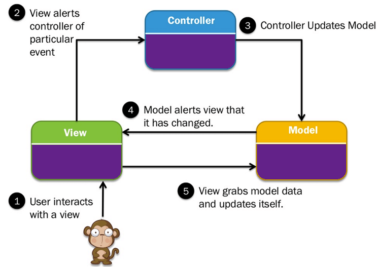

# Web Framework - Struts 2

## MVC Architecture


TODO
https://www.guru99.com/images/1/122118_0445_MVCTutorial1.png

MVC is popular as it isolates the application logic from the user interface layer

- Model: The lowest level of the pattern which is responsible for **maintaining data**.
- View: This is responsible for **displaying all or a portion of the data** to the user.
- Controller: Software Code that controls the **interactions between the Model and View**.

Flow: Here the Controller receives all requests for the application and then 
works with the Model to prepare any data needed by the View. 
The View then uses the data prepared by the Controller to generate a final presentable response.

## Struts 2 Architecture

Struts2 is realized with following five core components:

- Actions
- Interceptors
- Value Stack / OGNL
- Results / Result types
- View technologies

Struts 2 is slightly different from a traditional MVC framework in that the `action` takes the role of the `model` rather than 
the `controller`, although there is some overlap.
(note: action contains both business logic and model data)


Work Flow

- User sends a request to the server for requesting for some resource (i.e pages).
- The FilterDispatcher looks at the request and then determines the appropriate Action.
- Configured interceptors functionalities applies such as validation, file upload etc.
- Selected action is executed to perform the requested operation.
- Again, configured interceptors are applied to do any post-processing if required.
- Finally the result is prepared by the view and returns the result to the user.

## Hello World Example

一个最简单的应用，可以分为三个部分，真好对应了MVC的三个点。

- Controller, 服务器接收到一串URL，应该被分配到哪里去处理，在 `Config` 里面配置。
- Model, 接收到请求之后，进行业务逻辑处理，访问数据库，得出结果，一般是 `Action` 的工作。
- View, 把data组装在一个页面，最终返回给用户，一般是 `jsp` 的格式。

参考 -> <http://www.tutorialspoint.com/struts_2/struts_examples.htm>

对比Struts2和Spring MVC，其实整个workflow是很类似的。为什么最终大多数人选择了Spring？个人感觉有以下几个原因。
- Spring MVC 的 flow 更加容易理解一点点。跳转和业务逻辑放在Controller里，（或者，业务逻辑可以独立出来做一层也可以，更加清晰），Model就是数据层。
- Struts 2 的 flow 有一点点搞。跳转放到了Controller里，业务逻辑和数据访问放到了Model里，也就是Action。（其实，使用的时候稍微注意下，也可以达到上面一样的架构，不过有更好的选择，为什么要费这个功夫呢？）
- View 其实都差不多。
- 最后，Spring IoC的概念太火，很多开发团队开始使用Spring，进而使用Spring全家桶，包括Spring MVC。

## Configuration

### web.xml

- Function: define necessary servlet/filter to process incoming request (e.g. define `FilterDispatcher` to process HTTP request)
- File location: `WebContent/WEB-INF`

~~~ xml
<?xml version="1.0" encoding="UTF-8"?>
<web-app xmlns:xsi="http://www.w3.org/2001/XMLSchema-instance"
   xmlns="http://java.sun.com/xml/ns/javaee"
   xmlns:web="http://java.sun.com/xml/ns/javaee/web-app_2_5.xsd"
   xsi:schemaLocation="http://java.sun.com/xml/ns/javaee
   http://java.sun.com/xml/ns/javaee/web-app_3_0.xsd"
   id="WebApp_ID" version="3.0">

   <display-name>Struts 2</display-name>
   
   <welcome-file-list>
      <welcome-file>index.jsp</welcome-file>
   </welcome-file-list>

   <filter>
      <filter-name>struts2</filter-name>
      <filter-class>
         org.apache.struts2.dispatcher.FilterDispatcher
      </filter-class>
   </filter>

   <filter-mapping>
      <filter-name>struts2</filter-name>
      <url-pattern>/*</url-pattern>
   </filter-mapping>
</web-app>
~~~

### struts.xml

- Function: map `action` class to `view` (in struts 1, it also maps `action` to `form`)
- File location: `WEB-INF/classes`

~~~ xml
<?xml version="1.0" encoding="UTF-8"?>
<!DOCTYPE struts PUBLIC
   "-//Apache Software Foundation//DTD Struts Configuration 2.0//EN"
   "http://struts.apache.org/dtds/struts-2.0.dtd">
<struts>
   <constant name="struts.devMode" value="true" />
   <package name="helloworld" extends="struts-default">

      <action name="hello"
            class="com.tutorialspoint.struts2.HelloWorldAction"
            method="execute">
            <result name="success">/HelloWorld.jsp</result>
      </action>

   </package>
</struts>
~~~

### Annotation

an alternative to `struts.xml`

EXAMPLE:

key point: extend `ActionSupport`class; `@Results`, `@Result`, `@Action`, `@RequiredFieldValidator`, `@IntRangeFieldValidator`

~~~ java
import com.opensymphony.xwork2.ActionSupport;
import org.apache.struts2.convention.annotation.Action;
import org.apache.struts2.convention.annotation.Result;
import org.apache.struts2.convention.annotation.Results;
import com.opensymphony.xwork2.validator.annotations.*;

@Results({
   @Result(name="success", location="/success.jsp"),
   @Result(name="input", location="/index.jsp")
})
public class Employee extends ActionSupport{
   private String name;
   private int age;

   @Action(value="/empinfo")
   public String execute()
   {
       return SUCCESS;
   }

   @RequiredFieldValidator( message = "The name is required" )
   public String getName() {
       return name;
   }
   public void setName(String name) {
       this.name = name;
   }

   @IntRangeFieldValidator(message = "Age must be in between 28 and 65",
                                      min = "29", max = "65")
   public int getAge() {
       return age;
   }
   public void setAge(int age) {
       this.age = age;
   }
}
~~~

### struts.properties (Optional)

- Function: provides a mechanism to change the default behavior of the framework
- File location: `WEB-INF/classes`

~~~ 
When set to true, Struts will act much more friendly for developers
struts.devMode = true

Enables reloading of internationalization files
struts.i18n.reload = true

Enables reloading of XML configuration files
struts.configuration.xml.reload = true

Sets the port that the server is run on
struts.url.http.port = 8080
~~~ 

Notice: Actually all of the properties contained within the `struts.properties` configuration file 
can also be configured in the `web.xml` using the `init-param`, 
as well using the `constant` tag in the `struts.xml` configuration file.

## Action

contain `model`, `execute` business logic

FLOW:

```
(.jsp) form (action="doSomething") 
-> 
action class 
-> 
return "success"/"failure" 
-> 
view page(.jsp)
```

EXAMPLE:

~~~ java
import com.opensymphony.xwork2.ActionSupport;

public class HelloWorldAction extends ActionSupport{
   private String name;

   public String execute() throws Exception {
      if ("SECRET".equals(name))
      {
         return SUCCESS;
      }else{
         return ERROR;
      }
   }

   public String getName() {
      return name;
   }

   public void setName(String name) {
      this.name = name;
   }
}
~~~

## Interceptor

- conceptually the same as **servlet filters**
- Interceptors allow for crosscutting functionality to be implemented separately from the action as well as the framework. i.e. **Spring AOP**

e.g. struts.xml:

- use `params` interceptor to send the request parameters to the action (MUST HAVE)
- use `timer` interceptor to measure how long it took to execute an action method

~~~ xml
<?xml version="1.0" encoding="UTF-8"?>
<!DOCTYPE struts PUBLIC
   "-//Apache Software Foundation//DTD Struts Configuration 2.0//EN"
   "http://struts.apache.org/dtds/struts-2.0.dtd">
<struts>
   <constant name="struts.devMode" value="true" />
   <package name="helloworld" extends="struts-default">
      <action name="hello"
         class="com.tutorialspoint.struts2.HelloWorldAction"
         method="execute">
         <interceptor-ref name="params"/>
         <interceptor-ref name="timer" />
         <result name="success">/HelloWorld.jsp</result>
      </action>
   </package>
</struts>
~~~

->

```
INFO: Executed action [//hello!execute] took 109 ms.
```

## Result Type

`<results>` tag plays the role of a `view`

result type:
- **dispatcher** (default; .jsp, .html)
- Velocity
- Freemaker
- XSLT
- Tiles
- **redirect**

e.g. type = dispatcher:

~~~ xml
<result name="success" type="dispatcher">
   <param name="location">
      /HelloWorld.jsp
   </param>
</result>
~~~

## Value Stack/OGNL

a stack where keeps all the model data

e.g. get value stack and store something in action class

~~~ java
ValueStack stack = ActionContext.getContext().getValueStack();
stack.push(...);
~~~ 

e.g. get some value from the stack in jsp

~~~ xml
<s:property value="name"/>
~~~

e.g. store some data into the stack in jsp

~~~ xml
   <form action="hello">
      <input type="text" name="name"/>
      <input type="submit" value="Say Hello"/>
   </form>
   <!--name must match the property in action class-->
~~~

## View Technology

Struts 2 Tags

- Control
- Data
- Form
- Ajax

## Form Validation

### Validation in Action Class using validate()

**FLOW**: 

```
http-request 
-> 
dispacher filter
-> 
interceptors 
-> 
validate() 
->
pass: action class execute()
fail: <result name="input">not validated</result>
```

EXAMPLE: (key point: `validate()`)

~~~ java
import com.opensymphony.xwork2.ActionSupport;

public class Employee extends ActionSupport{
   private String name;
   private int age;

   public String execute() {
       return SUCCESS;
   }
   public String getName() {
       return name;
   }
   public void setName(String name) {
       this.name = name;
   }
   public int getAge() {
       return age;
   }
   public void setAge(int age) {
       this.age = age;
   }

   public void validate() {
      if (name == null || name.trim().equals(""))
         addFieldError("name","The name is required");
      if (age < 28 || age > 65)
         addFieldError("age","Age must be in between 28 and 65");
   }
}
~~~

key point: `result input`

~~~ xml
<?xml version="1.0" encoding="UTF-8"?>
<!DOCTYPE struts PUBLIC
   "-//Apache Software Foundation//DTD Struts Configuration 2.0//EN"
   "http://struts.apache.org/dtds/struts-2.0.dtd">

<struts>
   <constant name="struts.devMode" value="true" />
   <package name="helloworld" extends="struts-default">

      <action name="empinfo"
         class="com.tutorialspoint.struts2.Employee"
         method="execute">
         <result name="input">/index.jsp</result>
         <result name="success">/success.jsp</result>
      </action>

   </package>

</struts>
~~~ 

### Validation using XML

`'[action-class]'-validation.xml`

~~~ xml
<!DOCTYPE validators PUBLIC
"-//OpenSymphony Group//XWork Validator 1.0.2//EN"
"http://www.opensymphony.com/xwork/xwork-validator-1.0.2.dtd">

<validators>
   <field name="name">
      <field-validator type="required">
         <message>
            The name is required.
         </message>
      </field-validator>
   </field>

   <field name="age">
     <field-validator type="int">
         <param name="min">29</param>
         <param name="max">64</param>
         <message>
            Age must be in between 28 and 65
         </message>
      </field-validator>
   </field>
</validators>
~~~ 

## Database Access

就是在 Action Class 里面直接使用 Java JDBC API 连接数据库。

~~~ java
public String execute() {
   String ret = ERROR;
   Connection conn = null;

   try {
      String URL = "jdbc:mysql://localhost/struts_tutorial";
      Class.forName("com.mysql.jdbc.Driver");
      conn = DriverManager.getConnection(URL, "root", "root123");
      String sql = "SELECT name FROM login WHERE";
      sql+=" user = ? AND password = ?";
      PreparedStatement ps = conn.prepareStatement(sql);
      ps.setString(1, user);
      ps.setString(2, password);
      ResultSet rs = ps.executeQuery();

      while (rs.next()) {
         name = rs.getString(1);
         ret = SUCCESS;
      }
   } catch (Exception e) {
      ret = ERROR;
   } finally {
      if (conn != null) {
         try {
            conn.close();
         } catch (Exception e) {
         }
      }
   }
   return ret;
}
~~~

<http://www.tutorialspoint.com/struts_2/struts_database_access.htm>

## Struts2 V.S. Struts 1

Action Class

- In Struts 1 it's mandatory to extend `org.apache.struts.action.Action` and  implement `execute()` method which returns `ActionForward` and accept `HttpServletRequest` and `HttpServletResponse`.
- In Struts 2, Action class can be a simple POJO or Java object with `execute()` method. Also `execute()` method returns `String` rather than returning `ActionForward` object.

**Thread Modeling**

- Struts 1 Actions are singletons and must be thread-safe since there will only be one instance of a class to handle all requests for that Action.
- Struts 2 Action objects are instantiated for each request, so there are no thread-safety issues.

Servlet Dependency

- Struts 1 Actions have dependencies on the servlet API since the `HttpServletRequest` and `HttpServletResponse` is passed to the execute method when an Action is invoked.
- Struts 2 Actions are not coupled to a container. Most often the servlet contexts are represented as simple Maps

Harvesting Input

- Struts 1 uses an `ActionForm` object to capture input. Like `Actions`, all `ActionForms` must extend a base class.
- Struts 2 uses `Action properties` as input properties, eliminating the need for a second input object. The `Action properties` can be accessed from the web page via the `taglibs`.

Binding values into views

- Struts 1 uses the standard JSP mechanism for binding objects into the page context for access.
- Struts 2 uses a `ValueStack` technology so that the `taglibs` can access values without coupling your view to the object type it is rendering.

Configuration

- In Struts 1 we used to configure Struts using `struts-config.xml` amd map url to `*.do` or `*.action`.
- In Struts 2 you can use multiple configuration file, most commonly used as `struts.xml`. And we can map url to `/*`. (which means all url pattern will be flown to struts2 filter)

Front Controller

- In Struts 1, `ActionServlet` is considered as front controller.
- In Struts 2, `Filter` can be considered as front end controller.

Read More

- http://javarevisited.blogspot.com/2013/03/difference-between-struts-1-and-struts-2-mvc-framework-jakarta.html
- https://struts.apache.org/docs/comparing-struts-1-and-2.html

## Links

- [Struts Tutorial Points](http://www.tutorialspoint.com/struts_2/index.htm)
- [Struts 2 workflow](https://struts.apache.org/docs/the-struts-2-request-flow.html)
- [Struts 2 developer guide](https://struts.apache.org/docs/core-developers-guide.html)
- [Complete Struts 1.1 Reference](http://strutscr.uw.hu)
- [Struts 1 Tutorial](http://tutorials4u.net/struts-tutorial/struts1_tutorial_index.html)
- [Struts 1 sequence diagram](http://rollerjm.free.fr/pro/Struts11.html#3)
- [Struts 1 architecture](http://www.raistudies.com/struts-1/architecture-of-struts-1-mvc-framework)
- [Struts 1 vs 2](https://struts.apache.org/docs/comparing-struts-1-and-2.html)
