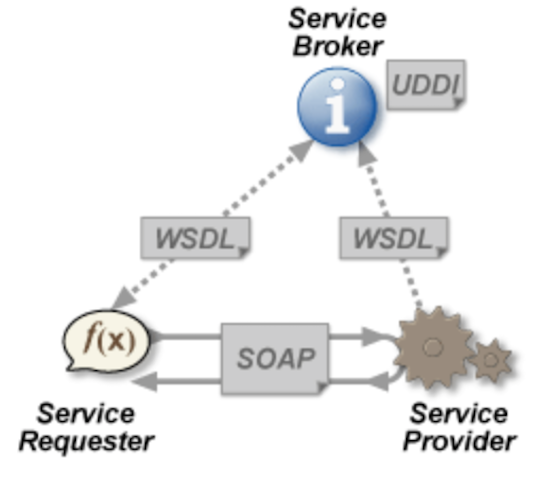

# Web Service - Basic

## What is Web Service

"A Web service is a method of communication between two electronic devices over a network."

Common Type: `SOAP` web service, `RESTful` web service

Web Service is used primarily as a means for businesses to communicate with each other and with clients, Web services allow organizations to **communicate data** without intimate knowledge of each other's IT systems behind the firewall.

## Real World Web Services Example

**Register/Ordering**

Consider a simple account-management and order processing system. The accounting personnel use a client application built with Visual Basic or JSP to create new accounts and enter new customer orders.

The processing logic for this system is written in Java and resides on a Solaris machine, which also interacts with a database to store information.

~~~
Client(VB) -> account registration
	-> SOAP ->
DB Command -> Server & DB(Java)
~~~

The steps to perform this operation are as follows:

- The client program bundles the account registration information into a SOAP message.
- This SOAP message is sent to the web service as the body of an HTTP POST request.
- The web service unpacks the SOAP request and converts it into a command that the application can understand.
- The application processes the information as required and responds with a new unique account number for that customer.
- Next, the web service packages the response into another SOAP message, which it sends back to the client program in response to its HTTP request.
- The client program unpacks the SOAP message to obtain the results of the account registration process.

<http://www.tutorialspoint.com/webservices/what_are_web_services.htm>

## SOAP

Simple Object Access Protocol

- based on XML
- a communication protocol between applications
- a format for sending messages
- platform independent, language independent

### Structure

In the example of SOAP web service

- Data type: SOAP in XML
- Transmit protocol: HTTP
- Interface packages: WSDL
- Lookup Directory: UDDI

{:height="240px"}

### SOAP Message (XML)

A SOAP message is an ordinary XML document containing the following elements:

- An Envelope element that identifies the XML document as a SOAP message
- A Header element that contains header information
- A Body element that contains call and response information
- A Fault element containing errors and status information

~~~ xml
<?xml version="1.0"?>
<soap:Envelope
xmlns:soap="http://www.w3.org/2001/12/soap-envelope"
soap:encodingStyle="http://www.w3.org/2001/12/soap-encoding">

<soap:Header>
  ...
</soap:Header>

<soap:Body>
  ...
  <soap:Fault>
  ...
  </soap:Fault>
</soap:Body>

</soap:Envelope>
~~~

### WSDL

Web Services Description Language
It is just a simple XML document.
The description includes the **name** of the service, the **location** of the service, and **ways to communicate with the service**.

**Document Structure**

~~~
<definitions>

<types>
  data type definitions........
</types>

<message>
  definition of the data being communicated....
</message>

<portType>
  set of operations......
</portType>

<binding>
  protocol and data format specification....
</binding>

</definitions>
~~~

### UDDI

Universal Description, Discovery and Integration

a directory service where businesses can register and search for Web services

## Code Example - Create a Web Service with Server & Client

**JAX-WS**

- [JAX-WS Five Minute Tutorial](http://java.dzone.com/articles/jax-ws-hello-world)
- [Create JAXWS Web Services](http://www.java2blog.com/2013/03/jaxws-web-service-eclipse-tutorial.html) - see src

Steps:

- Server Side:
	- Create Endpoint Interface using `@WebService` and `@WebMethod` ->
  - Create Endpoint Implementation class ->
  - Create Endpoint Publisher using `Endpoint.publish("url",new impl());`
- Client Side:
  - Generate the client stubs using `wsimport -s . url`
  - Call the web service -> new Impl() -> getImplPort()

**Eclipse**

- [Create SOAP Web Services using eclipse](http://www.java2blog.com/2013/03/soap-web-service-example-in-java-using.html)
- [How to Create Sample WSDL in Eclipse and Generate Client](http://crunchify.com/create-sample-wsdl-in-eclipse-and-generate-client/)

**Spring**

- [Consume Spring SOAP W.S](https://spring.io/guides/gs/consuming-web-service/) - Local: WSWeatherDemo
- [Build Spring SOAP W.S](http://briansjavablog.blogspot.com/2013/01/spring-web-services-tutorial.html)

## Links

- [Web Service Tutorial](http://www.java2blog.com/2013/03/soap-web-service-tutorial.html)
- [Where to use Web Services](http://www.computerworld.com/article/2566429/app-development/book-excerpt--when-to-use-web-services.html)
