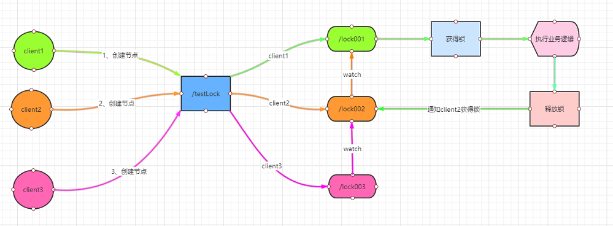

# Zookeeper - implement Distributed Lock

实现分布式锁

## 基本需求

分布式的架构下，实现对于某一个资源的锁。

## 流程

基本原理是：利用了Zk的临时顺序节点。
- 每个进程各自创建一个锁对象，尝试在Zk上创建一个临时顺序节点。
- 按照FIFO的顺序，先创建的节点的顺序靠前，后创建的节点顺序靠后。且每一个节点会 watch 前一个节点。
- 第一个顺序节点抢到了锁，执行业务逻辑，完了释放锁，删除临时节点。
- 第二个顺序节点被通知，抢到锁，执行业务逻辑，新一轮的循环开始。

## 代码实现 - 锁

`Lock.java`

实现小细节1：
`zooKeeper.create`，会异步回调
`processResult(int i, String s, Object o, String s1)`，会进而异步回调
`processResult(int i, String s, Object o, List<String> list, Stat stat)`。

实现小细节2：
`CountDownLatch`在这里的作用是为了让各个线程顺序执行，在分布式情况下需要做出调整。（整个Lock类和Test类其实都需要相应变化）

~~~ java
package com.lock;

import java.util.Collections;
import java.util.List;
import java.util.concurrent.CountDownLatch;

import org.apache.zookeeper.*;
import org.apache.zookeeper.data.Stat;

/**
 * AsyncCallback.StringCallback 创建节点的时候异步回调
 * AsyncCallback.Children2Callback 获取子节点和 stat 的回调
 *
 */
public class Lock implements Watcher ,AsyncCallback.StringCallback,AsyncCallback.Children2Callback{

    private String lockPath = "/lock";
    private static ZooKeeper zooKeeper;
    private CountDownLatch countDownLatch = new CountDownLatch(1);
    private String lockDataName;
    private String threadName;

    /**
     * 加锁
     * @return
     */
    public void tryLock() throws KeeperException, InterruptedException {
        threadName = Thread.currentThread().getName();
        System.out.println(threadName+" 开始抢锁……");
        zooKeeper.create(lockPath,threadName.getBytes()
			,ZooDefs.Ids.OPEN_ACL_UNSAFE
			,CreateMode.EPHEMERAL_SEQUENTIAL
			,this
			,Thread.currentThread().getName());
        countDownLatch.await();
    }

    /**
     * 解锁
     * @throws KeeperException
     * @throws InterruptedException
     */
    public void unlock() throws KeeperException, InterruptedException {
        System.out.println(threadName+" "+lockDataName+" 释放锁……");
        zooKeeper.delete(lockDataName,-1);
    }

    /**
     * getChildren
     * @param i
     * @param s
     * @param o
     * @param list
     * @param stat
     */
    @Override
    public void processResult(int i, String s, Object o, List<String> list, Stat stat) {
        Collections.sort(list);//排序
        int index = list.indexOf(lockDataName.substring(1));
        if(index == 1){//位于第一个位置
            System.out.println(threadName+","+lockDataName+" 已抢到锁……");
            countDownLatch.countDown();
        }else{
            //System.out.println(threadName+" 等待锁释放 , 监听的节点："+list.get(index-1));
            try {
                zooKeeper.exists("/"+list.get(index-1),this);//监听它前面的节点数据，如果删除则触发 wacher
            } catch (KeeperException e) {
                e.printStackTrace();
            } catch (InterruptedException e) {
                e.printStackTrace();
            }
        }
    }

    /**
     * String
     * @param i
     * @param s
     * @param o
     * @param s1
     */
    @Override
    public void processResult(int i, String s, Object o, String s1) {
      zooKeeper.getChildren("/",false,this,"myLock");
      lockDataName = s1;
    }

    @Override
    public void process(WatchedEvent event) {
        if (Event.EventType.NodeDeleted == event.getType()) {
            zooKeeper.getChildren("/",false,this,"myLock");
        }
    }
	
	public String getLockDataName() {
        return lockDataName;
    }

    public void setLockDataName(String lockDataName) {
        this.lockDataName = lockDataName;
    }

    public ZooKeeper getZooKeeper() {
        return zooKeeper;
    }

    public void setZooKeeper(ZooKeeper zooKeeper) {
        this.zooKeeper = zooKeeper;
    }

    public String getThreadName() {
        return threadName;
    }

    public void setThreadName(String threadName) {
        this.threadName = threadName;
    }
	
}
~~~

## 代码实现 - 测试

`TestLock.java`

~~~ java
package com.lock;

import com.common.ZkConnect;
import org.apache.zookeeper.KeeperException;

public class TestLock {

    public static void main(String[] args) throws InterruptedException {
        ZkConnect connect = new ZkConnect();
        connect.connect();

        for(int i = 0;i<5;i++){

            new Thread(new Runnable() {
                @Override
                public void run() {
                    Lock lock = new Lock();
                    lock.setZooKeeper(connect.getZooKeeper());
                    try {
                        lock.tryLock();
                    } catch (KeeperException e) {
                        e.printStackTrace();
                    } catch (InterruptedException e) {
                        e.printStackTrace();
                    }

                    System.out.println(lock.getThreadName()+","+lock.getLockDataName()+" 业务处理……");

                    try {
                        lock.unlock();
                    } catch (KeeperException e) {
                        e.printStackTrace();
                    } catch (InterruptedException e) {
                        e.printStackTrace();
                    }
                }
            }).start();
        }

        Thread.sleep(Long.MAX_VALUE);
    }
}
~~~

## 参考

- 分布式锁 <https://gitbook.cn/books/5ef47a1690c794640abd37d4/index.html>
