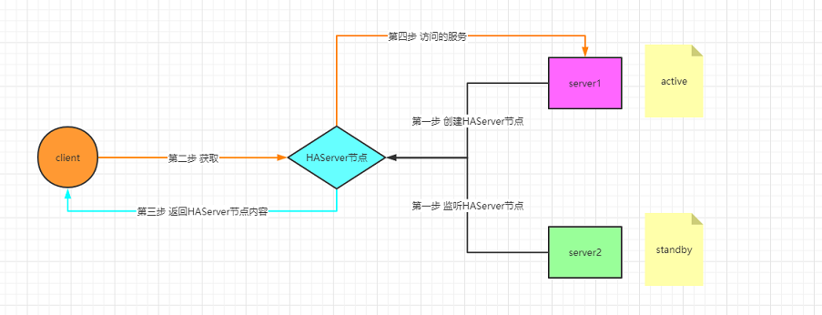
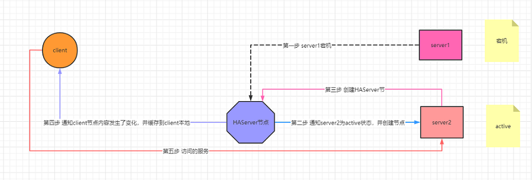

# Zookeeper - implement HA

实现高可用

## 基本功能

高可用 HA ，简化的场景是，有主备两台Server，平时主服务器负责处理所有的request，备用服务器在一边standby。
如果主服务挂了，马上备用服务器顶上去。实现永不宕机。

这里我们不讨论主备之间是如何同步的，（假设主备同步已经做好了），我们的关注点在于，整个系统如何架构，如何切换。

## 流程

平时的流程

宕机后流程

## 代码实现 - Provider

`Server1.java`：Server2类似，改一下端口就行。

原理是：
- 主备服务器使用不同的端口，相同的服务名。
- 启动时，各自尝试在 Zk 上建立以服务名命名的节点。
- 如果不存在，就是主服务器，会创建一个临时节点，并把自己的IP+端口号写在该节点上。
- 如果存在，就是备用服务器，会使用一个 Wather 绑定在该节点，看是否有变化。
- 如果主服务器挂了，它所创建的临时节点随之消失。
- 备用服务器被告知节点变化，自己创建一个新的节点，成为主服务器。
- 再有其它服务器连上时，自动变成备用服务器。

~~~ java
package com.ha.server;

import com.ha.common.HAAction;

import java.io.IOException;
import java.net.ServerSocket;
import java.net.Socket;

public class Server1 {

    public static boolean isRunning = true;
    private static String serviceName = "MyHAServer";
    private static int port = 8090;
    private static String ip = "127.0.0.1";

    public static void main(String[] args) throws IOException, InterruptedException {

        ServerSocket serverSocket = new ServerSocket(port);
        HAAction acceptor = new HAAction(ip,port,serviceName);
        acceptor.createActive();

        while(isRunning){
            Socket socket = serverSocket.accept();
            System.out.println("连接当前连接的 ip 和端口号为："+ip+":"+port);
        }
    }
}
~~~

`HAAction.java`

这里的关键是理解 `ZooKeeper.exists(String path, boolean watch)` 这个方法。API的解释如下：

> Return the stat of the node of the given path. Return null if no such a node exists.
> If the watch is true and the call is successful (no exception is thrown), 
> a watch will be left on the node with the given path. 
> The watch will be triggered by a successful operation that creates/delete the node or sets the data on the node.

参考 -> <https://zookeeper.apache.org/doc/r3.3.3/api/org/apache/zookeeper/ZooKeeper.html#exists(java.lang.String,%20boolean)>

~~~ java
package com.ha.common;

import com.common.ZkConnect;
import org.apache.zookeeper.*;
import org.apache.zookeeper.data.Stat;

public class HAAction {

    private String ip;
    private int port;
    private String serviceName;
    private ZooKeeper zooKeeper;

    public HAAction(String ip,int port,String serviceName) throws InterruptedException {
        this.ip = ip;
        this.port = port;
        this.serviceName = serviceName;

        ZkConnect connect =new ZkConnect();
        connect.connect();//连接 zookeeper 服务
        zooKeeper = connect.getZooKeeper();
    }

    /**
     * 获取 Active
     * @throws KeeperException
     * @throws InterruptedException
     */
    public void createActive(){
        System.out.println("服务器 ip "+ip+",port "+port+"尝试占用 active");
        try {
            String serviceNamePath = "/"+serviceName;

            if(exists(serviceNamePath,false)){ // // 第2个Node
                System.out.println("服务器状态是 Standby");
                exists(serviceNamePath,true);
            }else{ // 第1个Node
                System.out.println("开始创建节点！！！！");
                createTempData(serviceNamePath,ip+":"+port);
                System.out.println(ip+":"+port+"的服务器状态是 Active");
            }
        } catch (KeeperException e) {
            System.out.println("切换 active 出现异常，已被其他服务器占用");
            try {
                exists("/"+serviceName,true);//继续监听
            } catch (KeeperException ex) {
                ex.printStackTrace();
            } catch (InterruptedException ex) {
                ex.printStackTrace();
            }
        } catch (InterruptedException e) {
            e.printStackTrace();
        }
    }

    /**
     * 该路径是否存在
     * @param path
     * @return
     * @throws KeeperException
     * @throws InterruptedException
     */
    public boolean exists(String path,boolean isWatch) throws KeeperException, InterruptedException {
        Stat s= null;
        if(isWatch){
            s = zooKeeper.exists(path,new existsWatcher());
        }else{
            s = zooKeeper.exists(path,false);
        }
        return s!=null;
    }

    /**
     * 服务器节点删除的监听器类
     */
    class existsWatcher implements Watcher {

        @Override
        public void process(WatchedEvent watchedEvent) {
            if(watchedEvent.getType() == Event.EventType.NodeDeleted){
                System.out.println("有服务器已经宕机，其他服务器正在抢占资源节点！！！");
                createActive();
            }
        }
    }

    /**
     * 创建临时节点
     * @param path
     * @param data
     * @throws KeeperException
     * @throws InterruptedException
     */
    public void createTempData(String path, String data) throws KeeperException, InterruptedException {
        this.zooKeeper.create(path, data.getBytes(), ZooDefs.Ids.OPEN_ACL_UNSAFE, CreateMode.EPHEMERAL);
    }

}
~~~

## 代码实现 - Client

`Client.java`

~~~
package com.ha.client;

import com.common.ZkConnect;
import org.apache.zookeeper.KeeperException;
import org.apache.zookeeper.WatchedEvent;
import org.apache.zookeeper.Watcher;
import org.apache.zookeeper.ZooKeeper;

import java.io.IOException;
import java.net.Socket;

public class Client {

    private static ZooKeeper zooKeeper;
    private static final String serverName = "MyHAServer";
    static String serverHost = null;

    public static void main(String[] args) throws InterruptedException, KeeperException {

        ZkConnect connect = new ZkConnect();
        connect.connect();//建立连接会堵塞
        zooKeeper = connect.getZooKeeper();

        setServerHost();//设置端口号

        for(int i = 0;i<50;i++){
            System.out.println("连接服务器地址为:"+serverHost);
            String ip = serverHost.substring(0,serverHost.indexOf(":"));
            String port = serverHost.substring(serverHost.indexOf(":")+1,serverHost.length());

            try {
                Socket socket = new Socket(ip,Integer.parseInt(port));
            } catch (IOException e) {
                e.printStackTrace();
                System.out.println("连接失败！！！");
                continue;
            }
            System.out.println("连接成功！！！");

            Thread.sleep(5000);
        }
    }

    private static void setServerHost(){
        try{
            byte b [] = zooKeeper.getData("/" + serverName, new Watcher() {
                @Override
                public void process(WatchedEvent watchedEvent) {
                    if(watchedEvent.getType() == Event.EventType.NodeDeleted){
                        System.out.println("开始重新获取服务节点数据……");
                        setServerHost();
                    }
                }
            },null);
            System.out.println("最新的服务器地址为："+new String(b));
            serverHost = new String(b);
        }catch (KeeperException e) {
            try {
                Thread.sleep(1000);//停顿一秒，让其他服务有时间创建节点
            } catch (InterruptedException ex) {
                ex.printStackTrace();
            }
            setServerHost();//出现异常后重新获取
        } catch (InterruptedException e) {
            e.printStackTrace();
        }
    }
}
~~~

## 测试

- 分别启动 Server1、Server2.
- 启动 Client，观察连接 server 的输出信息。
- 停掉 active 状态的服务，观察 standby 的服务能否自动切换成 active。

## 参考

- HA（高可用） <https://gitbook.cn/books/5ef47a1690c794640abd37d4/index.html>
