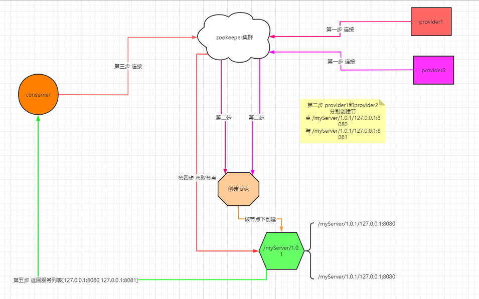
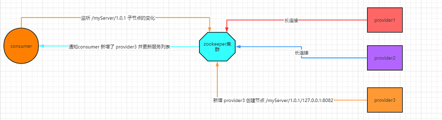
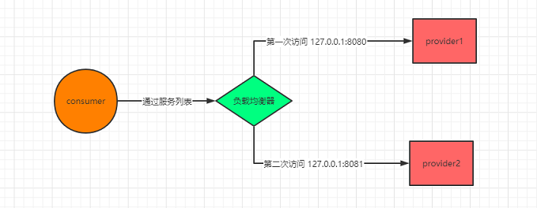

# Zookeeper - implement Registry

实现注册中心

## 基本功能

Client查询Properties文件，或者DB，获取Provider的信息，进而调用相应的服务。

~~~
Client -> Properties / DB -> Provider_1
                          -> Provider_2
			  -> Provider_3
~~~

这里主要有两个挑战：
- 一是Provider端IP，端口动态变化，如何同步。
- 二是某个Provider下线了，某个新的Provider上线了，如何让Consumer感知变化。

这些挑战，其实仔细想想，在原有的框架下，也是可以解决的。那么为什么还要引入Zookeeper呢？

个人认为主要的差别在于单机v.s.集群。Zk由于其自身的分布式架构，保证了高可用性。
而且，Zk用起来很方便。自己撸/改进一个单机版的服务协调框架，还不如直接使用Zk呢。

## 流程

大致流程如下：

新增节点流程如下：

负载均衡策略放在了Consumer端：

## 代码实现 - Provider

Provider端主要有两个类：
- `Provider1.java`
- `RegistCenterProvider.java`

`Provider1.java`如下。`Provider2.java`, `Provider2.java`类似，把端口号改了就行。
用来模拟服务提供方。这里只做了简单的功能，把自己的服务信息注册到Zk上，然后不停地在控制台打印自己还存活的信息，且接收Socket连接。

~~~ java
package com.provider;
import com.registCenterCommon.RegistCenterProvider;
import java.net.Socket;
import java.net.ServerSocket;

/**
 * 服务提供方
 */
public class Provider1 {
    public static boolean isRunning = true;
    private static String serviceName = "myServer";
    private static int port = 8080;
    private static String ip = "127.0.0.1";
    private static String version = "1.0.1";

    public static void main(String[] args) throws Exception {

        ServerSocket serverSocket = new ServerSocket(port);
        //把当前的服务信息注册到注册中心中
        RegistCenterProvider registCenterProvider = new RegistCenterProvider(ip,version,port,serviceName);
        registCenterProvider.register();

        while(isRunning){
            Socket socket = serverSocket.accept();
            System.out.println("当前连接的服务版本、ip 和端口号为：/"+version+"/"+ip+":"+port);
        }
        serverSocket.close();
    }
}
~~~

`RegistCenterProvider.java`:Provider调用该类和Zk建立连接，创建持久化节点`/serviceName`，以及临时节点`/version/ip/port`。

~~~ java
package com.registCenterCommon;
import com.common.ZkConnect;
import org.apache.zookeeper.ZooKeeper;
import org.apache.zookeeper.data.Stat;

/**
 * 服务提供端注册中心
 */
public class RegistCenterProvider {

    private String ip;
    private String version;
    private int port;
    private String serviceName;

    public RegistCenterProvider(String ip, String version, int port, String serviceName) {
        this.ip = ip;
        this.version = version;
        this.port = port;
        this.serviceName = serviceName;
    }

    /**
     * 服务提供方注册
     * @throws Exception
     */
    public  void register() throws Exception {
        ZkConnect zk = new ZkConnect();
        zk.connect("54.169.132.0,52.74.51.0");
        ZooKeeper zooKeeper = zk.getZooKeeper();
        if(zooKeeper.exists("/"+serviceName,false)==null){
            zk.createPersistentNode("/"+serviceName,"");
        }
        Stat stat =  zooKeeper.exists("/"+serviceName+"/"+version,false);
        if(stat == null){
            zk.createPersistentNode("/"+serviceName+"/"+version,"");
        }
        zk.createEphemeralNode("/"+serviceName+"/"+version+"/"+ip+":"+port,"");
        System.out.println("服务提供方注册成功，注册信息为：/"+serviceName+"/"+version+"/"+ip+":"+port);
    }
}
~~~

## 代码实现 - Consumer

Consumer端也有两个类：
- `Consumer.java`
- `RegistCenterConsumer.java`

`Consumer.java`:调用`RegistCenterConsumer`和Zk建立连接，然后获取所有的服务信息，最后尝试连接到目标服务器上面。负载均衡是使用随机数实现的。

~~~ java
package com.consumer;
import java.net.Socket;
import com.registCenterCommon.Connect;
import com.registCenterCommon.RegistCenterConsumer;
import java.util.List;
import java.util.Random;

/**
 * @Classname Consumer
 */
public class Consumer {

    private static String serviceName = "myServer";
    private static String version = "1.0.1";

    public static void main(String[] args) throws Exception {

        RegistCenterConsumer registCenterConsumer = new RegistCenterConsumer(serviceName,version);
        List<Connect> services = registCenterConsumer.pullServiceList();

        for(int i = 0;i<20;i++){
            int randomIndex = new Random().nextInt(services.size());
            Connect connect = services.get(randomIndex);
            Socket socket = new Socket(connect.getIp(),connect.getPort());
            System.out.println(connect+"连接成功！！！");
        }

        Thread.sleep(40000);

        System.out.println("重新访问…………………………");
        System.out.println("最新列表信息为："+services);

        for(int i = 0;i<20;i++){
            int randomIndex = new Random().nextInt(services.size());
            Connect connect = services.get(randomIndex);
            Socket socket = new Socket(connect.getIp(),connect.getPort());
            System.out.println(connect+"连接成功！！！");
        }
    }
}
~~~

`RegistCenterConsumer.java`：拿到Zk上的节点信息，然后parse成`Connection`返回。另外，有一个内部类`serverListWatch`，implement了Zk的`Watcher`接口，从而可以知悉Zk上的节点变化。

~~~ java
package com.registCenterCommon;

import com.common.ZkConnect;
import org.apache.zookeeper.KeeperException;
import org.apache.zookeeper.WatchedEvent;
import org.apache.zookeeper.Watcher;
import org.apache.zookeeper.ZooKeeper;

import java.util.ArrayList;
import java.util.List;
import java.util.concurrent.CopyOnWriteArrayList;

public class RegistCenterConsumer {

    private String version;
    private String serviceName;
    private ZooKeeper zooKeeper;
    private  final List<Connect> serviceList = new CopyOnWriteArrayList();

    public RegistCenterConsumer(String serviceName,String version){
        this.serviceName = serviceName;
        this.version = version;
    }

    /**
     * 服务提供方注册
     * @throws Exception
     */
    public  List<Connect> pullServiceList() throws Exception {
        ZkConnect zk = new ZkConnect();
        zk.connect("54.169.132.0,52.74.51.0");
        zooKeeper = zk.getZooKeeper();
        List<String> serverList = this.getServerList("/"+serviceName+"/"+version);
        serviceList.addAll(this.getConnectByString(serverList));
        return serviceList;
    }

    /**
     * 根据服务列表获取连接对象列表
     * @param list
     * @return
     */
    private  List<Connect> getConnectByString(List<String> list){
        List<Connect> connectList = new ArrayList<>();
        for(String str : list){
            String ip = str.substring(0,str.indexOf(":"));
            String port = str.substring(str.indexOf(":")+1,str.length());
            connectList.add(new Connect(ip,Integer.parseInt(port)));
        }
        return connectList;
    }

    /**
     * 功能描述:  
     * 〈获取集群的服务列表〉
     * @Param: [path]
     * @Return: java.util.List<java.lang.String>
     */
    private List<String> getServerList(String path) {
        try {
            return zooKeeper.getChildren(path, new serverListWatch());
        } catch (KeeperException e) {
            e.printStackTrace();
        } catch (InterruptedException e) {
            e.printStackTrace();
        }
        return null;
    }

    class serverListWatch implements Watcher {

        @Override
        public void process(WatchedEvent watchedEvent) {
            if(watchedEvent.getType()== Event.EventType.NodeChildrenChanged){
                System.out.println("服务列表节点数据产生变化~~~~~~");
                serviceList.clear();
                serviceList.addAll(getConnectByString(getServerList(watchedEvent.getPath())));
                System.out.println("最新服务器列表："+serviceList);
            }
        }
    }
}
~~~

## 测试流程

- 启动 zookeeper
- 启动 Provider1 ， Provider2 ， Provider3
- 启动 Consumer
- 观察
- 然后断掉 Provider3 ，再观察

## 参考

- 注册中心 <https://gitbook.cn/books/5ef47a1690c794640abd37d4/index.html>
